---
## Front matter
title: "Отчет по лабораторной работе №1"
subtitle: "Подготовка лабораторного стенда"
author: "Галацан Николай, НПИбд-01-22"

## Generic otions
lang: ru-RU
toc-title: "Содержание"

## Bibliography
bibliography: bib/cite.bib
csl: pandoc/csl/gost-r-7-0-5-2008-numeric.csl

## Pdf output format
toc: true # Table of contents
toc-depth: 2
lof: true # List of figures
lot: false # List of tables
fontsize: 12pt
linestretch: 1.5
papersize: a4
documentclass: scrreprt
## I18n polyglossia
polyglossia-lang:
  name: russian
  options:
	- spelling=modern
	- babelshorthands=true
polyglossia-otherlangs:
  name: english
## I18n babel
babel-lang: russian
babel-otherlangs: english
## Fonts
mainfont: IBM Plex Serif
romanfont: IBM Plex Serif
sansfont: IBM Plex Sans
monofont: IBM Plex Mono
mathfont: STIX Two Math
mainfontoptions: Ligatures=Common,Ligatures=TeX,Scale=0.94
romanfontoptions: Ligatures=Common,Ligatures=TeX,Scale=0.94
sansfontoptions: Ligatures=Common,Ligatures=TeX,Scale=MatchLowercase,Scale=0.94
monofontoptions: Scale=MatchLowercase,Scale=0.94,FakeStretch=0.9
mathfontoptions:
## Biblatex
biblatex: true
biblio-style: "gost-numeric"
biblatexoptions:
  - parentracker=true
  - backend=biber
  - hyperref=auto
  - language=auto
  - autolang=other*
  - citestyle=gost-numeric
## Pandoc-crossref LaTeX customization
figureTitle: "Рис."
tableTitle: "Таблица"
listingTitle: "Листинг"
lofTitle: "Список иллюстраций"
lotTitle: "Список таблиц"
lolTitle: "Листинги"
## Misc options
indent: true
header-includes:
  - \usepackage{indentfirst}
  - \usepackage{float} # keep figures where there are in the text
  - \floatplacement{figure}{H} # keep figures where there are in the text
---

# Цель работы

Целью данной работы является приобретение практических навыков установки
Rocky Linux на виртуальную машину с помощью инструмента Vagrant.

# Выполнение лабораторной работы

В первую очередь скачиваю необходимое ПО и файлы для выполнения работы на Windows:

- Vagrant

- Packer

- FAR

- образ ОС Rocky Linux

- конфигурационные файлы и скрипты


Создаю каталоги для проекта (рис. [-@fig:1]).

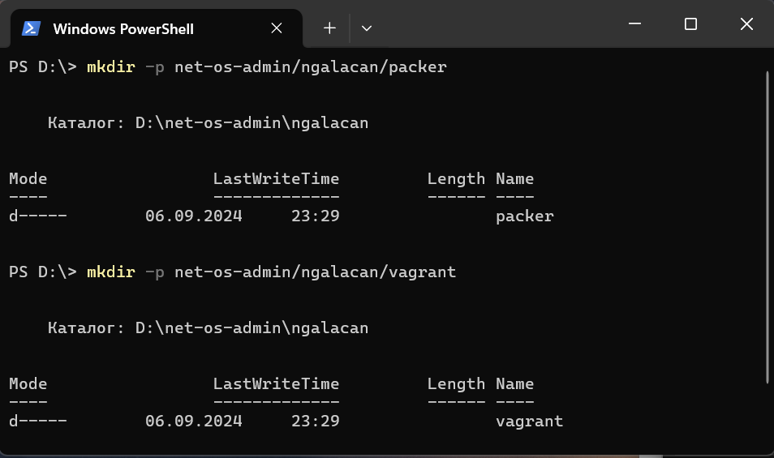{#fig:1 width=70%}

Размещаю все конфигурационные файлы и образ диска согласно инструкции. Создаю дополнительные подкаталоги `default, server, client` в каталоге `vagrant`. Размещаю скрипты, предварительно изменив `user` на `ngalacan`, где это необходимо (рис. [-@fig:2])

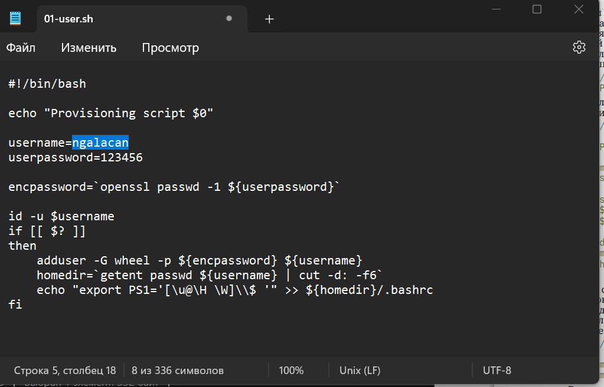{#fig:2 width=70%}

## Развёртывание лабораторного стенда на ОС Windows

Используя FAR, перехожу в созданный рабочий каталог с проектом. В этом же каталоге размещён файл `packer.exe`. В командной строке ввожу
```
packer.exe init vagrant-rocky.pkr.hcl
packer.exe build vagrant-rocky.pkr.hcl
```
(рис. [-@fig:3], рис. [-@fig:4])

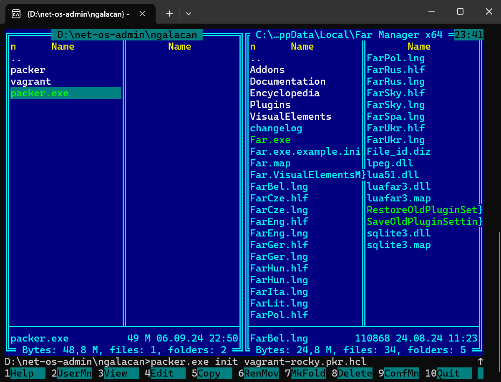{#fig:3 width=70%}

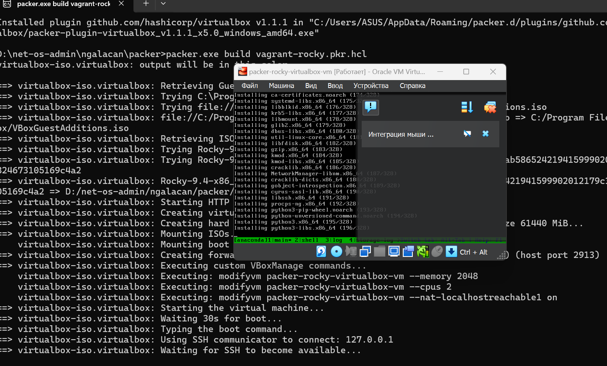{#fig:4 width=70%}

Убеждаюсь, что после конца установки появился box-файл (рис. [-@fig:5])

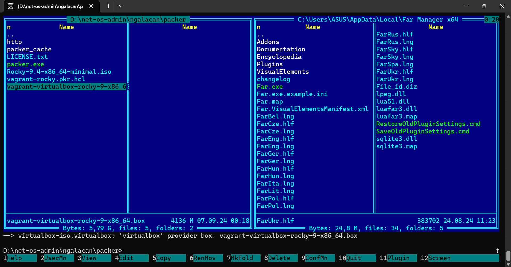{#fig:5 width=70%}

Для регистрации образа виртуальной машины в vagrant в командной строке ввожу `vagrant box add rocky9 vagrant-virtualbox-rocky-9-x86_64.box`. Для запуска ВМ ввожу в консоли
```
vagrant up server
vagrant up client
```

(рис. [-@fig:6]) и залогиниваюсь под пользователем vagrant (рис. [-@fig:7], рис. [-@fig:8])

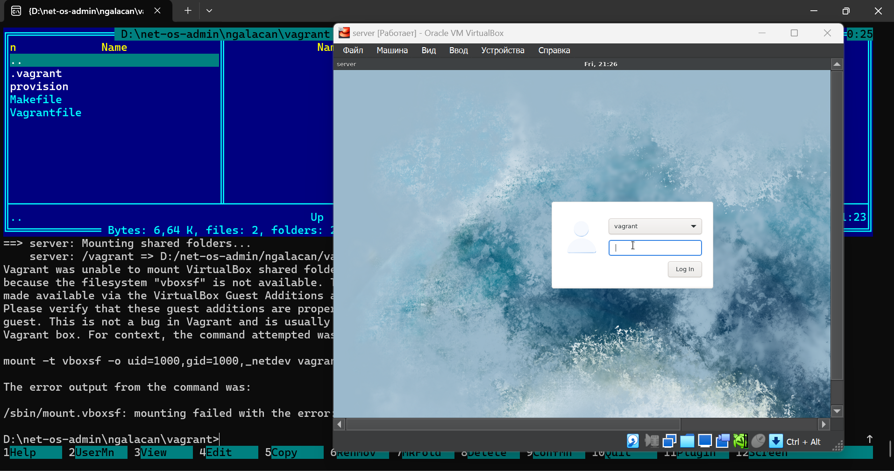{#fig:6 width=80%}

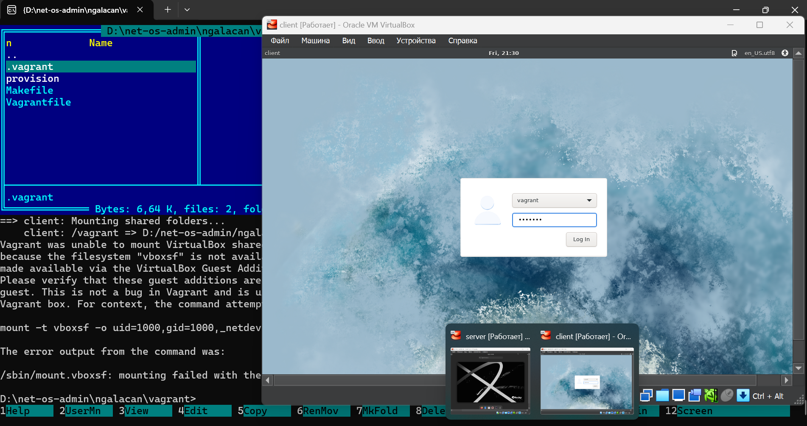{#fig:7 width=80%}

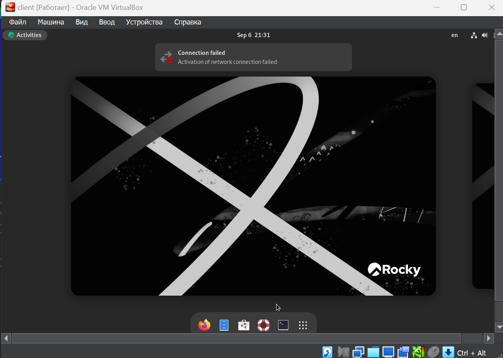{#fig:8 width=80%}

Подключаюсь к серверу из консоли, ввожу пароль vagrant, пытаюсь переключиться на пользователя, разлогиниваюсь. Аналогично подключаюсь к клиенту (рис. [-@fig:9]).

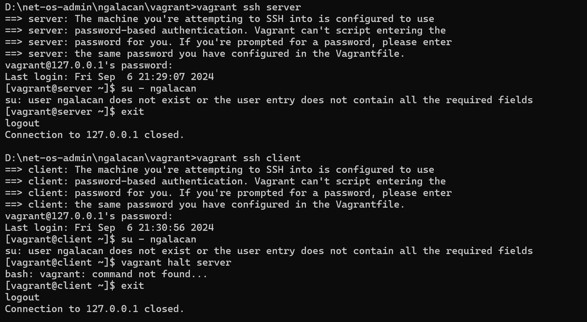{#fig:9 width=70%}

Выключаю обе ВМ (рис. [-@fig:10]).

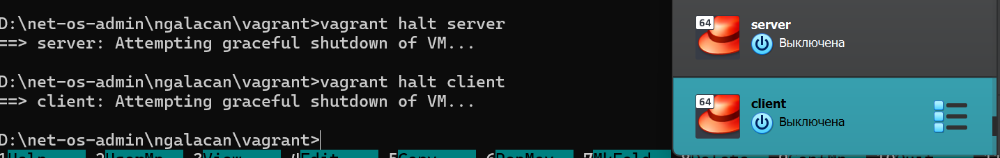{#fig:10 width=70%}

## Внесение изменений в настройки внутреннего окружения виртуальной машины

Для отработки созданных скриптов ввожу команды 
```
vagrant up server --provision
vagrant up client --provision
```
(рис. [-@fig:11]).

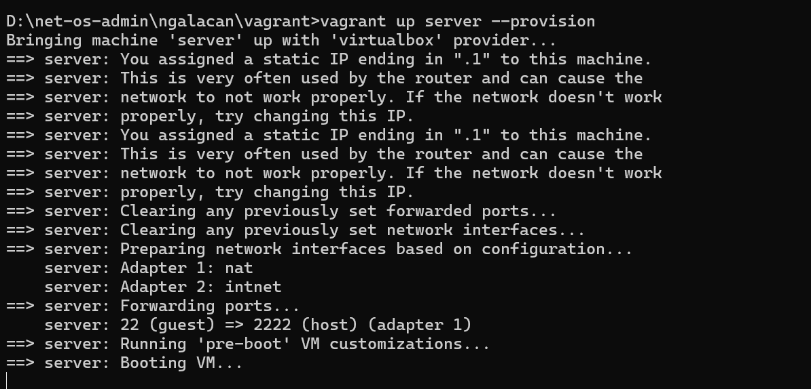{#fig:11 width=70%}

Так как с первой попытки пользователь не появляется, перезапускаю ВМ и ввожу `vagrant provision server`. Аналогично с клиентом. После этого вижу, что пользователь появляется, осуществляю вход в систему и проверяю приглашение командной строки (рис. [-@fig:12], рис. [-@fig:13]). После установки перезагружаю систему.

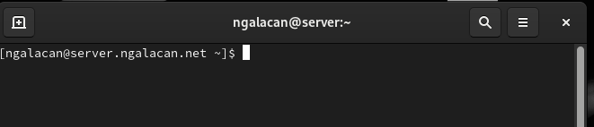{#fig:12 width=70%}

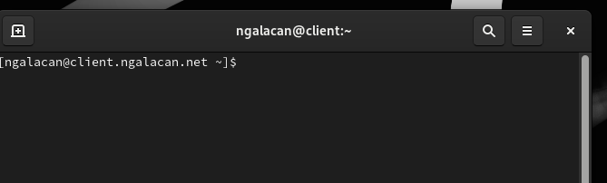{#fig:13 width=70%}

Выключаю обе ВМ через консоль (рис. [-@fig:14]).

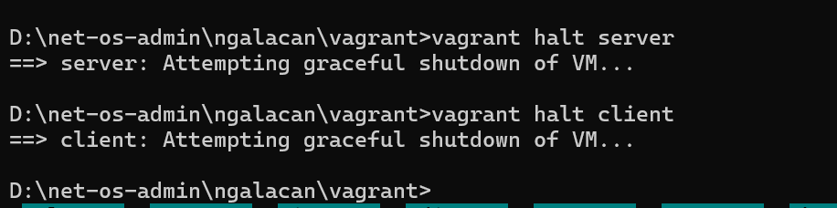{#fig:14 width=70%}

# Выводы

В результате выполнения работы были приобретены практические навыки установки Rocky Linux на виртуальную машину с помощью инструмента Vagrant.


# Ответы на контрольные вопросы

1. Для чего предназначен Vagrant?

Это инструмент для создания и управления средами виртуальных машин в одном рабочем процессе.
Он позволяет автоматизировать процесс установки на виртуальную машину как основного дистрибутива операционной системы, так и настройки необходимого в дальнейшем программного обеспечения.

2. Что такое box-файл? В чём назначение Vagrantfile?

**box-файл** (или Vagrant Box) — сохранённый образ виртуальной
развёрнутой в ней операционной системы, box-файл используется
как основа для клонирования виртуальных машин с теми или иными
настройками. 

**Vagrantfile** — конфигурационный файл, написанный
на языке Ruby, в котором указаны настройки запуска виртуальной
машины.

3. Приведите описание и примеры вызова основных команд Vagrant.

vagrant help — вызов справки по командам Vagrant;

vagrant box list — список подключённых к Vagrant box-файлов;

vagrant box add — подключение box-файла к Vagrant;

vagrant destroy— отключение box-файла от Vagrant и удаление его из
виртуального окружения;

vagrant init — создание «шаблонного» конфигурационного файла
Vagrantfile для его последующего изменения;

vagrant up — запуск виртуальной машины с использованием инструкций
по запуску из конфигурационного файла Vagrantfile;

vagrant reload — перезагрузка виртуальной машины;

vagrant halt — остановка и выключение виртуальной машины;

vagrant provision — настройка внутреннего окружения имеющейся виртуальной машины (например, добавление новых инструкций
(скриптов) в ранее созданную виртуальную машину);

vagrant ssh — подключение к виртуальной машине через ssh.

4. Дайте построчные пояснения содержания файлов vagrant-rocky.pmakekr.hcl, ks.cfg,
Vagrantfile, Makefile.

**vagrant-rocky.pkr.hcl** — специальный файл с описанием метаданных по установке дистрибутива на виртуальную машину
(содержание используемого в данном практикуме файла .hcl приведено в разделе 1.5.1.1); в частности, в разделе переменных этот файл содержит указание на
версию дистрибутива, его хэш-функцию, имя и пароль пользователя по умолчанию; в разделе builders указаны специальные синтаксические конструкции для
автоматизации работы VirtualBox; в разделе provisioners прописаны действия
(по сути shell-скрипт) по установке дополнительных пакетов дистрибутива;

**ks.cfg** — определяет настройки для установки дистрибутива, которые пользователь обычно вводит вручную,
в частности настройки языка интерфейса, языковые настройки клавиатуры,
тайм-зону, сетевые настройки и т.п.; файл ks.cfg должен быть расположен
в подкаталоге http

**Vagrantfile** — файл с конфигурацией запуска виртуальных машин — сервера и клиента

**Makefile** — набор инструкций для программы make по работе с Vagrant
