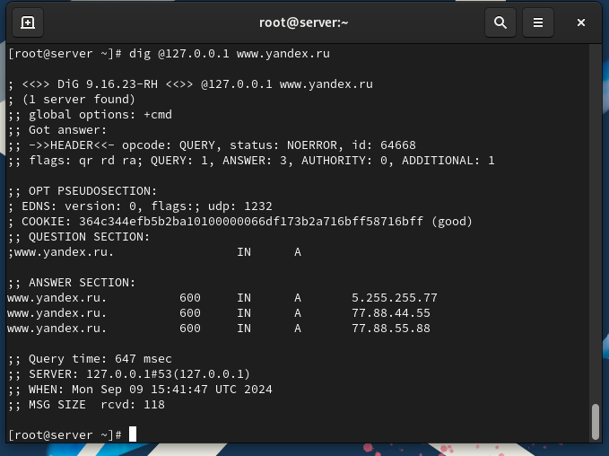
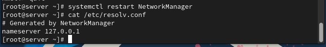
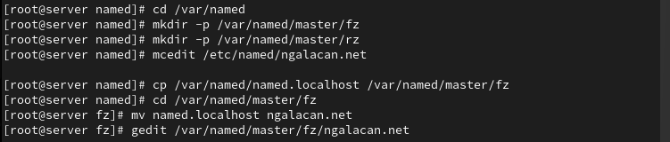
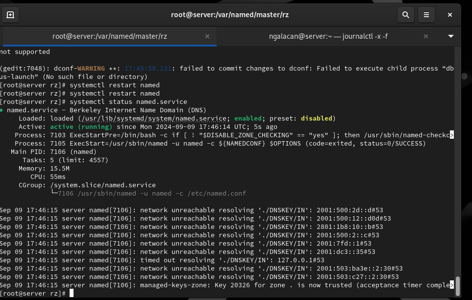

---
## Front matter
title: "Отчет по лабораторной работе №2"
subtitle: "Настройка DNS-сервера"
author: "Галацан Николай, НПИбд-01-22"

## Generic otions
lang: ru-RU
toc-title: "Содержание"

## Bibliography
bibliography: bib/cite.bib
csl: pandoc/csl/gost-r-7-0-5-2008-numeric.csl

## Pdf output format
toc: true # Table of contents
toc-depth: 2
lof: true # List of figures
lot: false # List of tables
fontsize: 12pt
linestretch: 1.5
papersize: a4
documentclass: scrreprt
## I18n polyglossia
polyglossia-lang:
  name: russian
  options:
	- spelling=modern
	- babelshorthands=true
polyglossia-otherlangs:
  name: english
## I18n babel
babel-lang: russian
babel-otherlangs: english
## Fonts
mainfont: IBM Plex Serif
romanfont: IBM Plex Serif
sansfont: IBM Plex Sans
monofont: IBM Plex Mono
mathfont: STIX Two Math
mainfontoptions: Ligatures=Common,Ligatures=TeX,Scale=0.94
romanfontoptions: Ligatures=Common,Ligatures=TeX,Scale=0.94
sansfontoptions: Ligatures=Common,Ligatures=TeX,Scale=MatchLowercase,Scale=0.94
monofontoptions: Scale=MatchLowercase,Scale=0.94,FakeStretch=0.9
mathfontoptions:
## Biblatex
biblatex: true
biblio-style: "gost-numeric"
biblatexoptions:
  - parentracker=true
  - backend=biber
  - hyperref=auto
  - language=auto
  - autolang=other*
  - citestyle=gost-numeric
## Pandoc-crossref LaTeX customization
figureTitle: "Рис."
tableTitle: "Таблица"
listingTitle: "Листинг"
lofTitle: "Список иллюстраций"
lotTitle: "Список таблиц"
lolTitle: "Листинги"
## Misc options
indent: true
header-includes:
  - \usepackage{indentfirst}
  - \usepackage{float} # keep figures where there are in the text
  - \floatplacement{figure}{H} # keep figures where there are in the text
---

# Цель работы

Приобретение практических навыков по установке и конфигурированию DNSсервера, усвоение принципов работы системы доменных имён.

# Выполнение лабораторной работы

## Установка DNS-сервера

Запускаю ВМ через рабочий каталог. На ВМ `server` вхожу под собственным пользователеми перехожу в режим суперпользователя. Устанавливаю `bind` и `bind-utils` (рис. [-@fig:1]).

{#fig:1 width=70%}

С помощью утилиты `dig` делаю запрос к DNS-адресу (рис. [-@fig:2])

{#fig:2 width=70%}

##  Конфигурирование кэширующего DNS-сервера

Просматриваю файлы `/etc/resolv.conf`, `/etc/named.conf` (рис. [-@fig:3]), `/var/named/named.ca` (рис. [-@fig:4]), `/var/named/named.localhost`, `/var/named/named.loopback` (рис. [-@fig:5]).

{#fig:3 width=70%}

{#fig:4 width=70%}

{#fig:5 width=70%}

Запускаю DNS-сервер и включаю в автозапуск:
```
systemctl start named
systemctl enable named
```

Ввожу `dig @127.0.0.1 www.yandex.ru` и анализирую отличия в информации от рис. [-@fig:2]. В данном случае выводится больше данных (рис. [-@fig:6]).

{#fig:6 width=80%}

Сделаю DNS-сервер сервером по умолчанию для хоста `server` и внутренней виртуальной сети. Для этого требуется изменить настройки сетевого соединения `eth0`
в NetworkManager, переключив его на работу с внутренней сетью и указав для него
в качестве DNS-сервера по умолчанию адрес `127.0.0.1` (рис. [-@fig:7]). То же самое делаю для `System eth0` (рис. [-@fig:8])

{#fig:7 width=80%}

{#fig:8 width=80%}

Перезапускаю NetworkManager и проверяю наличие изменений в файле `/etc/resolv.conf` (рис. [-@fig:9]).

{#fig:9 width=70%}

Вношу изменения в файл `/etc/named.conf`  (рис. [-@fig:10]).

{#fig:10 width=70%}

Вношу изменения в настройки межсетевого экрана узла `server`, разрешив работу с DNS. Убеждаюсь, что DNS-запросы идут через узел `server`, который прослушивает порт 53 (рис. [-@fig:11]).

{#fig:11 width=70%}

Для конфигурирования кэширующего DNS-сервера при наличии фильтрации DNS-запросов маршрутизаторами вношу изменения в файл `named.conf` (рис. [-@fig:12])

{#fig:12 width=70%}

## Конфигурирование первичного DNS-сервера

Ввожу команды:
```
cp /etc/named.rfc1912.zones /etc/named/
cd /etc/named
mv /etc/named/named.rfc1912.zones /etc/named/ngalacan.net

```

Включаю файл описания зоны `/etc/named/ngalacan.net` в конфигурационном файле
DNS `/etc/named.conf`, добавив в нём в конце строку:
`include "/etc/named/user.net";`. 

Редактирую файл `/etc/named/user.net` (рис. [-@fig:13])

{#fig:13 width=70%}

В каталоге `/var/named` создаю подкаталоги `master/fz` и `master/rz`, в которых будут
располагаться файлы прямой и обратной зоны соответственно. Копирую шаблон прямой DNS-зоны `named.localhost` из каталога
`/var/named` в каталог `/var/named/master/fz`, переименовав его в `ngalacan.net` (рис. [-@fig:14]).

{#fig:14 width=70%}

Изменяю файл `/var/named/master/fz/ngalacan.net` (рис. [-@fig:15]).

{#fig:15 width=70%}

Копирую шаблон обратной DNS-зоны `named.loopback` из каталога
`/var/named` в каталог `/var/named/master/rz` и переименуйте его в `192.168.1` (рис. [-@fig:16]).

{#fig:16 width=70%}

Изменяю  файл `/var/named/master/rz/192.168.1` (рис. [-@fig:17]).

{#fig:17 width=70%}

Изменяю права доступа, восстанавливаю метки SELinux, проверяю (рис. [-@fig:18]).

{#fig:18 width=70%}

Во втором терминале открываю лог системных сообщений. В первом терминале перезапускаю DNS-сервер. После исправления всех ошибок и опечаток DNS-сервер запускается успешно (рис. [-@fig:19]).

{#fig:19 width=70%}

## Анализ работы DNS-сервера

При помощи утилиты `dig` получаю описание DNS-зоны с сервера `ns.ngalacan.net` (рис. [-@fig:20]).

{#fig:20 width=70%}

Анализирую корректность работы DNS-сервера (рис. [-@fig:21]).

{#fig:21 width=70%}

## Внесение изменений в настройки внутреннего окружения виртуальной машины

Перехожу в каталог для внесения изменений в настройки внутреннего окружения `/vagrant/provision/server/`, создаю в нём
каталог `dns`, в который помещаю в соответствующие каталоги конфигурационные файлы DNS (рис. [-@fig:22]).

{#fig:22 width=70%}

Создаю скрипт `dns.sh` (рис. [-@fig:23]).

{#fig:23 width=70%}

Для отработки созданного скрипта во время загрузки виртуальной машины
в конфигурационном файле `Vagrantfile` вношу изменения в разделе конфигурации для сервера (рис. [-@fig:24]).

{#fig:24 width=70%}


# Выводы

В результате выполнения работы были приобретены практические навыки по установке и конфигурированию DNS-сервера, усвоены принципы работы системы доменных имён.

# Ответы на контрольные вопросы

1. Что такое DNS? 

- Это система, предназначенная для преобразования человекочитаемых доменных имен в IP-адреса компьютерами для идентификации друг друга в сети.

2. Каково назначение кэширующего DNS-сервера? 

- Его задача - хранить результаты предыдущих DNS-запросов в памяти. Когда клиент делает запрос, кэширующий DNS проверяет свой кэш, и если он содержит соответствующую информацию, сервер возвращает ее без необходимости обращаться к другим DNS-серверам. Это ускоряет процесс запроса.

3. Чем отличается прямая DNS-зона от обратной? 

- Прямая зона преобразует доменные имена в IP-адреса, обратная зона выполняет обратное: преобразует IP-адреса в доменные имена.

4. В каких каталогах и файлах располагаются настройки DNS-сервера? Кратко охарактеризуйте, за что они отвечают. 

- В Linux-системах обычно используется файл /etc/named.conf для общих настроек. Зоны хранятся в файлах в каталоге /var/named/, например, /var/named/example.com.zone.

5.	Что указывается в файле resolv.conf? 

- Содержит информацию о DNS-серверах, используемых системой, а также о параметрах конфигурации.

6.	Какие типы записи описания ресурсов есть в DNS и для чего они используются? 

- A (IPv4-адрес), AAAA (IPv6-адрес), CNAME (каноническое имя), MX (почтовый сервер), NS (имя сервера), PTR (обратная запись), SOA (начальная запись зоны), TXT (текстовая информация).

7.	Для чего используется домен in-addr.arpa? 

- Используется для обратного маппинга IP-адресов в доменные имена.

8.	Для чего нужен демон named? 

- Это DNS-сервер, реализация BIND (Berkeley Internet Name Domain).

9.	В чём заключаются основные функции slave-сервера и master-сервера? 

- Master-сервер хранит оригинальные записи зоны, slave-серверы получают копии данных от master-сервера.

10.	Какие параметры отвечают за время обновления зоны? 

- refresh, retry, expire, и minimum.

11.	Как обеспечить защиту зоны от скачивания и просмотра? 

- Это может включать в себя использование TSIG (Transaction SIGnatures) для аутентификации между серверами.

12.	Какая запись RR применяется при создании почтовых серверов? 

- MX (Mail Exchange).

13.	Как протестировать работу сервера доменных имён? 

- Используйте команды nslookup, dig, или host.

14.	Как запустить, перезапустить или остановить какую-либо службу в системе? 

- systemctl start|stop|restart <service>.

15.	Как посмотреть отладочную информацию при запуске какого-либо сервиса или службы? 

- Используйте опции, такие как -d или -v при запуске службы.

16.	Где хранится отладочная информация по работе системы и служб? Как её посмотреть?

 - В системных журналах, доступных через journalctl.
 
17.	Как посмотреть, какие файлы использует в своей работе тот или иной процесс? Приведите несколько примеров. 

- lsof -p <pid> или fuser -v <file>.

18.	Приведите несколько примеров по изменению сетевого соединения при помощи командного интерфейса nmcli. 

- Примеры включают nmcli connection up|down <connection_name>.

19.	Что такое SELinux? 

- Это мандатный контроль доступа для ядра Linux.

20.	Что такое контекст (метка) SELinux? 

- Метка, определяющая, какие ресурсы могут быть доступны процессу или объекту.

21.	Как восстановить контекст SELinux после внесения изменений в конфигурационные файлы? 

- restorecon -Rv <directory>.

22.	Как создать разрешающие правила политики SELinux из файлов журналов, содержащих сообщения о запрете операций? 

- Используйте audit2allow.

23.	Что такое булевый переключатель в SELinux? 

- Это параметр, который включает или отключает определенные аспекты защиты SELinux.

24.	Как посмотреть список переключателей SELinux и их состояние? 

- getsebool -a.

25.	Как изменить значение переключателя SELinux? 

- setsebool -P <boolean_name> <on|off>.


