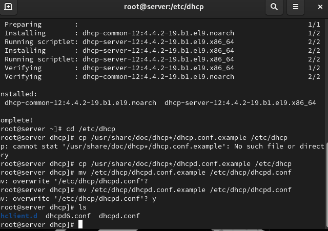
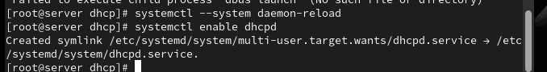
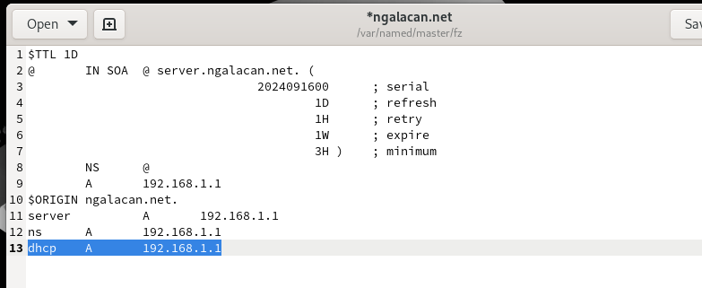
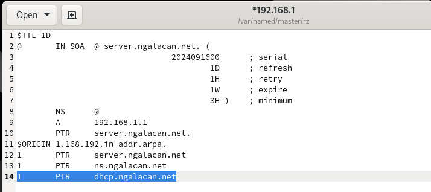
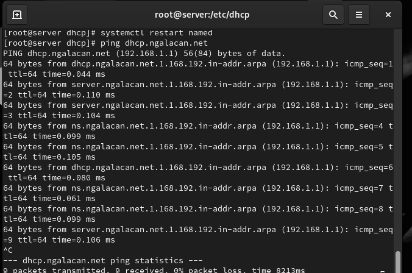
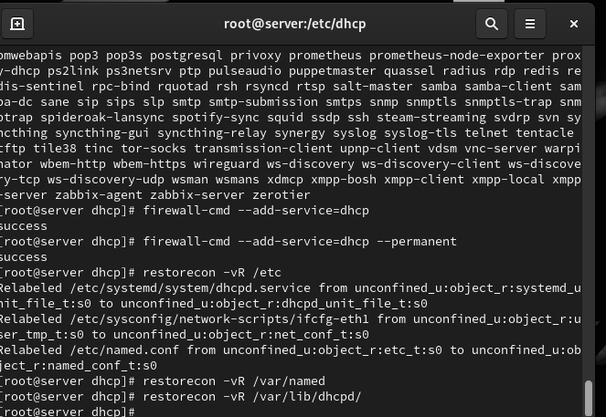
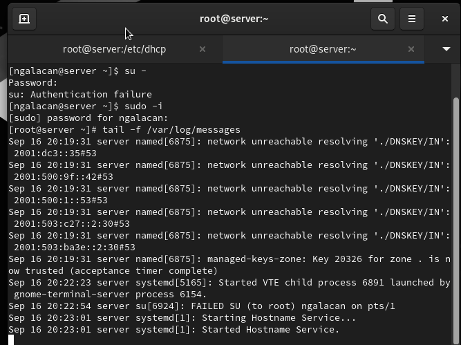
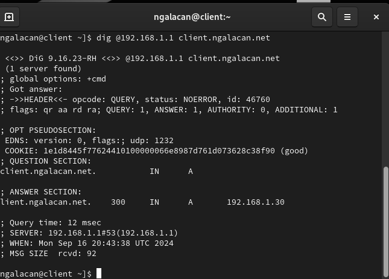

---
## Front matter
lang: ru-RU
title: Презентация по лабораторной работе №3
subtitle: "Настройка DHCP-сервера"
author:
  - Галацан Николай
institute:
  - Российский университет дружбы народов, Москва, Россия

## i18n babel
babel-lang: russian
babel-otherlangs: english

## Formatting pdf
toc: false
toc-title: Содержание
slide_level: 2
aspectratio: 169
section-titles: true
theme: metropolis
header-includes:
 - \metroset{progressbar=frametitle,sectionpage=progressbar,numbering=fraction}
 - '\makeatletter'
 - '\beamer@ignorenonframefalse'
 - '\makeatother'
---


## Докладчик

  * Галацан Николай
  * 1032225763
  * уч. группа: НПИбд-01-22
  * Факультет физико-математических и естественных наук
  * Российский университет дружбы народов

## Цели и задачи

Приобретение практических навыков по установке и конфигурированию DHCP-сервера.

# Установка DHCP-сервера

## Выполнение лабораторной работы

```
dnf -y install dhcp-server

```


#  Конфигурирование DHCP-сервера

## Выполнение лабораторной работы


{#fig:1 width=60%}

## Выполнение лабораторной работы

{#fig:2 width=60%}

## Выполнение лабораторной работы

{#fig:3 width=60%}

## Выполнение лабораторной работы

{#fig:4 width=60%}

## Выполнение лабораторной работы

{#fig:5 width=60%}

## Выполнение лабораторной работы

{#fig:6 width=60%}

## Выполнение лабораторной работы

{#fig:7 width=60%}

## Выполнение лабораторной работы

{#fig:8 width=60%}

## Выполнение лабораторной работы

{#fig:9 width=60%}


# Анализ работы DHCP-сервера

## Выполнение лабораторной работы

{#fig:10 width=60%}

## Выполнение лабораторной работы

{#fig:11 width=60%}

## Выполнение лабораторной работы

{#fig:12 width=60%}

## Выполнение лабораторной работы

{#fig:13 width=60%}

## Выполнение лабораторной работы

{#fig:14 width=60%}

## Выполнение лабораторной работы

{#fig:15 width=60%}

## Выполнение лабораторной работы

{#fig:16 width=60%}

# Анализ работы DHCP-сервера после настройки обновления DNS-зоны

## Выполнение лабораторной работы

{#fig:17 width=60%}

# Внесение изменений в настройки внутреннего окружения виртуальной машины

## Выполнение лабораторной работы

{#fig:18 width=60%}

## Выводы

В результате выполнения работы были приобретены практические навыки по установке и конфигурированию DHCP-сервера.

