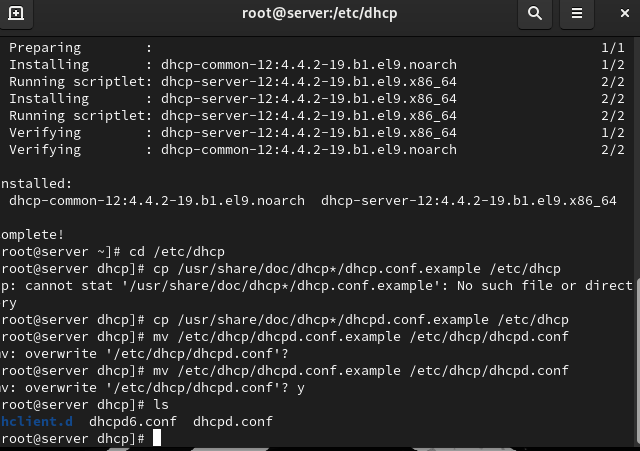
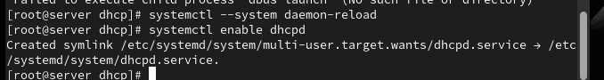
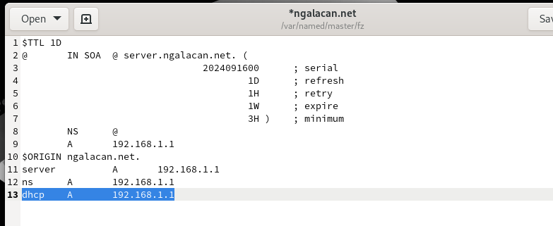
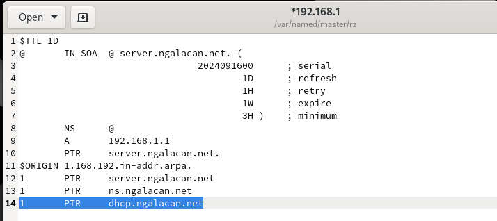
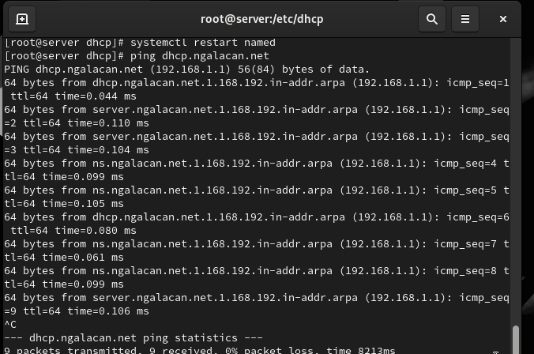
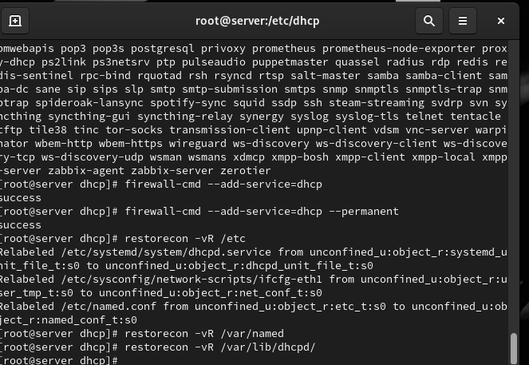
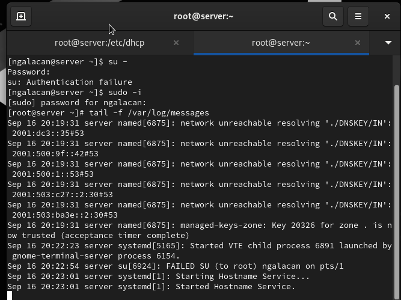
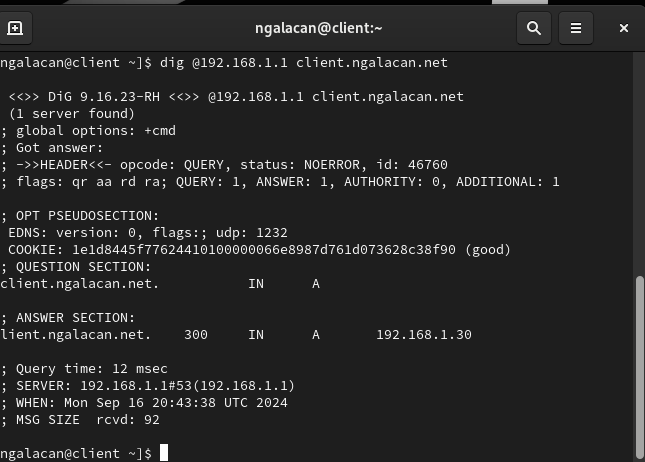

---
## Front matter
title: "Отчет по лабораторной работе №3"
subtitle: "Настройка DHCP-сервера"
author: "Галацан Николай, НПИбд-01-22"

## Generic otions
lang: ru-RU
toc-title: "Содержание"

## Bibliography
bibliography: bib/cite.bib
csl: pandoc/csl/gost-r-7-0-5-2008-numeric.csl

## Pdf output format
toc: true # Table of contents
toc-depth: 2
lof: true # List of figures
lot: false # List of tables
fontsize: 12pt
linestretch: 1.5
papersize: a4
documentclass: scrreprt
## I18n polyglossia
polyglossia-lang:
  name: russian
  options:
	- spelling=modern
	- babelshorthands=true
polyglossia-otherlangs:
  name: english
## I18n babel
babel-lang: russian
babel-otherlangs: english
## Fonts
mainfont: IBM Plex Serif
romanfont: IBM Plex Serif
sansfont: IBM Plex Sans
monofont: IBM Plex Mono
mathfont: STIX Two Math
mainfontoptions: Ligatures=Common,Ligatures=TeX,Scale=0.94
romanfontoptions: Ligatures=Common,Ligatures=TeX,Scale=0.94
sansfontoptions: Ligatures=Common,Ligatures=TeX,Scale=MatchLowercase,Scale=0.94
monofontoptions: Scale=MatchLowercase,Scale=0.94,FakeStretch=0.9
mathfontoptions:
## Biblatex
biblatex: true
biblio-style: "gost-numeric"
biblatexoptions:
  - parentracker=true
  - backend=biber
  - hyperref=auto
  - language=auto
  - autolang=other*
  - citestyle=gost-numeric
## Pandoc-crossref LaTeX customization
figureTitle: "Рис."
tableTitle: "Таблица"
listingTitle: "Листинг"
lofTitle: "Список иллюстраций"
lotTitle: "Список таблиц"
lolTitle: "Листинги"
## Misc options
indent: true
header-includes:
  - \usepackage{indentfirst}
  - \usepackage{float} # keep figures where there are in the text
  - \floatplacement{figure}{H} # keep figures where there are in the text
---

# Цель работы

Приобретение практических навыков по установке и конфигурированию DHCP-сервера.

# Выполнение лабораторной работы

## Установка DHCP-сервера

Запускаю ВМ через рабочий каталог. На ВМ `server` вхожу под собственным пользователем и перехожу в режим суперпользователя. Устанавливаю `dhcp`:
```
dnf -y install dhcp-server

```


##  Конфигурирование DHCP-сервера

Копирую файл примера конфигурации DHCP `dhcpd.conf.example` из каталога
/`usr/share/doc/dhcp*` в каталог `/etc/dhcp` и переименовываю его в файл с названием
`dhcpd.conf` (рис. [-@fig:1]).

{#fig:1 width=70%}

Редактирую файл `/etc/dhcp/dhcpd.conf` (рис. [-@fig:2])

{#fig:2 width=70%}

Настраиваю привязку `dhcpd` к интерфейсу `eth1` виртуальной машины `server`. Ввожу
```
cp /lib/systemd/system/dhcpd.service /etc/systemd/system/

```
и редактирую файл ` /etc/systemd/system/dhcpd.service` (рис. [-@fig:3])

{#fig:3 width=70%}

Перезагружаю конфигурацию `dhcpd` и разрешаю загрузку DHCP-сервера при запуске виртуальной машины `server` (рис. [-@fig:4])

{#fig:4 width=70%}

Добавляю запись для DHCP-сервера в конце файла прямой DNS-зоны (рис. [-@fig:5]) и в конце файла обратной зоны (рис. [-@fig:6]).

{#fig:5 width=70%}

{#fig:6 width=70%}

Перезапускаю `named` и обращаюсь к DHCP-серверу по имени (рис. [-@fig:7]). 

{#fig:7 width=80%}

Вношу изменения в настройки межсетевого экрана узла `server`, разрешив работу с DHCP. Восстанавливаю контекст безопасности SELinux (рис. [-@fig:8])

{#fig:8 width=70%}

В дополнительном терминале запускаю мониторинг происходящих в системе процессов в реальном времени (рис. [-@fig:9]).

{#fig:9 width=70%}

В основном терминале запускаю DHCP-сервер.

## Анализ работы DHCP-сервера

Проверяю файл `01-routing.sh` в подкаталоге `vagrant/provision/client` (рис. [-@fig:10]). В Vagrantfile проверяю, что скрипт подключен.

{#fig:10 width=70%}

Включаю ВМ `client`. На `server` вижу запись о подключении к ВМ узла `client` и выдачи ему
IP-адреса из соответствующего диапазона адресов (рис. [-@fig:11]).

{#fig:11 width=70%}

Также просматриваю файл ` /var/lib/dhcpd/dhcpd.leases` (рис. [-@fig:12])

{#fig:12 width=70%}

На ВМ `client` ввожу `ifconfig` и просматриваю имеющиеся интерфейсы  (рис. [-@fig:13])

{#fig:13 width=70%}

Редактирую файл `/etc/named/ngalacan.net` (рис. [-@fig:14]).

{#fig:14 width=70%}

Перезапускаю DNS-сервер. Редактирую файл `/etc/dhcp/dhcpd.conf` (рис. [-@fig:15]).

{#fig:15 width=70%}

Перезапускаю DHCP-сервер. В каталоге прямой DNS-зоны появился файл `ngalacan.net.jnl` (рис. [-@fig:16]).

{#fig:16 width=70%}

## Анализ работы DHCP-сервера после настройки обновления DNS-зоны


На виртуальной машине `client` открываю терминал и с помощью утилиты `dig` убеждаюсь в наличии DNS-записи о клиенте в прямой DNS-зоне (рис. [-@fig:17]).

{#fig:17 width=70%}

## Внесение изменений в настройки внутреннего окружения виртуальной машины

На ВМ `server` перехожу в каталог для внесения изменений в настройки внутреннего окружения `/vagrant/provision/server/`, создаю в нём каталог `dhcp`, в который помещаю в соответствующие подкаталоги конфигурационные файлы DHCP:

```
cd /vagrant/provision/server
mkdir -p /vagrant/provision/server/dhcp/etc/dhcp
mkdir -p /vagrant/provision/server/dhcp/etc/systemd/system
cp -R /etc/dhcp/dhcpd.conf /vagrant/provision/server/dhcp/etc/dhcp/
cp -R /etc/systemd/system/dhcpd.service 
            /vagrant/provision/server/dhcp/etc/systemd/system/
```

Заменяю конфигурационные файлы DNS-сервера:

```
cd /vagrant/provision/server/dns/
cp -R /var/named/* /vagrant/provision/server/dns/var/named/
cp -R /etc/named/* /vagrant/provision/server/dns/etc/named/
```

В каталоге `/vagrant/provision/server` создаю исполняемый файл `dhcp.sh` (рис. [-@fig:18]).

{#fig:18 width=70%}

Для отработки скрипта во время запуска добавляю в Vagrantfile в разделе конфигурации для сервера 

```
server.vm.provision "server dhcp",
	type: "shell",
	preserve_order: true,
	path: "provision/server/dhcp.sh"

```
После этого выключаю ВМ:
```
vagrant halt client
vagrant halt server

```


# Выводы

В результате выполнения работы были приобретены практические навыки по установке и конфигурированию DHCP-сервера.

# Ответы на контрольные вопросы

1. В каких файлах хранятся настройки сетевых подключений? 

- В Linux настройки сети обычно хранятся в текстовых файлах в
директории `/etc/network/` или `/etc/sysconfig/network-scripts/`.

2. За что отвечает протокол DHCP? 

- Протокол DHCP (Dynamic Host Configuration Protocol) отвечает за автоматическое присвоение
сетевых настроек устройствам в сети, таких как IP-адресов,
маски подсети, шлюза, DNS-серверов и других параметров.

3. Поясните принцип работы протокола DHCP. Какими сообщениями обмениваются клиент и сервер, используя протокол DHCP? 

- Принцип работы протокола DHCP:

Discover (Обнаружение): Клиент отправляет в сеть запрос на
обнаружение DHCP-сервера.

Offer (Предложение): DHCP-сервер отвечает клиенту, предлагая
ему конфигурацию сети.

Request (Запрос): Клиент принимает предложение и отправляет
запрос на использование предложенной конфигурации.

Acknowledgment (Подтверждение): DHCP-сервер подтверждает
клиенту, что предложенная конфигурация принята и может быть
использована.

4. В каких файлах обычно находятся настройки DHCP-сервера? За что
отвечает каждый из файлов? 

- Настройки DHCP-сервера обычно
хранятся в файлах конфигурации, таких как `/etc/dhcp/dhcpd.conf`. Они содержат информацию о диапазонах IP-адресов, параметрах сети и других опциях DHCP.


5. Что такое DDNS? Для чего применяется DDNS? 

- DDNS (Dynamic Domain Name System) - это система динамического доменного
имени. Она используется для автоматического обновления записей DNS, когда IP-адрес узла изменяется. DDNS применяется, например, в домашних сетях, где IP-адреса часто изменяются
посредством DHCP.

6. Какую информацию можно получить, используя утилиту ifconfig? Приведите примеры с использованием различных опций. 

- Утилита `ifconfig` используется для получения информации о сетевых
интерфейсах.

Примеры:

`ifconfig`: Показывает информацию обо всех активных сетевых
интерфейсах.

`ifconfig eth0`: Показывает информацию о конкретном интерфейсе
(в данном случае, eth0).

7. Какую информацию можно получить, используя утилиту ping? Приведите примеры с использованием различных опций. - Утилита `ping` используется для проверки доступности узла в сети.

Примеры:

`ping google.com`: Пингует домен google.com.

`ping -c 4 192.168.1.1`: Пингует IP-адрес 192.168.1.1 и отправляет 4
эхо-запроса.

