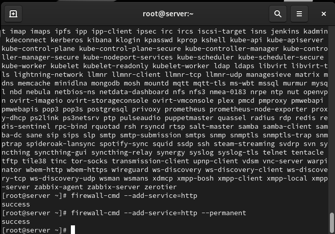
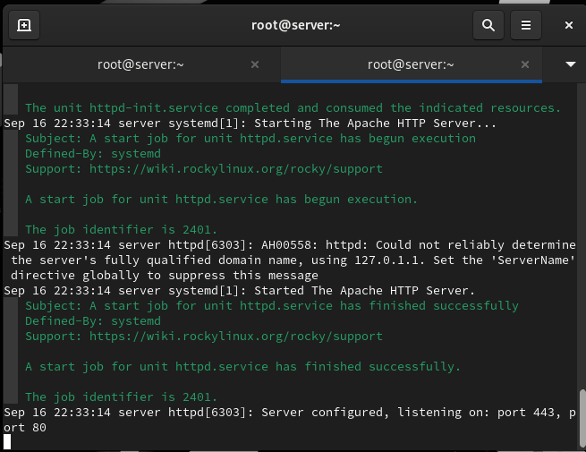
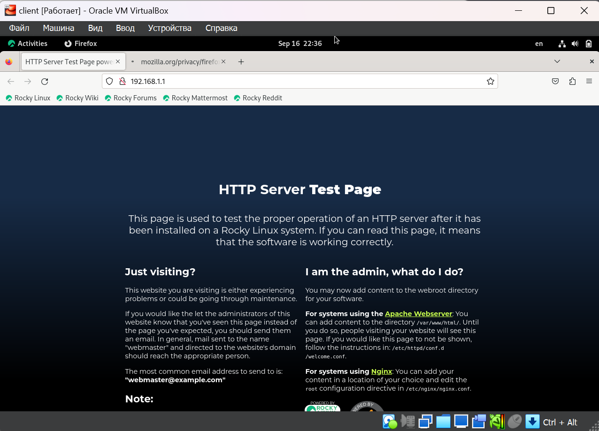
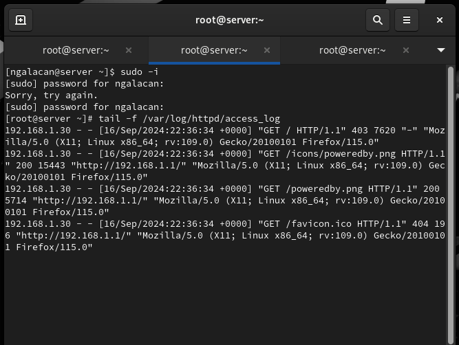
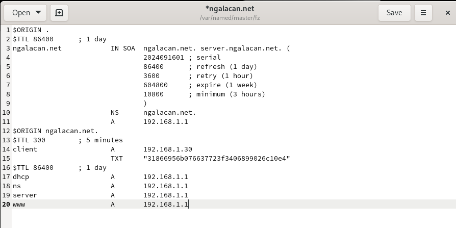
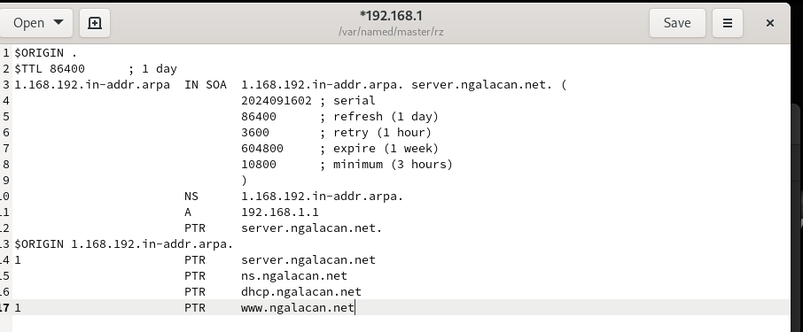
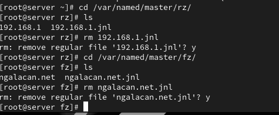
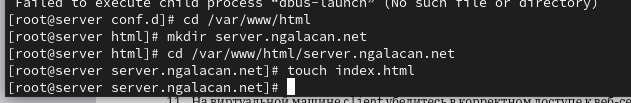
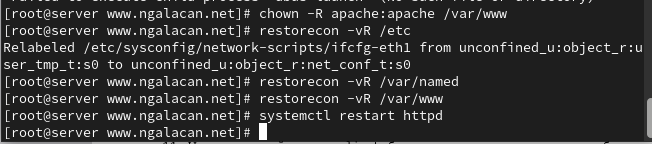

---
## Front matter
lang: ru-RU
title: Презентация по лабораторной работе №4
subtitle: "Базовая настройка HTTP-сервера Apache"
author:
  - Галацан Николай
institute:
  - Российский университет дружбы народов, Москва, Россия

## i18n babel
babel-lang: russian
babel-otherlangs: english

## Formatting pdf
toc: false
toc-title: Содержание
slide_level: 2
aspectratio: 169
section-titles: true
theme: metropolis
header-includes:
 - \metroset{progressbar=frametitle,sectionpage=progressbar,numbering=fraction}
 - '\makeatletter'
 - '\beamer@ignorenonframefalse'
 - '\makeatother'
---


## Докладчик

  * Галацан Николай
  * 1032225763
  * уч. группа: НПИбд-01-22
  * Факультет физико-математических и естественных наук
  * Российский университет дружбы народов

## Цели и задачи

Приобретение практических навыков по установке и базовому конфигурированию
HTTP-сервера Apache.

# Установка HTTP-сервера

## Выполнение лабораторной работы

```
LANG=C yum grouplist
dnf -y groupinstall "Basic Web Server"

```


# Базовое конфигурирование HTTP-сервера

## Выполнение лабораторной работы

{#fig:1 width=60%}

## Выполнение лабораторной работы

{#fig:2 width=60%}

## Выполнение лабораторной работы

{#fig:3 width=60%}

# Анализ работы HTTP-сервера 

## Выполнение лабораторной работы


{#fig:4 width=60%}

## Выполнение лабораторной работы

{#fig:5 width=60%}

## Выполнение лабораторной работы

{#fig:6 width=60%}

# Настройка виртуального хостинга для HTTP-сервера

## Выполнение лабораторной работы

{#fig:7 width=70%}

## Выполнение лабораторной работы

{#fig:8 width=70%}

## Выполнение лабораторной работы

{#fig:9 width=70%}

## Выполнение лабораторной работы

{#fig:10 width=70%}

## Выполнение лабораторной работы

{#fig:11 width=70%}

## Выполнение лабораторной работы
{#fig:12 width=70%}

## Выполнение лабораторной работы

{#fig:13 width=70%}

## Выполнение лабораторной работы

{#fig:14 width=70%} 

## Выполнение лабораторной работы

{#fig:15 width=70%}


# Внесение изменений в настройки внутреннего окружения виртуальной машины

## Выполнение лабораторной работы

{#fig:16 width=70%}

## Выводы

В результате выполнения работы были приобретены практические навыки по установке и базовому конфигурированию
HTTP-сервера Apache.
