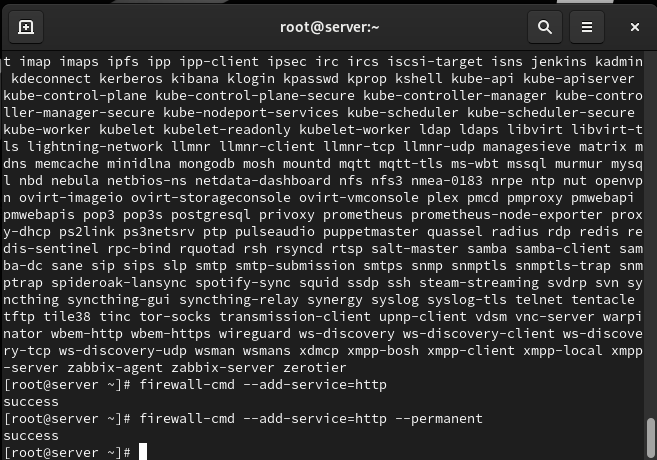
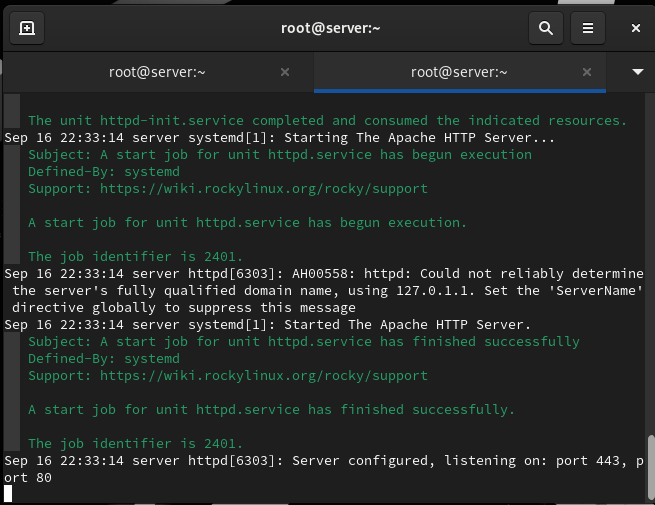
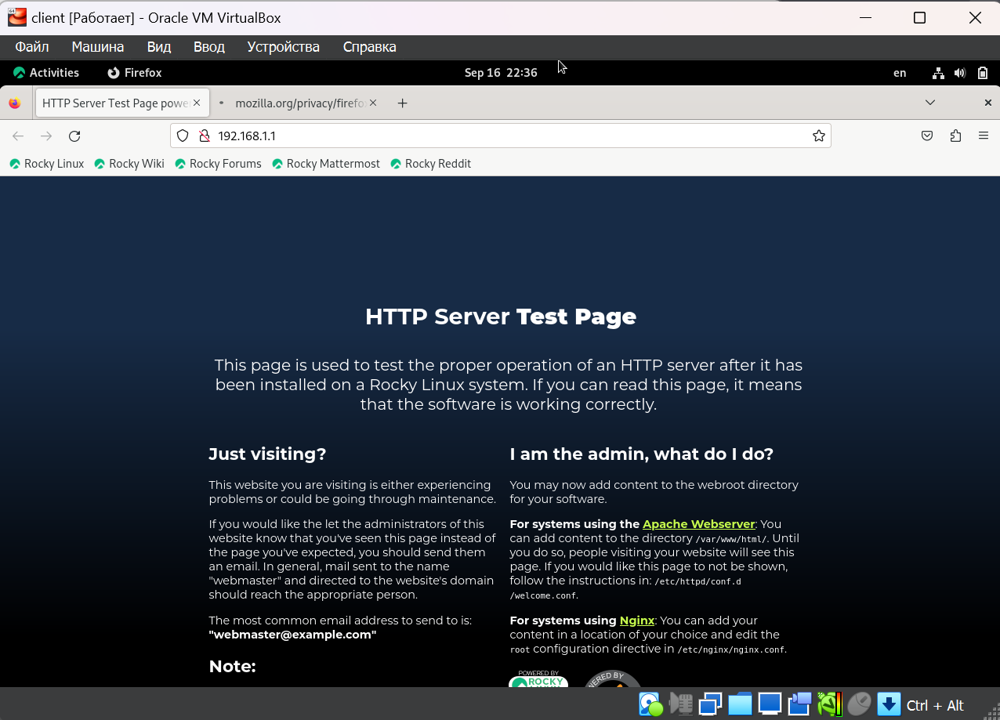
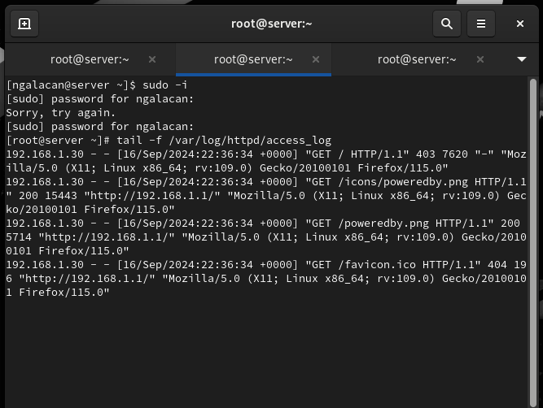
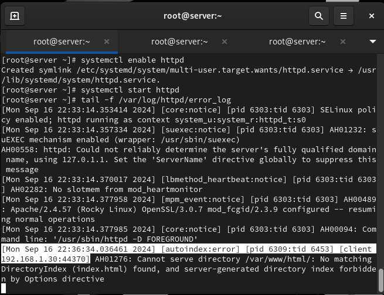
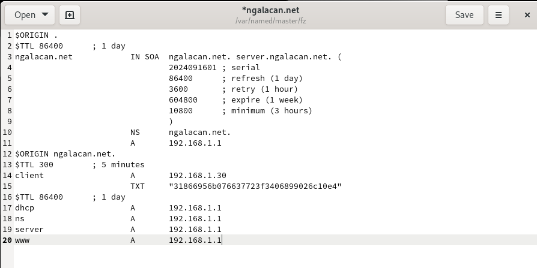
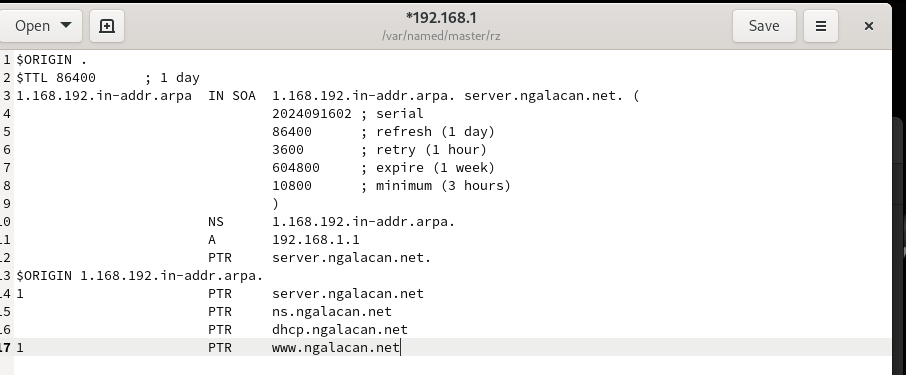
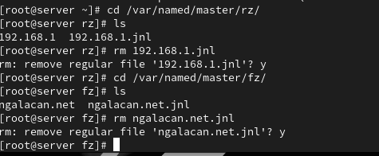
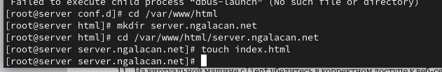
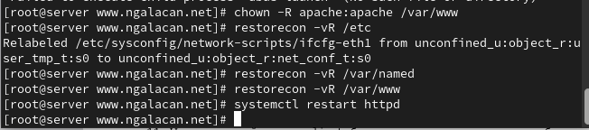

---
## Front matter
title: "Отчет по лабораторной работе №4"
subtitle: "Базовая настройка HTTP-сервера Apache"
author: "Галацан Николай, НПИбд-01-22"

## Generic otions
lang: ru-RU
toc-title: "Содержание"

## Bibliography
bibliography: bib/cite.bib
csl: pandoc/csl/gost-r-7-0-5-2008-numeric.csl

## Pdf output format
toc: true # Table of contents
toc-depth: 2
lof: true # List of figures
lot: false # List of tables
fontsize: 12pt
linestretch: 1.5
papersize: a4
documentclass: scrreprt
## I18n polyglossia
polyglossia-lang:
  name: russian
  options:
	- spelling=modern
	- babelshorthands=true
polyglossia-otherlangs:
  name: english
## I18n babel
babel-lang: russian
babel-otherlangs: english
## Fonts
mainfont: IBM Plex Serif
romanfont: IBM Plex Serif
sansfont: IBM Plex Sans
monofont: IBM Plex Mono
mathfont: STIX Two Math
mainfontoptions: Ligatures=Common,Ligatures=TeX,Scale=0.94
romanfontoptions: Ligatures=Common,Ligatures=TeX,Scale=0.94
sansfontoptions: Ligatures=Common,Ligatures=TeX,Scale=MatchLowercase,Scale=0.94
monofontoptions: Scale=MatchLowercase,Scale=0.94,FakeStretch=0.9
mathfontoptions:
## Biblatex
biblatex: true
biblio-style: "gost-numeric"
biblatexoptions:
  - parentracker=true
  - backend=biber
  - hyperref=auto
  - language=auto
  - autolang=other*
  - citestyle=gost-numeric
## Pandoc-crossref LaTeX customization
figureTitle: "Рис."
tableTitle: "Таблица"
listingTitle: "Листинг"
lofTitle: "Список иллюстраций"
lotTitle: "Список таблиц"
lolTitle: "Листинги"
## Misc options
indent: true
header-includes:
  - \usepackage{indentfirst}
  - \usepackage{float} # keep figures where there are in the text
  - \floatplacement{figure}{H} # keep figures where there are in the text
---

# Цель работы

Приобретение практических навыков по установке и базовому конфигурированию
HTTP-сервера Apache.

# Выполнение лабораторной работы

## Установка HTTP-сервера

Запускаю ВМ через рабочий каталог. На ВМ `server` вхожу под собственным пользователем и перехожу в режим суперпользователя. Устанавливаю стандартный веб-сервер:
```
LANG=C yum grouplist
dnf -y groupinstall "Basic Web Server"

```


## Базовое конфигурирование HTTP-сервера

Просматриваю содержание конфигурационных файлов в каталогах `/etc/httpd/conf` и `/etc/httpd/conf.d` (рис. [-@fig:1]).

{#fig:1 width=70%}

Вношу изменения в настройки межсетевого экрана узла `server`, разрешив работу с http (рис. [-@fig:2])

{#fig:2 width=70%}

Во втором терминале открываю расширенный лог системных сообщений. В первом терминале активирую и запускаю HTTP-сервер:
```
systemctl enable httpd
systemctl start httpd
```
В логе системных сообщений вижу, что веб-сервер запущен (рис. [-@fig:3])

{#fig:3 width=70%}

## Анализ работы HTTP-сервера 

На виртуальной машине `server` открываю лог ошибок работы веб-сервера: `tail -f /var/log/httpd/error_log`;  мониторинг доступа к веб-серверу: `tail -f /var/log/httpd/access_log`.

Запустив ВМ `client`, открываю браузер и в адресной строке ввожу `192.168.1.1` (рис. [-@fig:4])

{#fig:4 width=70%}

Вижу записи в мониторинге доступа (рис. [-@fig:5]) и в логе ошибок о подключении к серверу (рис. [-@fig:6]).

{#fig:5 width=70%}

{#fig:6 width=70%}

## Настройка виртуального хостинга для HTTP-сервера

Останавливаю работу DNS-сервера. Добавляю  запись для HTTP-сервера в конце файла прямой DNS-зоны (рис. [-@fig:7]). 

{#fig:7 width=70%}

Добавляю также запись в конце файла обратной зоны (рис. [-@fig:8])

{#fig:8 width=70%}

Удаляю из соответствующих каталогов файлы журналов DNS (рис. [-@fig:9]).

{#fig:9 width=70%}

Перезапускаю DNS-сервер. В каталоге `/etc/httpd/conf.d` создаю файлы `server.ngalacan.net.conf` и
`www.ngalacan.net.conf` :
```
cd /etc/httpd/conf.d
touch server.ngalacan.net.conf
touch www.ngalacan.net.conf
```

Редактирую `server.ngalacan.net.conf`  (рис. [-@fig:10]).

{#fig:10 width=70%}

Редактирую `www.ngalacan.net.conf`  (рис. [-@fig:11]).

{#fig:11 width=70%}

Перехожу в `/var/www/html` создаю каталог `server.ngalacan.net` и в нем файл `index.html` (рис. [-@fig:12]). Ввожу в файл сообщение *Welcome to the server.ngalacan.net server.* Аналогично создаю каталог и файл для `www.ngalacan.net`.

{#fig:12 width=70%}

Корректирую права доступа в каталог с веб-контентом, восстанавливаю контекст безопасности в SELinux, перезагружаю HTTP-сервер (рис. [-@fig:13])

{#fig:13 width=70%}

На ВМ `client` ввожу в адресную строку браузера `server.ngalacan.net`  (рис. [-@fig:14]) и `www.ngalacan.net` (рис. [-@fig:15]).

{#fig:14 width=70%} 

{#fig:15 width=70%}


## Внесение изменений в настройки внутреннего окружения виртуальной машины

На ВМ `server` перехожу в каталог для внесения изменений в настройки внутреннего окружения `/vagrant/provision/server/`, создаю в нём каталог `http`, в который помещаю в соответствующие подкаталоги конфигурационные файлы HTTP-сервера:
```
cd /vagrant/provision/server
mkdir -p /vagrant/provision/server/http/etc/httpd/conf.d
mkdir -p /vagrant/provision/server/http/var/www/html
cp -R /etc/httpd/conf.d/*
↪ /vagrant/provision/server/http/etc/httpd/conf.d/
cp -R /var/www/html/* /vagrant/provision/server/http/var/www/html
```
Заменяю конфигурационные файлы DNS-сервера:

```
cd /vagrant/provision/server/dns/
cp -R /var/named/* /vagrant/provision/server/dns/var/named/
```

В каталоге `/vagrant/provision/server` создаю исполняемый файл `http.sh` (рис. [-@fig:16]).

{#fig:16 width=70%}


Для отработки скрипта во время запуска добавляю в Vagrantfile в разделе конфигурации для сервера 

```
server.vm.provision "server http",
	type: "shell",
	preserve_order: true,
	path: "provision/server/http.sh"

```
После этого выключаю ВМ:
```
vagrant halt client
vagrant halt server

```

# Выводы

В результате выполнения работы были приобретены практические навыки по установке и базовому конфигурированию
HTTP-сервера Apache.

# Ответы на контрольные вопросы

1. Через какой порт по умолчанию работает Apache? 

- По умолчанию Apache работает через порт 80 для HTTP и порт 443 для HTTPS.

2. Под каким пользователем запускается Apache и к какой группе относится этот пользователь?

- Apache обычно запускается от имени
пользователя www-data (или apache, в зависимости от дистрибутива)
и относится к группе с тем же именем.

3. Где располагаются лог-файлы веб-сервера? Что можно по ним
отслеживать? 

- Лог-файлы веб-сервера обычно располагаются в
директории логов. Например, в Ubuntu логи Apache хранятся в
/var/log/apache2/, а в CentOS - в /etc/httpd/logs/. Лог-файлы содержат
информацию о запросах к серверу, ошибки, статусы запросов и
другие события, что позволяет администраторам отслеживать
активность и выявлять проблемы.

4. Где по умолчанию содержится контент веб-серверов? 

- Контент веб-серверов по умолчанию обычно находится в директории, называемой
"DocumentRoot". Например, в Apache на Linux DocumentRoot по
умолчанию установлен в `/var/www/html/`. В этой директории
содержатся файлы, которые веб-сервер отдает при запросах.

5. Каким образом реализуется виртуальный хостинг? Что он даёт? 

- Виртуальный хостинг в Apache позволяет хостить несколько сайтов
на одном сервере. Разные сайты
обслуживаются на одном IP-адресе, но на разных доменных именах.
Это основывается на значении заголовка "Host" в HTTP-запросе,
который используется для определения, какой виртуальный хост
должен обработать запрос.
Виртуальный хостинг позволяет хозяину сервера размещать
несколько сайтов на одном физическом сервере, управлять ими
независимо, и предоставлять услуги хостинга для различных
клиентов или проектов.
