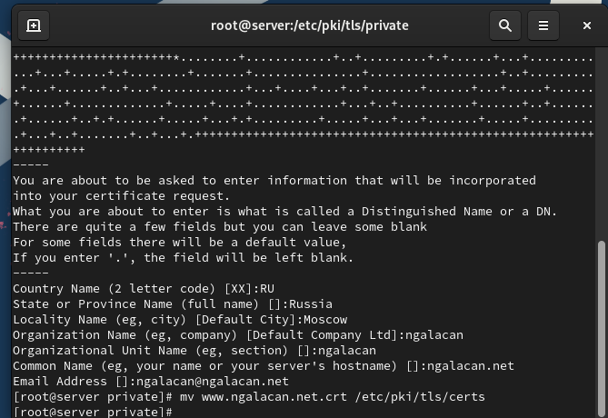
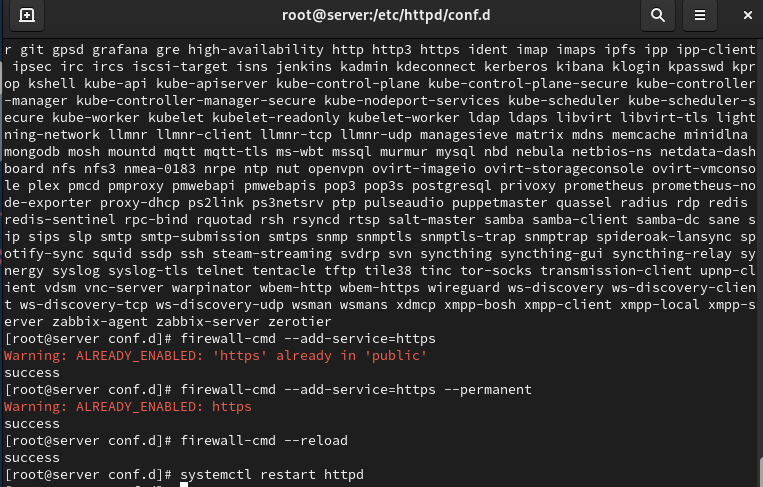
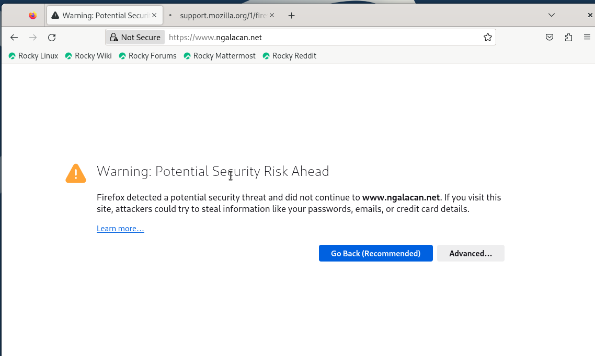
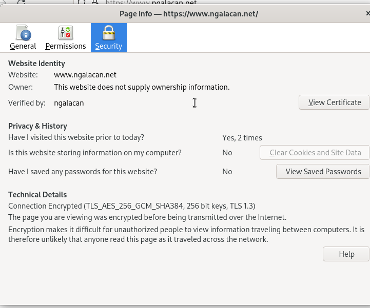
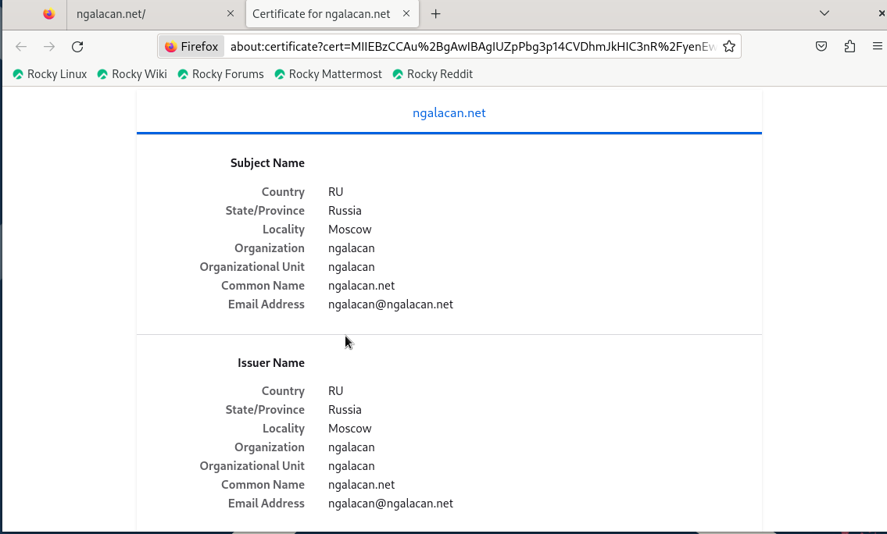
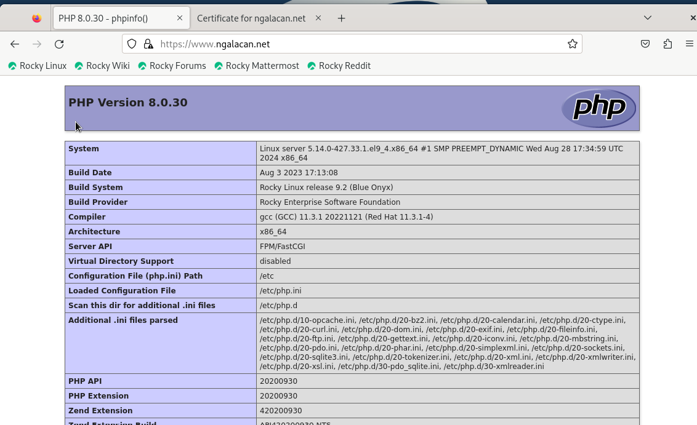
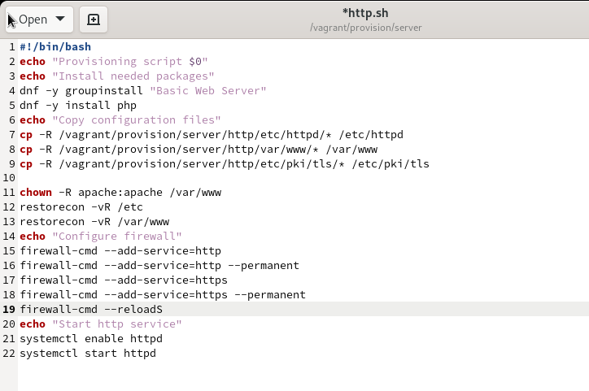

---
## Front matter
title: "Отчет по лабораторной работе №5"
subtitle: "Расширенная настройка HTTP-сервера Apache"
author: "Галацан Николай, НПИбд-01-22"

## Generic otions
lang: ru-RU
toc-title: "Содержание"

## Bibliography
bibliography: bib/cite.bib
csl: pandoc/csl/gost-r-7-0-5-2008-numeric.csl

## Pdf output format
toc: true # Table of contents
toc-depth: 2
lof: true # List of figures
lot: false # List of tables
fontsize: 12pt
linestretch: 1.5
papersize: a4
documentclass: scrreprt
## I18n polyglossia
polyglossia-lang:
  name: russian
  options:
	- spelling=modern
	- babelshorthands=true
polyglossia-otherlangs:
  name: english
## I18n babel
babel-lang: russian
babel-otherlangs: english
## Fonts
mainfont: IBM Plex Serif
romanfont: IBM Plex Serif
sansfont: IBM Plex Sans
monofont: IBM Plex Mono
mathfont: STIX Two Math
mainfontoptions: Ligatures=Common,Ligatures=TeX,Scale=0.94
romanfontoptions: Ligatures=Common,Ligatures=TeX,Scale=0.94
sansfontoptions: Ligatures=Common,Ligatures=TeX,Scale=MatchLowercase,Scale=0.94
monofontoptions: Scale=MatchLowercase,Scale=0.94,FakeStretch=0.9
mathfontoptions:
## Biblatex
biblatex: true
biblio-style: "gost-numeric"
biblatexoptions:
  - parentracker=true
  - backend=biber
  - hyperref=auto
  - language=auto
  - autolang=other*
  - citestyle=gost-numeric
## Pandoc-crossref LaTeX customization
figureTitle: "Рис."
tableTitle: "Таблица"
listingTitle: "Листинг"
lofTitle: "Список иллюстраций"
lotTitle: "Список таблиц"
lolTitle: "Листинги"
## Misc options
indent: true
header-includes:
  - \usepackage{indentfirst}
  - \usepackage{float} # keep figures where there are in the text
  - \floatplacement{figure}{H} # keep figures where there are in the text
---

# Цель работы

Приобретение практических навыков по расширенному конфигурированию HTTP-сервера Apache в части безопасности и возможности использования PHP.

# Выполнение лабораторной работы

## Конфигурирование HTTP-сервера для работы через протокол HTTPS

Запускаю ВМ через рабочий каталог. На ВМ `server` вхожу под собственным пользователем и перехожу в режим суперпользователя. В каталоге `/etc/ssl` создаю каталог `private`:
```
mkdir -p /etc/pki/tls/private
ln -s /etc/pki/tls/private /etc/ssl/private
cd /etc/pki/tls/private
```

Генерирую ключ и сертификат (рис. [-@fig:1]), введя следующую команду:
```
openssl req -x509 -nodes -newkey rsa:2048 -keyout www.ngalacan.net.key 
    ↪ -out www.ngalacan.net.crt

```
{#fig:1 width=70%}

Сгенерированные ключ и сертификат появляются в соответствующем каталоге `/etc/ssl/private`. Копирую сертификат в каталог `/etc/ssl/certs` (рис. [-@fig:2])

{#fig:2 width=70%}

Редактирую конфигурационный файл  `/etc/httpd/conf.d/www.ngalacan.net` (рис. [-@fig:3])

{#fig:3 width=70%}

Вношу изменения в настройки межсетевого экрана на сервере, перезапускаю веб-сервер (рис. [-@fig:4])

{#fig:4 width=70%}

На ВМ `client` открываю в браузере страницу `www.ngalacan.net` с сообщением о незащищенности соединения (рис. [-@fig:5]). Добавив страницу в исключения, просматриваю информацию о сертификате (рис. [-@fig:6]), (рис. [-@fig:7]). 

{#fig:5 width=70%}

{#fig:6 width=70%}

{#fig:7 width=70%}

## Конфигурирование HTTP-сервера для работы с PHP

Устанавливаю пакеты для работы с PHP: `dnf -y install php`.

В каталоге `/var/www/html/www.ngalacan.net` заменяю `index.html` на `index.php` (рис. [-@fig:8]).

{#fig:8 width=70%}

Редактирую `index.php` (рис. [-@fig:9]).

{#fig:9 width=70%}

Корректирую права доступа в каталог с веб-контентом, восстанавливаю контекст безопасности в SELinux, перезагружаю HTTP-сервер:
```
chown -R apache:apache /var/www

restorecon -vR /etc
restorecon -vR /var/www

systemctl restart httpd

```

На ВМ `client` ввожу в адресную строку браузера `www.ngalacan.net` и вижу веб-страницу с информацией об используемой версии PHP (рис. [-@fig:10]).

{#fig:10 width=70%}


## Внесение изменений в настройки внутреннего окружения виртуальной машины

На ВМ `server` перехожу в каталог для внесения изменений в настройки внутреннего окружения `/vagrant/provision/server/` и копирую в соответствующие каталоги конфигурационные файлы:
```
cp -R /etc/httpd/conf.d/* /vagrant/provision/server/http/etc/httpd/conf.d
cp -R /var/www/html/* /vagrant/provision/server/http/var/www/html
mkdir -p /vagrant/provision/server/http/etc/pki/tls/private
mkdir -p /vagrant/provision/server/http/etc/pki/tls/certs
cp -R /etc/pki/tls/private/www.user.net.key
	↪ /vagrant/provision/server/http/etc/pki/tls/private
cp -R /etc/pki/tls/certs/www.user.net.crt
	↪ /vagrant/provision/server/http/etc/pki/tls/certs
```

В скрипт `/vagrant/provision/server/http.sh` вношу изменения, добавив установку PHP и настройку межсетевого экрана для работы с `https` (рис. [-@fig:11]).

{#fig:11 width=70%}

# Выводы

В результате выполнения работы были приобретены практические навыки по расширенному конфигурированию HTTP-сервера Apache в части безопасности и возможности использования PHP.

# Ответы на контрольные вопросы

1. В чём отличие HTTP от HTTPS? 

- **HTTP** (HyperText Transfer Protocol) – это протокол передачи
данных, который используется для передачи информации
между клиентом (например, веб-браузером) и сервером. Однако
он не обеспечивает шифрование данных, что делает их
уязвимыми к перехвату злоумышленниками. 

- **HTTPS** (HyperText Transfer Protocol Secure) - это расширение
протокола HTTP с добавлением шифрования, обеспечивающее
безопасную передачу данных между клиентом и сервером. Протокол HTTPS использует SSL (Secure Sockets Layer) или более современный TLS (Transport Layer Security) для
шифрования данных.

2. Каким образом обеспечивается безопасность контента веб-сервера при работе через HTTPS? 

- Шифрование данных: при использовании HTTPS данные,
передаваемые между клиентом и сервером, шифруются, что
делает их невозможными для прочтения злоумышленниками,
перехватывающими трафик.

- Идентификация сервера: сервер предоставляет цифровой
сертификат, подтверждающий его легитимность. Этот
сертификат выдается сертификационным центром и содержит
информацию о владельце сертификата, публичный ключ для
шифрования и подпись, подтверждающую подлинность
сертификата.

3. Что такое сертификационный центр? 
- Сертификационный центр (Центр сертификации) - это доверенная сторона, которая выдает цифровые
сертификаты, подтверждающие подлинность владельца сертификата.
Пример: Одним из известных сертификационных центров
является "Let's Encrypt". Он предоставляет бесплатные SSL-
сертификаты, которые используются для обеспечения безопасного соединения на множестве веб-сайтов. Владельцы
веб-сайтов могут получить сертификат от Let's Encrypt, чтобы
обеспечить шифрование и подтвердить свою легитимность в
онлайн-среде.


