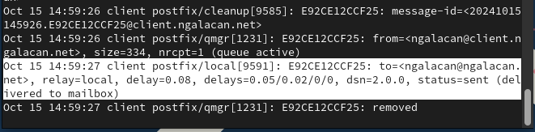

---
## Front matter
title: "Отчет по лабораторной работе №8"
subtitle: "Настройка SMTP-сервера"
author: "Галацан Николай, НПИбд-01-22"

## Generic otions
lang: ru-RU
toc-title: "Содержание"

## Bibliography
bibliography: bib/cite.bib
csl: pandoc/csl/gost-r-7-0-5-2008-numeric.csl

## Pdf output format
toc: true # Table of contents
toc-depth: 2
lof: true # List of figures
lot: false # List of tables
fontsize: 12pt
linestretch: 1.5
papersize: a4
documentclass: scrreprt
## I18n polyglossia
polyglossia-lang:
  name: russian
  options:
	- spelling=modern
	- babelshorthands=true
polyglossia-otherlangs:
  name: english
## I18n babel
babel-lang: russian
babel-otherlangs: english
## Fonts
mainfont: IBM Plex Serif
romanfont: IBM Plex Serif
sansfont: IBM Plex Sans
monofont: IBM Plex Mono
mathfont: STIX Two Math
mainfontoptions: Ligatures=Common,Ligatures=TeX,Scale=0.94
romanfontoptions: Ligatures=Common,Ligatures=TeX,Scale=0.94
sansfontoptions: Ligatures=Common,Ligatures=TeX,Scale=MatchLowercase,Scale=0.94
monofontoptions: Scale=MatchLowercase,Scale=0.94,FakeStretch=0.9
mathfontoptions:
## Biblatex
biblatex: true
biblio-style: "gost-numeric"
biblatexoptions:
  - parentracker=true
  - backend=biber
  - hyperref=auto
  - language=auto
  - autolang=other*
  - citestyle=gost-numeric
## Pandoc-crossref LaTeX customization
figureTitle: "Рис."
tableTitle: "Таблица"
listingTitle: "Листинг"
lofTitle: "Список иллюстраций"
lotTitle: "Список таблиц"
lolTitle: "Листинги"
## Misc options
indent: true
header-includes:
  - \usepackage{indentfirst}
  - \usepackage{float} # keep figures where there are in the text
  - \floatplacement{figure}{H} # keep figures where there are in the text
---

# Цель работы

Приобретение практических навыков по установке и конфигурированию SMTP-сервера.


# Выполнение лабораторной работы

## Установка Postfix

Запускаю ВМ через рабочий каталог. На ВМ `server` вхожу под собственным пользователем и перехожу в режим суперпользователя. Устанавливаб необходимые пакеты:
```
dnf -y install postfix
dnf -y install s-nail
```

Конфигурирую межсетевой экран, восстанавливаю контекст безопасности, запускаю Postfix (рис. [-@fig:1]).

{#fig:1 width=70%}

## Изменение параметров Postfix с помощью postconf

Просматриваю текущие настройки, введя `postconf`. Просматриваю значения `myorigin` и `mydomain`. Заменяю значение параметра `myorigin` на `mydomain` и проверяю замену. Проверяю корректность содержания конфигурационного файла, введя `postfix check`, перезагружаю конф. файлы Postfix, просматриваю все параметры со значением, отличным от значения по умолчанию (рис. [-@fig:2])

{#fig:2 width=70%}

Задаю жестко значение домена, отключаю IPv6 в списке разрешенных в работе протоколов, оставив только IPv4, после чего перезагружаю Postfix (рис. [-@fig:3])

{#fig:3 width=70%}

## Проверка работы Postfix

Ввожу команду для отправки себе письма: 
```
echo .| mail -s test1 ngalacan@server.ngalacan.net
```

На втором терминале запускаю мониторинг работы почтовой службы и вижу сообщение о доставке (рис. [-@fig:4])

{#fig:4 width=70%}

Просматриваю содержимое `/var/spool/mail` и убеждаюсь, что письмо в файле `ngalacan` появилось (рис. [-@fig:5]). 

{#fig:5 width=70%}

На ВМ `client` перехожу в режим суперпользователя и устанавливаю аналогично необходимые пакеты. Отключаю IPv6 в списке разрешенных в работе протоколов, оставив только IPv4, запускаю Postfix (рис. [-@fig:6]). 

{#fig:6 width=70%}

Аналогичным образом отправляю себе второе письмо через клиент. Письмо на сервер не доставлено.

На сервере изменяю конфигурацию Postfix, разрешив Postfix прослушивать соединения не только с локального узла, но и с других интерфейсов сети. Добавляю адрес внутренней сети, разрешив пересылку между узлами сети. Перезагружаю конфигурацию Postfix и перезапускаю его:

```
postconf inet_interfaces
postconf mynetworks
postconf -e 'inet_interfaces = all'
postconf -e 'mynetworks = 127.0.0.0/8, 192.168.0.0/16'
postfix check
systemctl reload postfix
systemctl stop postfix
systemctl start postfix

```

Повторяю отправку письма и проверяю. Вижу в журнале сообщения о том, что установлено соединение с сервером, письмо получено, соединение разорвано (рис. [-@fig:7]).

{#fig:7 width=70%}

## Конфигурация Postfix для домена

С клиента отправляю письмо на свой доменный адрес:

```
echo .| mail -s test2 ngalacan@ngalacan.net
```

Запустив мониторинг работы почтовой службы, вижу, что сообщение не доставлено (рис. [-@fig:8]).

{#fig:8 width=70%}

Просматриваю очередь на отправление сообщений. Вношу изменения в файл прямой DNS-зоны (рис. [-@fig:9]).

{#fig:9 width=70%}

Вношу изменения в файл обратной DNS-зоны  (рис. [-@fig:10]).

{#fig:10 width=70%}

В конфигурации Postfix добавляю домен в список элементов сети, для которых данный сервер является конечной точкой доставки почты:
```
postconf -e 'mydestination = $myhostname, localhost.$mydomain, 
		↪ localhost, $mydomain'
```

Перезагружаю конфигурацию Postfix (`postfix check, systemctl reload postfix`), восстанавливаю контекст безопасности в SELinux, перезапускаю DNS, пробую отправить сообщения из очереди на отправление:
```
restorecon -vR /etc
restorecon -vR /var/named

systemctl restart named

postqueue -f
```

Проверяю отправку почты с клиента на доменный адрес (рис. [-@fig:11])

{#fig:11 width=70%}

Дополнительно проверяю `/var/spool/mail/ngalacan` и убеждаюсь, что сообщение доставлено (рис. [-@fig:12])

{#fig:12 width=70%}

## Внесение изменений в настройки внутреннего окружения виртуальной машины


На ВМ `server` перехожу в каталог для внесения изменений в настройки внутреннего окружения `/vagrant/provision/server/` и заменяю конф. файлы DNS-сервера. Создаю скрипт `mail.sh` с правом на исполнение  (рис. [-@fig:13]).

{#fig:13 width=70%}


Редактирую скрипт (рис. [-@fig:14]).

{#fig:14 width=70%}

На ВМ `client` аналогично создаю скрипт `mail.sh' и редактирую его (рис. [-@fig:15]).

{#fig:15 width=70%}

Для отработки созданных скриптов во время загрузки виртуальных машин в конфигурационном файле `Vagrantfile` добавляю запись в конфигурации сервера 

```
server.vm.provision "server mail",
		type: "shell",
		preserve_order: true,
		path: "provision/server/mail.sh"
```
 
 и клиента
 
```
client.vm.provision "client mail",
		type: "shell",
		preserve_order: true,
		path: "provision/client/mail.sh"
```

# Выводы

В результате выполнения работы были приобретены практические навыки по установке и конфигурированию SMTP-сервера.

# Ответы на контрольные вопросы

1. В каком каталоге и в каком файле следует смотреть конфигурацию Postfix?

- Конфигурация Postfix обычно хранится в файле `main.cf`, а путь к
этому файлу может различаться в разных системах. Однако, обычно
он находится в каталоге `/etc/postfix/`. Таким образом, путь к файлу
конфигурации будет `/etc/postfix/main.cf`.

2. Каким образом можно проверить корректность синтаксиса конфигурационном файле Postfix? 

- ` postfix check`

3. В каких параметрах конфигурации Postfix требуется внести изменения в
значениях для настройки возможности отправки писем не на локальный
хост, а на доменные адреса? 

- Для настройки возможности отправки
писем не на локальный хост, а на доменные адреса, вы можете
изменить параметры `myhostname` и `mydomain` в файле `main.cf`.

4. Приведите примеры работы с утилитой `mail` по отправке письма,
просмотру имеющихся писем, удалению письма. 

- Отправка письма: `echo "Текст письма" user@example.com`

- Просмотр имеющихся писем: `mail`

- Удаление письма: `mail -d номер_письма`

5. Приведите примеры работы с утилитой postqueue. Как посмотреть очередь
сообщений? Как определить число сообщений в очереди? Как отправить
все сообщения, находящиеся в очереди? Как удалить письмо из очереди? 

- Просмотр очереди сообщений: `postqueue -p`

- Определение числа сообщений в очереди: `postqueue -p | grep -c "^[A-F0-9]"`

- Отправка всех сообщений из очереди: `postqueue -f`

- Удаление письма из очереди: `postsuper -d ID_СООБЩЕНИЯ`
