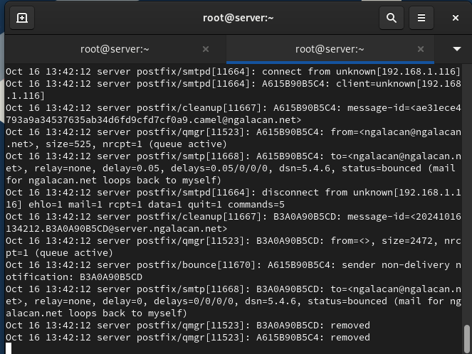

---
## Front matter
title: "Отчет по лабораторной работе №9"
subtitle: "Настройка POP3/IMAP сервера"
author: "Галацан Николай, НПИбд-01-22"

## Generic otions
lang: ru-RU
toc-title: "Содержание"

## Bibliography
bibliography: bib/cite.bib
csl: pandoc/csl/gost-r-7-0-5-2008-numeric.csl

## Pdf output format
toc: true # Table of contents
toc-depth: 2
lof: true # List of figures
lot: false # List of tables
fontsize: 12pt
linestretch: 1.5
papersize: a4
documentclass: scrreprt
## I18n polyglossia
polyglossia-lang:
  name: russian
  options:
	- spelling=modern
	- babelshorthands=true
polyglossia-otherlangs:
  name: english
## I18n babel
babel-lang: russian
babel-otherlangs: english
## Fonts
mainfont: IBM Plex Serif
romanfont: IBM Plex Serif
sansfont: IBM Plex Sans
monofont: IBM Plex Mono
mathfont: STIX Two Math
mainfontoptions: Ligatures=Common,Ligatures=TeX,Scale=0.94
romanfontoptions: Ligatures=Common,Ligatures=TeX,Scale=0.94
sansfontoptions: Ligatures=Common,Ligatures=TeX,Scale=MatchLowercase,Scale=0.94
monofontoptions: Scale=MatchLowercase,Scale=0.94,FakeStretch=0.9
mathfontoptions:
## Biblatex
biblatex: true
biblio-style: "gost-numeric"
biblatexoptions:
  - parentracker=true
  - backend=biber
  - hyperref=auto
  - language=auto
  - autolang=other*
  - citestyle=gost-numeric
## Pandoc-crossref LaTeX customization
figureTitle: "Рис."
tableTitle: "Таблица"
listingTitle: "Листинг"
lofTitle: "Список иллюстраций"
lotTitle: "Список таблиц"
lolTitle: "Листинги"
## Misc options
indent: true
header-includes:
  - \usepackage{indentfirst}
  - \usepackage{float} # keep figures where there are in the text
  - \floatplacement{figure}{H} # keep figures where there are in the text
---

# Цель работы

Приобретение практических навыков по установке и простейшему конфигурированию POP3/IMAP-сервера.


# Выполнение лабораторной работы

##  Установка Dovecot

Запускаю ВМ через рабочий каталог. На ВМ `server` вхожу под собственным пользователем и перехожу в режим суперпользователя. Устанавливаб необходимые пакеты:
```
dnf -y install dovecot telnet
```


## Настройка dovecot

В конфигурационном файле `/etc/dovecot/dovecot.conf` прописываю список почтовых протоколов, по которым разрешено работать Dovecot (рис. [-@fig:1]).

{#fig:1 width=70%}

В конфигурационном файле `/etc/dovecot/conf.d/10-auth.conf` проверяю, что указан метод аутентификации `plain` (рис. [-@fig:2])

{#fig:2 width=70%}

В конфигурационном файле `/etc/dovecot/conf.d/auth-system.conf.ext` проверяю, что для поиска пользователей и их паролей используется `pam` и файл `passwd`.  В конфигурационном файле `/etc/dovecot/conf.d/10-mail.conf` настраиваю месторасположение почтовых ящиков пользователей (рис. [-@fig:3])

{#fig:3 width=70%}

В Postfix задаю каталог для доставки почты, затем конфигурирую межсетевой экран, разрешив работать службам протоколов POP3 и IMAP, восстанавливаю контекст безопасности SELinux, а затем перезапускаю Postfix и запускаю Dovecot (рис. [-@fig:4])

{#fig:4 width=70%}

## Проверка работы Dovecot

На дополнительном терминале сервера запускаю мониторинг работы почтовой службы с помощью команды 
```
tail -f /var/log/maillog
```

На терминале сервера просматриваю имеющуюся почту и mailbox пользователя(рис. [-@fig:5]). 

{#fig:5 width=70%}

На клиенте в режиме суперпользователя устанавливаю почтовый клиент:
```
dnf -y install evolution
```
Запускаю Evolution. В окне настройки учётной записи почты указываю имя `ngalacan`, адрес почты `ngalacan@ngalacan.net` (рис. [-@fig:6]). 

{#fig:6 width=70%}

В качестве IMAP-сервера для входящих сообщений прописываю `mail.ngalacan.net`, в качестве пользователя - `ngalacan`, номер порта для IMAP – 143, настройки SSL и метода аутентификации – STARTTLS, аутентификация по обычному паролю (рис. [-@fig:7]). 

{#fig:7 width=70%}

В качестве SMTP-сервера для исходящих сообщений прописываю `mail.ngalacan.net`, в качестве пользователя - `ngalacan`, номер порта для SMTP - 25, настройки SSL и метода аутентификации - без аутентификации, аутентификация — «Без аутентификации»  (рис. [-@fig:8]).

{#fig:8 width=70%}

Отправляю через почтовый клиент несколько тестовых писем себе. На сервере открываю мониторинг работы почтовой службы и вижу, что установлено соединение с клиентом, указана информация о пользователе, письмо себе доставлено, соединение разорвано (рис. [-@fig:9]).

{#fig:9 width=70%}

Просматриваю письма с помощью `mail`: вижу доставленные письма, открываю одно из них. Также просматриваю `doveadm` (рис. [-@fig:10]).

{#fig:10 width=70%}

Проверяю работу почтовой службы, используя на сервере протокол Telnet. Подключаюсь к почтовому серверу через порт 110, ввожу логин и пароль, с помощью команды `list` вижу 3 письма (рис. [-@fig:11]).

{#fig:11 width=70%}

С помощью `retr 3` просматриваю 3 письмо, с помощью `dele 2` удаляю 2 письмо, просматриваю список и завершаю сеанс работы (рис. [-@fig:12])

{#fig:12 width=70%}

## Внесение изменений в настройки внутреннего окружения виртуальной машины

На ВМ `server` перехожу в каталог для внесения изменений в настройки внутреннего окружения `/vagrant/provision/server/` и копирую в соответствующие каталоги конфигурационные файлы:

```
cd /vagrant/provision/server
mkdir -p /vagrant/provision/server/mail/etc/dovecot/conf.d
cp -R /etc/dovecot/dovecot.conf
	↪ /vagrant/provision/server/mail/etc/dovecot/
cp -R /etc/dovecot/conf.d/10-auth.conf
	↪ /vagrant/provision/server/mail/etc/dovecot/conf.d/
cp -R /etc/dovecot/conf.d/auth-system.conf.ext
	↪ /vagrant/provision/server/mail/etc/dovecot/conf.d/
cp -R /etc/dovecot/conf.d/10-mail.conf
	↪ /vagrant/provision/server/mail/etc/dovecot/conf.d/
```


Вношу изменения в файл `/vagrant/provision/server/mail.sh` добавив в него
строки:
- по установке Dovecot и Telnet; 
- по настройке межсетевого экрана;
- по настройке Postfix в части задания месторасположения почтового ящика;
- по перезапуску Postfix и запуску Dovecot (рис. [-@fig:13]).

{#fig:13 width=70%}


На ВМ `client` перехожу в каталог для внесения изменений в настройки внутреннего окружения и редактирую скрипт `/vagrant/provision/client/mail.sh`, прописав в нем установку почтового клиента (рис. [-@fig:14]).

{#fig:14 width=70%}

# Выводы

В результате выполнения работы были приобретены практические навыки по установке и простейшему конфигурированию POP3/IMAP-сервера.

# Ответы на контрольные вопросы

1. За что отвечает протокол SMTP?

- Отвечает за отправку электронной почты. Этот протокол используется для передачи
писем от отправителя к почтовому серверу и от сервера к серверу.

2. За что отвечает протокол IMAP? 

- Отвечает за доступ и управление
электронной почтой на сервере. Позволяет клиентским
приложениям просматривать, синхронизировать и управлять
сообщениями, хранящимися на почтовом сервере.

3. За что отвечает протокол POP3? 

- За получение электронной почты. Письма загружаются с почтового сервера на
клиентский компьютер, и после этого они обычно удаляются с
сервера (но это можно настроить).

4. В чём назначение Dovecot? 

- Это почтовый сервер, который
предоставляет поддержку протоколов IMAP и POP3. Dovecot
обеспечивает доступ к электронной почте на сервере, а также
хранение и управление сообщениями.

5. В каких файлах обычно находятся настройки работы Dovecot? За что
отвечает каждый из файлов? 
- `/etc/dovecot/dovecot.conf`: Основной файл конфигурации Dovecot.
- `/etc/dovecot/conf.d/`: Дополнительные файлы конфигурации, разделенные на отдельные модули.

6. В чём назначение Postfix? 

- Это почтовый сервер (MTA - Mail Transfer Agent), отвечающий за отправку и маршрутизацию
электронной почты.

7. Какие методы аутентификации пользователей можно использовать в Dovecot и в чём их отличие? 

- PLAIN: Передача учетных данных в открытом виде (не
рекомендуется, если соединение не защищено).

- LOGIN: Аутентификация по протоколу LOGIN, который шифрует
только пароль.

8. Приведите пример заголовка письма с пояснениями его полей. 

```
From: john.doe@example.com
To: jane.smith@example.com
Subject: Meeting Tomorrow
Date: Tue, 6 Dec 2023 14:30:00 +0000
```

9. Приведите примеры использования команд для работы с почтовыми
протоколами через терминал (например через telnet). 

- Использование Telnet для проверки SMTP:
```
telnet example.com 25
EHLO example.com
MAIL FROM: sender@example.com
RCPT TO: recipient@example.com
DATA
Subject: Test Email
This is a test email.
.
QUIT
```
- Использование Telnet для проверки POP3:
```
telnet example.com 110
USER your_username
PASS your_password
LIST
RETR 1
QUIT
```

10. Приведите примеры с пояснениями по работе с doveadm. 

- Получение информации о пользователях: `doveadm user user@example.com`
- Получение списка всех писем пользователя: `doveadm search mailbox INBOX ALL`
- Удаление письма: `doveadm expunge -u user@example.com mailbox INBOX uid <UID>`


