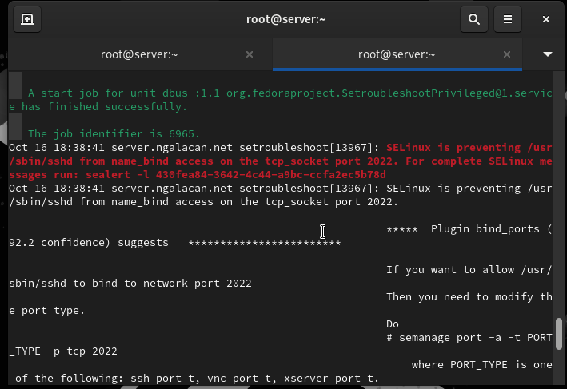

---
## Front matter
lang: ru-RU
title: Презентация по лабораторной работе №11
subtitle: "Настройка безопасного удалённого доступа по протоколу SSH"
author:
  - Галацан Николай
institute:
  - Российский университет дружбы народов, Москва, Россия

## i18n babel
babel-lang: russian
babel-otherlangs: english

## Formatting pdf
toc: false
toc-title: Содержание
slide_level: 2
aspectratio: 169
section-titles: true
theme: metropolis
header-includes:
 - \metroset{progressbar=frametitle,sectionpage=progressbar,numbering=fraction}
 - '\makeatletter'
 - '\beamer@ignorenonframefalse'
 - '\makeatother'
---


## Докладчик

  * Галацан Николай
  * 1032225763
  * уч. группа: НПИбд-01-22
  * Факультет физико-математических и естественных наук
  * Российский университет дружбы народов

## Цели и задачи

Приобретение практических навыков по настройке удалённого доступа к серверу
с помощью SSH.


# Запрет удалённого доступа по SSH для пользователя root

## Выполнение лабораторной работы

{#fig:1 width=70%}

## Выполнение лабораторной работы

{#fig:2 width=70%}

# Ограничение списка пользователей для удалённого доступа по SSH

## Выполнение лабораторной работы
 
{#fig:3 width=70%}

## Выполнение лабораторной работы

{#fig:4 width=70%}

## Выполнение лабораторной работы

{#fig:5 width=70%}

## Выполнение лабораторной работы

{#fig:6 width=70%}

# Настройка дополнительных портов для удалённого доступа по SSH

## Выполнение лабораторной работы

{#fig:7 width=70%}

## Выполнение лабораторной работы

{#fig:8 width=70%}

## Выполнение лабораторной работы

{#fig:9 width=70%}

## Выполнение лабораторной работы

{#fig:10 width=50%}

## Выполнение лабораторной работы

{#fig:11 width=70%}

#  Настройка удалённого доступа по SSH по ключу

## Выполнение лабораторной работы

{#fig:12 width=70%}

## Выполнение лабораторной работы

{#fig:13 width=70%}

#  Организация туннелей SSH, перенаправление TCP-портов

## Выполнение лабораторной работы

{#fig:14 width=70%}

## Выполнение лабораторной работы

{#fig:15 width=70%}

# Запуск консольных приложений через SSH

## Выполнение лабораторной работы

{#fig:16 width=50%}

# Запуск графических приложений через SSH

## Выполнение лабораторной работы

{#fig:17 width=60%}

## Выполнение лабораторной работы

{#fig:18 width=50%}

# Внесение изменений в настройки внутреннего окружения виртуальной машины

## Выполнение лабораторной работы

```
cd /vagrant/provision/server
mkdir -p /vagrant/provision/server/ssh/etc/ssh
cp -R /etc/ssh/sshd_config /vagrant/provision/server/ssh/etc/ssh/
```


## Выполнение лабораторной работы

{#fig:19 width=70%}

## Выполнение лабораторной работы

```
server.vm.provision "server ssh",
	type: "shell",
	preserve_order: true,
	path: "provision/server/ssh.sh"

```


## Выводы

В результате выполнения работы были приобретены практические навыки по настройке удалённого доступа к серверу с помощью SSH.

