---
## Front matter
title: "Отчет по лабораторной работе №11"
subtitle: Настройка безопасного удалённого доступа по протоколу SSH
author: "Галацан Николай, НПИбд-01-22"

## Generic otions
lang: ru-RU
toc-title: "Содержание"

## Bibliography
bibliography: bib/cite.bib
csl: pandoc/csl/gost-r-7-0-5-2008-numeric.csl

## Pdf output format
toc: true # Table of contents
toc-depth: 2
lof: true # List of figures
lot: false # List of tables
fontsize: 12pt
linestretch: 1.5
papersize: a4
documentclass: scrreprt
## I18n polyglossia
polyglossia-lang:
  name: russian
  options:
	- spelling=modern
	- babelshorthands=true
polyglossia-otherlangs:
  name: english
## I18n babel
babel-lang: russian
babel-otherlangs: english
## Fonts
mainfont: IBM Plex Serif
romanfont: IBM Plex Serif
sansfont: IBM Plex Sans
monofont: IBM Plex Mono
mathfont: STIX Two Math
mainfontoptions: Ligatures=Common,Ligatures=TeX,Scale=0.94
romanfontoptions: Ligatures=Common,Ligatures=TeX,Scale=0.94
sansfontoptions: Ligatures=Common,Ligatures=TeX,Scale=MatchLowercase,Scale=0.94
monofontoptions: Scale=MatchLowercase,Scale=0.94,FakeStretch=0.9
mathfontoptions:
## Biblatex
biblatex: true
biblio-style: "gost-numeric"
biblatexoptions:
  - parentracker=true
  - backend=biber
  - hyperref=auto
  - language=auto
  - autolang=other*
  - citestyle=gost-numeric
## Pandoc-crossref LaTeX customization
figureTitle: "Рис."
tableTitle: "Таблица"
listingTitle: "Листинг"
lofTitle: "Список иллюстраций"
lotTitle: "Список таблиц"
lolTitle: "Листинги"
## Misc options
indent: true
header-includes:
  - \usepackage{indentfirst}
  - \usepackage{float} # keep figures where there are in the text
  - \floatplacement{figure}{H} # keep figures where there are in the text
---

# Цель работы

Приобретение практических навыков по настройке удалённого доступа к серверу
с помощью SSH.


# Выполнение лабораторной работы

## Запрет удалённого доступа по SSH для пользователя root

Запускаю ВМ через рабочий каталог. На ВМ `server` вхожу под собственным пользователем и перехожу в режим суперпользователя. Задаю пароль для пользователя `root`. В дополнительном терминале запускаю мониторинг системных событий. С клиента пытаюсь получить доступ к серверу через SSH-соединение через пользователя `root`, однако в доступе отказано (рис. [-@fig:1]).

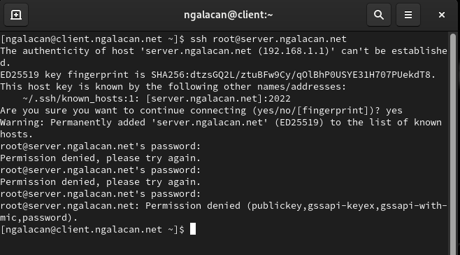{#fig:1 width=70%}

В конфигурационном файле ` /etc/ssh/sshd_config` запрещаю вход на сервер пользователю `root` (рис. [-@fig:2])

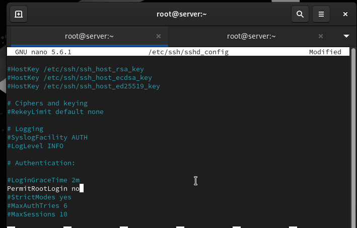{#fig:2 width=70%}

Перезагружаю `sshd`. Повторяю попытку получения доступа через `root`, вновь получаю отказ в доступе.


## Ограничение списка пользователей для удалённого доступа по SSH
 
 С клиента пытаюсь получить доступ к серверу через SSH-соединение через пользователя `ngalacan`, доступ получен (рис. [-@fig:3])

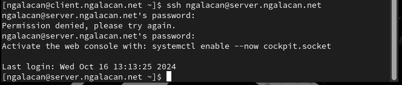{#fig:3 width=70%}

В конфигурационном файле ` /etc/ssh/sshd_config` добавляю строку  (рис. [-@fig:4])

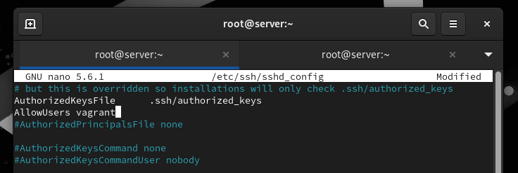{#fig:4 width=70%}

Перезагрузив `sshd`, вновь пытаюсь с клиента получить доступ через пользователя `ngalacan`, но в доступе отказано (рис. [-@fig:5]). 

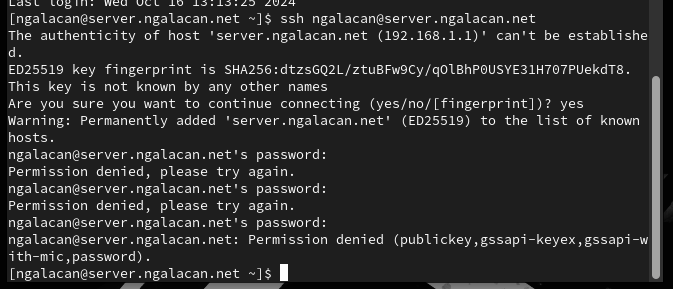{#fig:5 width=70%}

В файле ` /etc/ssh/sshd_config` изменяю строку `AllowUsers vagrant ngalacan`. Пытаюсь с клиента получить доступ через пользователя `ngalacan`, доступ получен (рис. [-@fig:6]). 

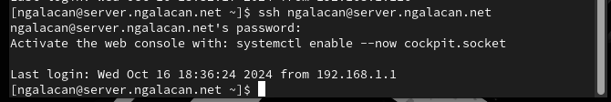{#fig:6 width=70%}

## Настройка дополнительных портов для удалённого доступа по SSH

В файле ` /etc/ssh/sshd_config`  добавляю порты (рис. [-@fig:7]). 

{#fig:7 width=70%}

Перезапускаю `sshd` и просматриваю статус. Выводится отказ в работе через порт 2022 (рис. [-@fig:8]).

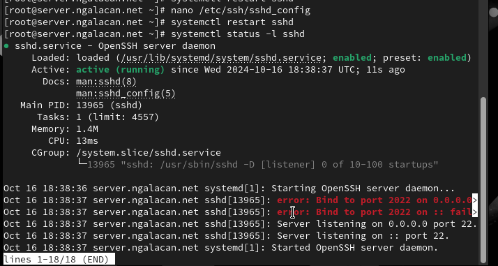{#fig:8 width=70%}

Дополнительно просматриваю журнал системных событий и вижу сообщения об ошибках в SELinux (рис. [-@fig:9]).

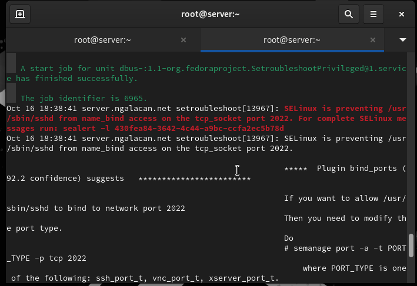{#fig:9 width=70%}

Исправляю метки SELinux к порту 2022, настраиваю межсетевой экран, перезапускаю `sshd` и вновь просматриваю статус. Прослушиваются оба порта  (рис. [-@fig:10]).

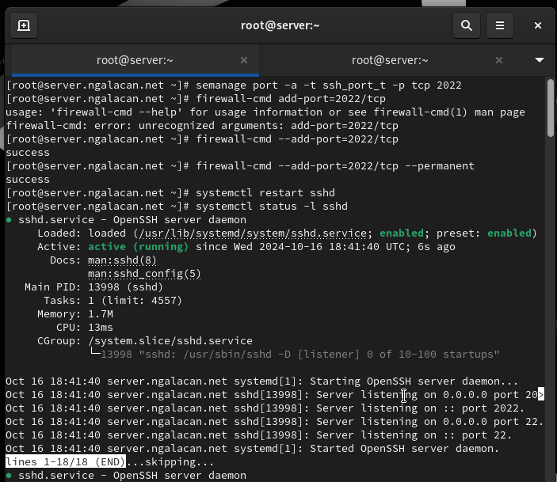{#fig:10 width=70%}

C клиента пытаюсь получить доступ через пользователя. После открытия оболочки получаю доступ в `root`. Отлогиниваюсь от `root` и от пользователя на сервере. Повторяю попытку получения доступа через порт 2022, повторяю те же самые действия (рис. [-@fig:11]).

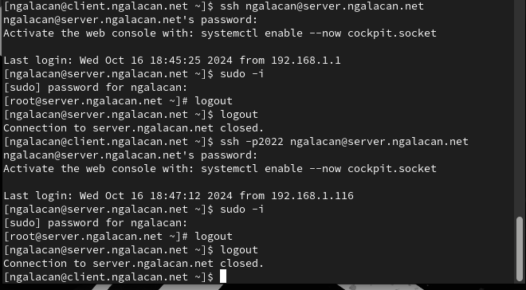{#fig:11 width=70%}

##  Настройка удалённого доступа по SSH по ключу

В файле ` /etc/ssh/sshd_config`  разрешаю аутентификацию по ключу, перезапускаю сервис (рис. [-@fig:12])

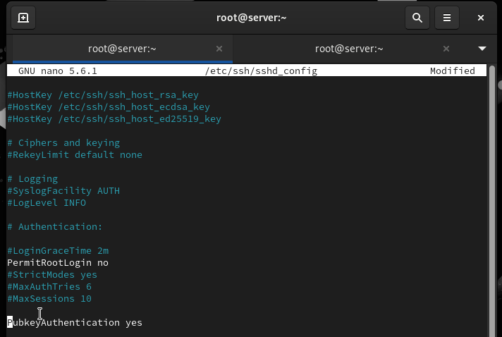{#fig:12 width=70%}


На клиенте генерирую SSH-ключ и копирую его на сервер. Пробую получить доступ к серверу через пользователя. Доступ получен, теперь не запрашивается пароль. Отлогиниваюсь с помощью `ctrl+d` (рис. [-@fig:13]).

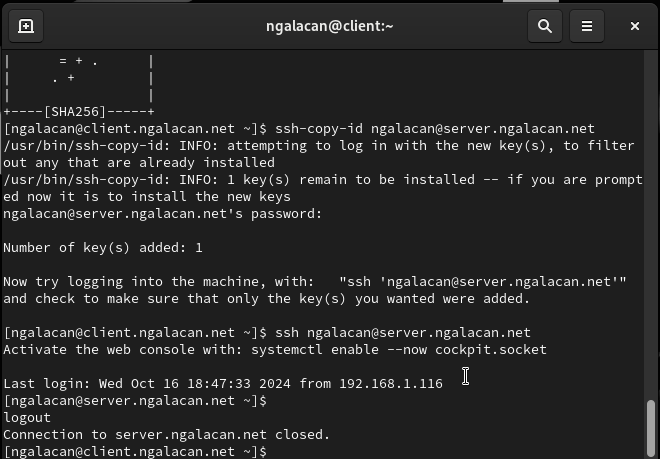{#fig:13 width=70%}

##  Организация туннелей SSH, перенаправление TCP-портов

На клиенте просматриваю, запущены ли какие-то службы с протоколом TCP (не запущены). Перенаправляю порт 80 на `server.ngalacan.net` на порт 8080. Вновь просматриваю службы с TCP (службы запущены) (рис. [-@fig:14]).

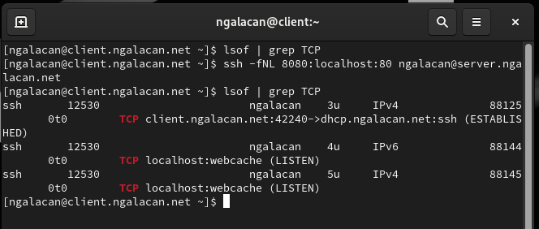{#fig:14 width=70%}

Запускаю браузер и ввожу `localhost:8080`. Вижу приветственное сообщение сервера (рис. [-@fig:15]).

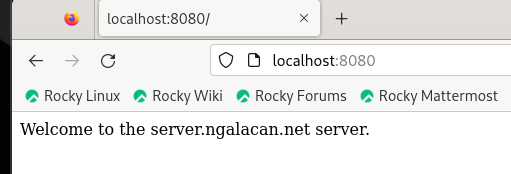{#fig:15 width=70%}

## Запуск консольных приложений через SSH

С клиента просматриваю имя узла, список файлов на сервере, почту (рис. [-@fig:16]).

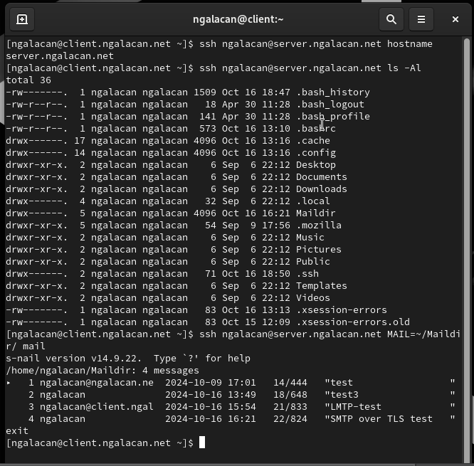{#fig:16 width=70%}

## Запуск графических приложений через SSH

В файле ` /etc/ssh/sshd_config`  разрешаю отображать на локальном клиентском компьютере графические интерфейсы X11 и перезапускаю сервис (рис. [-@fig:17]).

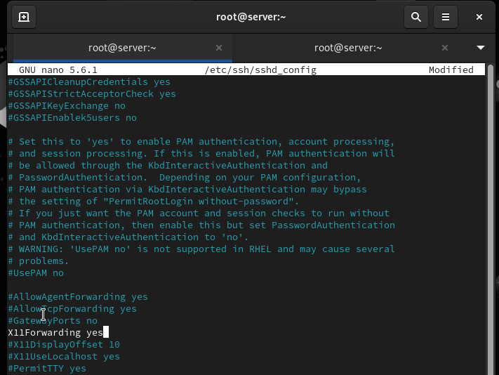{#fig:17 width=70%}

С клиента удаленно подключаюсь к серверу и запускаю `firefox` (рис. [-@fig:18]).

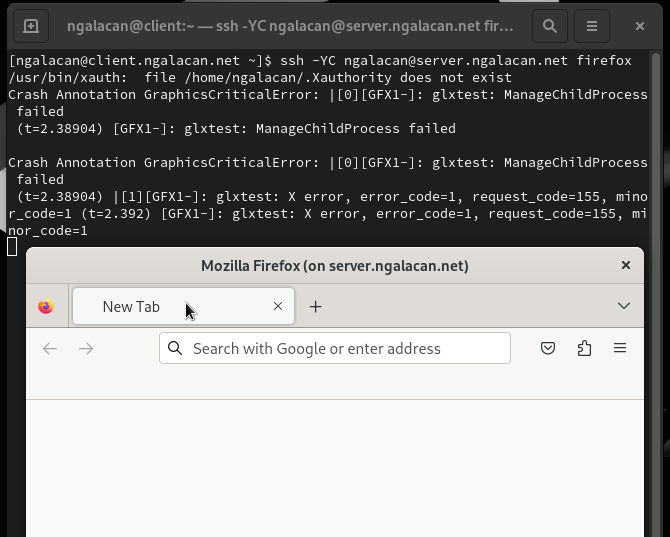{#fig:18 width=70%}

## Внесение изменений в настройки внутреннего окружения виртуальной машины

На ВМ `server` перехожу в каталог для внесения изменений в настройки внутреннего окружения `/vagrant/provision/server/` и копирую в соответствующие каталоги конфигурационные файлы:

```
cd /vagrant/provision/server
mkdir -p /vagrant/provision/server/ssh/etc/ssh
cp -R /etc/ssh/sshd_config /vagrant/provision/server/ssh/etc/ssh/
```


Создаю файл `/vagrant/provision/server/ssh.sh` (рис. [-@fig:19]).

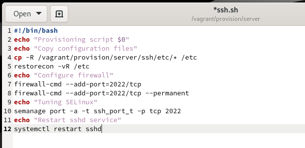{#fig:19 width=70%}

Для отработки созданного скрипта во время загрузки виртуальной машины `server`
в конфигурационном файле `Vagrantfile` добавляю следующую запись:

```
server.vm.provision "server ssh",
	type: "shell",
	preserve_order: true,
	path: "provision/server/ssh.sh"

```


# Выводы

В результате выполнения работы были приобретены практические навыки по настройке удалённого доступа к серверу с помощью SSH.


# Ответы на контрольные вопросы

1. Вы хотите запретить удалённый доступ по SSH на сервер пользователю root
и разрешить доступ пользователю alice. Как это сделать?

В файле `/etc/ssh/sshd_config` конфигурации прописать `PermitRootLogin no`
и `AllowUsers alice`.

2. Как настроить удалённый доступ по SSH через несколько портов? Для чего
это может потребоваться?

Для настройки удалённого доступа по SSH через несколько портов нужно
отредактировать файл конфигурации SSH и добавить
строку `Port <порт>`.


3. Какие параметры используются для создания туннеля SSH, когда команда
ssh устанавливает фоновое соединение и не ожидает какой-либо конкретной команды?

Для установки фонового соединения без команды используется параметр -N при использовании команды ssh: `ssh -N <hostname>`

4. Как настроить локальную переадресацию с локального порта 5555 на порт
80 сервера server2.example.com?
 
 `ssh -fNL 80:localhost:55555 server2.example.com`

5. Как настроить SELinux, чтобы позволить SSH связываться с портом 2022?

`semanage port -a -t ssh_port_t -p tcp 2022`

6. Как настроить межсетевой экран на сервере, чтобы разрешить входящие
подключения по SSH через порт 2022?

` firewall-cmd --add-port=2022/tcp --permanent`
