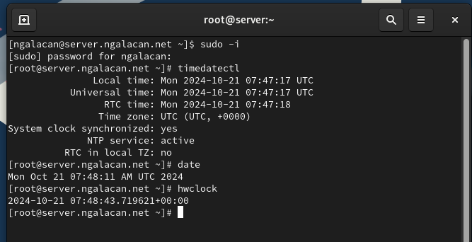
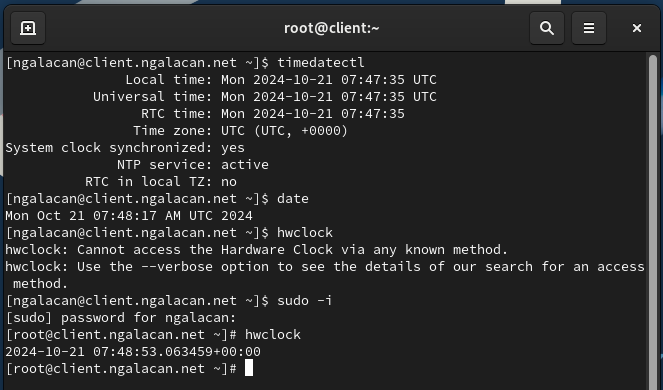
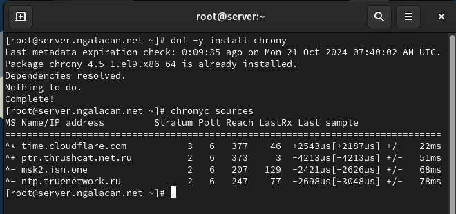
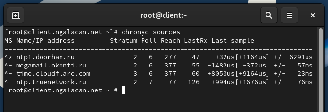
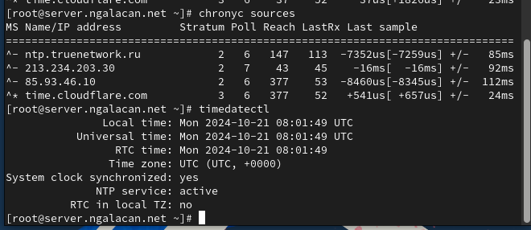
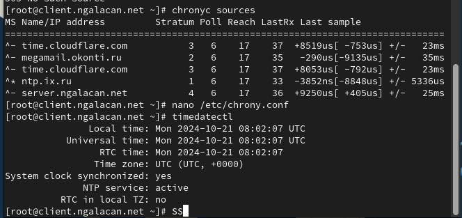
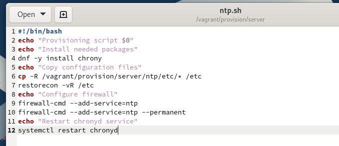
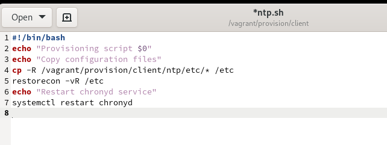

---
## Front matter
lang: ru-RU
title: Презентация по лабораторной работе №12
subtitle: "Синхронизация времени"
author:
  - Галацан Николай
institute:
  - Российский университет дружбы народов, Москва, Россия

## i18n babel
babel-lang: russian
babel-otherlangs: english

## Formatting pdf
toc: false
toc-title: Содержание
slide_level: 2
aspectratio: 169
section-titles: true
theme: metropolis
header-includes:
 - \metroset{progressbar=frametitle,sectionpage=progressbar,numbering=fraction}
 - '\makeatletter'
 - '\beamer@ignorenonframefalse'
 - '\makeatother'
---


## Докладчик

  * Галацан Николай
  * 1032225763
  * уч. группа: НПИбд-01-22
  * Факультет физико-математических и естественных наук
  * Российский университет дружбы народов

## Цели и задачи

Получение навыков по управлению системным временем и настройке синхронизации времени.


# Настройка параметров времени

## Выполнение лабораторной работы

{#fig:1 width=70%}

## Выполнение лабораторной работы

{#fig:2 width=70%}


# Управление синхронизацией времени
 
## Выполнение лабораторной работы

{#fig:3 width=70%}

## Выполнение лабораторной работы

{#fig:4 width=70%}

## Выполнение лабораторной работы

{#fig:5 width=70%}

## Выполнение лабораторной работы

```
systemctl restart chronyd
firewall-cmd --add-service=ntp --permanent
firewall-cmd --reload
```

## Выполнение лабораторной работы

{#fig:6 width=70%}

## Выполнение лабораторной работы

{#fig:7 width=70%}

## Выполнение лабораторной работы

{#fig:8 width=70%}

# Внесение изменений в настройки внутреннего окружения виртуальной машины

## Выполнение лабораторной работы

{#fig:9 width=70%}

## Выполнение лабораторной работы

{#fig:10 width=70%}

## Выполнение лабораторной работы

```
server.vm.provision "server ntp",
	type: "shell",
	preserve_order: true,
	path: "provision/server/ntp.sh"
client.vm.provision "client ntp",
	type: "shell",
	preserve_order: true,
	path: "provision/client/ntp.sh"
```


## Выводы

В результате выполнения работы были приобретены практические навыки по управлению системным временем и настройке синхронизации времени.
