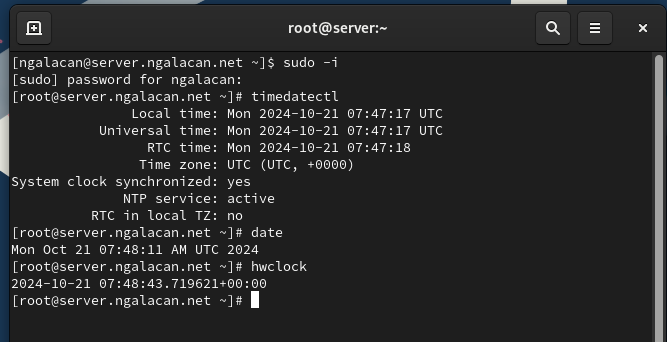
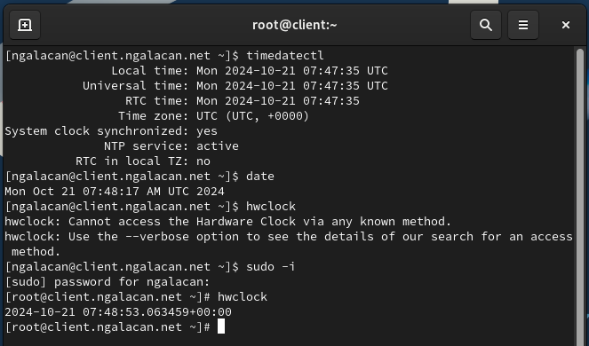
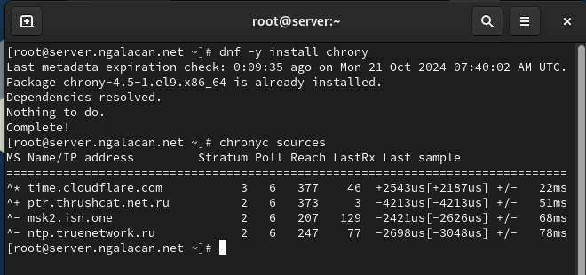
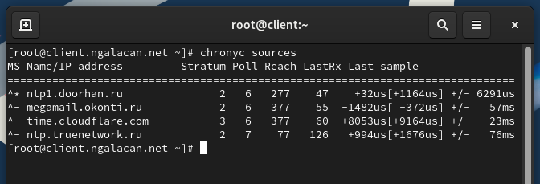
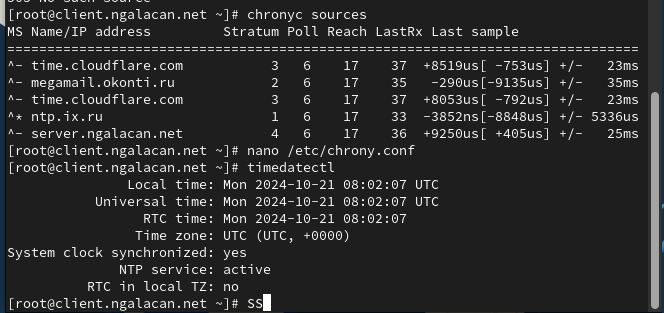
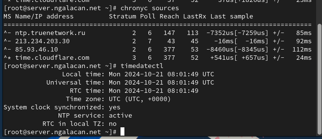
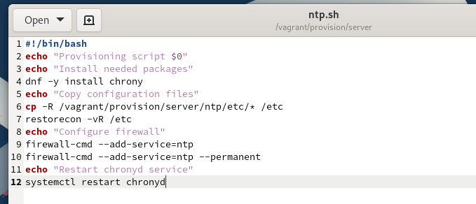

---
## Front matter
title: "Отчет по лабораторной работе №12"
subtitle: Синхронизация времени
author: "Галацан Николай, НПИбд-01-22"

## Generic otions
lang: ru-RU
toc-title: "Содержание"

## Bibliography
bibliography: bib/cite.bib
csl: pandoc/csl/gost-r-7-0-5-2008-numeric.csl

## Pdf output format
toc: true # Table of contents
toc-depth: 2
lof: true # List of figures
lot: false # List of tables
fontsize: 12pt
linestretch: 1.5
papersize: a4
documentclass: scrreprt
## I18n polyglossia
polyglossia-lang:
  name: russian
  options:
	- spelling=modern
	- babelshorthands=true
polyglossia-otherlangs:
  name: english
## I18n babel
babel-lang: russian
babel-otherlangs: english
## Fonts
mainfont: IBM Plex Serif
romanfont: IBM Plex Serif
sansfont: IBM Plex Sans
monofont: IBM Plex Mono
mathfont: STIX Two Math
mainfontoptions: Ligatures=Common,Ligatures=TeX,Scale=0.94
romanfontoptions: Ligatures=Common,Ligatures=TeX,Scale=0.94
sansfontoptions: Ligatures=Common,Ligatures=TeX,Scale=MatchLowercase,Scale=0.94
monofontoptions: Scale=MatchLowercase,Scale=0.94,FakeStretch=0.9
mathfontoptions:
## Biblatex
biblatex: true
biblio-style: "gost-numeric"
biblatexoptions:
  - parentracker=true
  - backend=biber
  - hyperref=auto
  - language=auto
  - autolang=other*
  - citestyle=gost-numeric
## Pandoc-crossref LaTeX customization
figureTitle: "Рис."
tableTitle: "Таблица"
listingTitle: "Листинг"
lofTitle: "Список иллюстраций"
lotTitle: "Список таблиц"
lolTitle: "Листинги"
## Misc options
indent: true
header-includes:
  - \usepackage{indentfirst}
  - \usepackage{float} # keep figures where there are in the text
  - \floatplacement{figure}{H} # keep figures where there are in the text
---

# Цель работы

Получение навыков по управлению системным временем и настройке синхронизации времени.

# Выполнение лабораторной работы

## Настройка параметров времени

Запускаю ВМ через рабочий каталог. На ВМ `server` вхожу под собственным пользователем и перехожу в режим суперпользователя. Задаю пароль для пользователя `root`. 

На сервере просматриваю параметры настройки даты и времени, текущее системное время, аппаратное время (рис. [-@fig:1]). То же самое просматриваю на клиенте (рис. [-@fig:2]).

{#fig:1 width=70%}

{#fig:2 width=70%}

Можно увидеть, что устройство находится во временной зоне UTC+0:00, сетевая синхронизация времени включена.

## Управление синхронизацией времени
 
Просматриваю источники времени на сервере (рис. [-@fig:3]) и клиенте (рис. [-@fig:4]).

{#fig:3 width=70%}


{#fig:4 width=70%}

В файле `/etc/chrony.conf` на сервере добавляю строку (рис. [-@fig:5]). 

{#fig:5 width=70%}

Перезапускаю службу, настраиваю межсетевой экран:

```
systemctl restart chronyd
firewall-cmd --add-service=ntp --permanent
firewall-cmd --reload
```

В файле ` /etc/chrony.conf` на клиенте добавляю строку (рис. [-@fig:6]). 

{#fig:6 width=70%}

Перезапустив службу `chronyd`, проверяю источники времени на сервере (рис. [-@fig:7]) и на клиенте (рис. [-@fig:8]). На клиенте появился источник `server.ngalacan.net`, имеющий уровень синхронизации 4. Это значит, что источник синхронизируется с источниками, имеющими уровень 3 (сервер), который, в свою очередь, синхронизируется с первичными источниками.

{#fig:7 width=70%}

{#fig:8 width=70%}

## Внесение изменений в настройки внутреннего окружения виртуальной машины

На ВМ `server` перехожу в каталог для внесения изменений в настройки внутреннего окружения `/vagrant/provision/server/` и копирую в соответствующие каталоги конфигурационные файлы:

```
cd /vagrant/provision/server
mkdir -p /vagrant/provision/server/ntp/etc
cp -R /etc/chrony.conf /vagrant/provision/server/ntp/etc/
```


Создаю файл `/vagrant/provision/server/ntp.sh` (рис. [-@fig:9]).

{#fig:9 width=70%}

Аналогично копирую файлы в соответствующие каталоги на клиенте:

```
cd /vagrant/provision/client
mkdir -p /vagrant/provision/client/ntp/etc
cp -R /etc/chrony.conf /vagrant/provision/client/ntp/etc/

```

Создаю файл `/vagrant/provision/client/ntp.sh` (рис. [-@fig:10]).

{#fig:10 width=70%}

Для отработки созданных скриптов во время загрузки ВМ
в конфигурационном файле `Vagrantfile` добавляю следующие записи:

```
server.vm.provision "server ntp",
	type: "shell",
	preserve_order: true,
	path: "provision/server/ntp.sh"
client.vm.provision "client ntp",
	type: "shell",
	preserve_order: true,
	path: "provision/client/ntp.sh"
```


# Выводы

В результате выполнения работы были приобретены практические навыки по управлению системным временем и настройке синхронизации времени.

# Ответы на контрольные вопросы

1. Почему важна точная синхронизация времени для служб баз данных?

Точная синхронизация времени в службах баз данных важна для обеспечения целостности и согласованности данных. Она позволяет различным узлам базы данных оперировать с одним и тем же временем, что помогает
предотвратить конфликты при репликации данных и обеспечить правильную последовательность операций

2. Почему служба проверки подлинности Kerberos сильно зависит от правильной синхронизации времени?

Служба проверки подлинности Kerberos зависит от правильной синхронизации времени для обеспечения безопасности. Керберос использует временные метки для защиты от атак воспроизведения и повтора. Если временные
метки не синхронизированы правильно, то проверка подлинности Kerberos
может не работать, так как таймстампы могут быть некорректно интерпретированы

3. Какая служба используется по умолчанию для синхронизации времени на
RHEL 7?

`chronyd`

4. Какова страта по умолчанию для локальных часов?

10 - страта по умолчанию для локальных часов.

5. Какой порт брандмауэра должен быть открыт, если вы настраиваете свой
сервер как одноранговый узел NTP?

`123 UDP`

6. Какую строку вам нужно включить в конфигурационный файл chrony, если вы хотите быть сервером времени, даже если внешние серверы NTP недоступны?

Для настройки сервера времени в chrony, даже если внешние серверы NTP
недоступны, нужно включить строку `local stratum 10` в конфигурационном
файле chrony.

7. Какую страту имеет хост, если нет текущей синхронизации времени NTP?

`16`, что означает "недоступно".

8. Какую команду вы бы использовали на сервере с chrony, чтобы узнать, с
какими серверами он синхронизируется?

`chronyc sources`

9. Как вы можете получить подробную статистику текущих настроек времени
для процесса chrony вашего сервера?

`chronyc tracking`
