---
## Front matter
lang: ru-RU
title: Презентация по лабораторной работе №13
subtitle: " Настройка NFS"
author:
  - Галацан Николай
institute:
  - Российский университет дружбы народов, Москва, Россия

## i18n babel
babel-lang: russian
babel-otherlangs: english

## Formatting pdf
toc: false
toc-title: Содержание
slide_level: 2
aspectratio: 169
section-titles: true
theme: metropolis
header-includes:
 - \metroset{progressbar=frametitle,sectionpage=progressbar,numbering=fraction}
 - '\makeatletter'
 - '\beamer@ignorenonframefalse'
 - '\makeatother'
---


## Докладчик

  * Галацан Николай
  * 1032225763
  * уч. группа: НПИбд-01-22
  * Факультет физико-математических и естественных наук
  * Российский университет дружбы народов

## Цели и задачи

Приобретение навыков настройки сервера NFS для удалённого доступа к ресурсам.

# Настройка сервера NFSv4

## Выполнение лабораторной работы

```
dnf -y install nfs-utils
```

## Выполнение лабораторной работы

{#fig:1 width=70%}

## Выполнение лабораторной работы

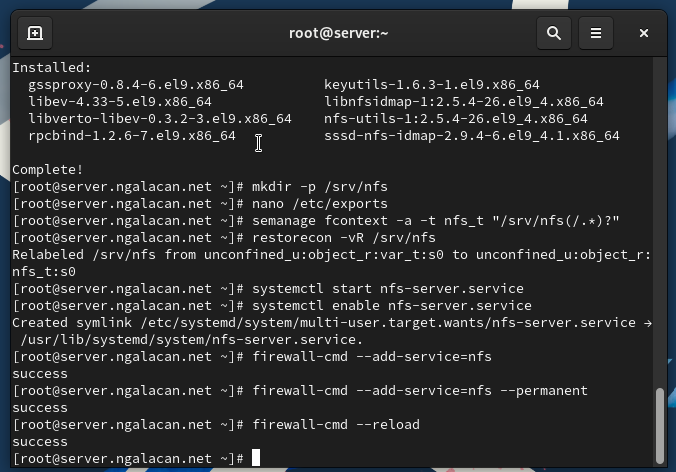{#fig:2 width=70%}

## Выполнение лабораторной работы

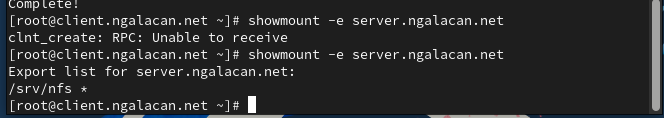{#fig:3 width=70%}

## Выполнение лабораторной работы

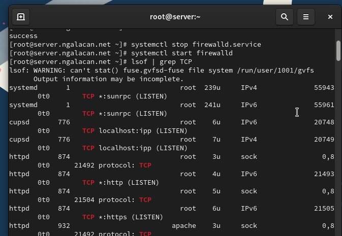{#fig:4 width=70%}

## Выполнение лабораторной работы

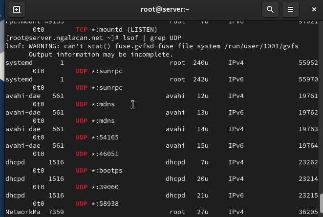{#fig:5 width=70%}


## Выполнение лабораторной работы

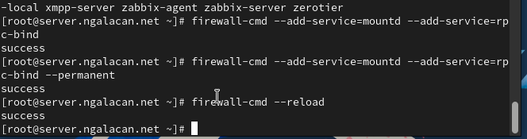{#fig:6 width=70%}

## Выполнение лабораторной работы 

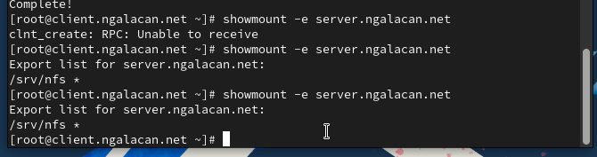{#fig:7 width=70%}

# Монтирование NFS на клиенте

## Выполнение лабораторной работы

```
mkdir -p /mnt/nfs
mount server.ngalacan.net:/srv/nfs /mnt/nfs
```

## Выполнение лабораторной работы

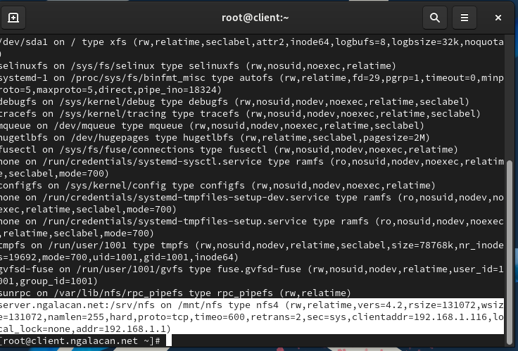{#fig:8 width=70%}

## Выполнение лабораторной работы

{#fig:9 width=60%}

## Выполнение лабораторной работы

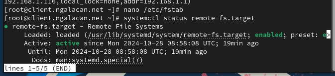{#fig:10 width=70%}

## Выполнение лабораторной работы

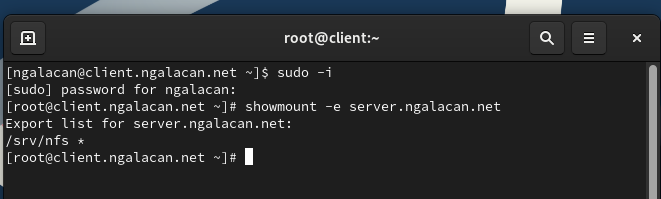{#fig:11 width=70%}


# Подключение каталогов к дереву NFS

## Выполнение лабораторной работы

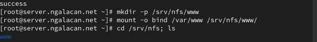{#fig:12 width=70%}

## Выполнение лабораторной работы

{#fig:13 width=70%}

# Подключение каталогов для работы пользователей

## Выполнение лабораторной работы

```
mkdir -p -m 700 ~/common
cd ~/common
touch ngalacan@server.txt
mkdir -p /srv/nfs/home/ngalacan
```

## Выполнение лабораторной работы

`mount -o bind /home/user/common /srv/nfs/home/ngalacan`

## Выполнение лабораторной работы

{#fig:14 width=70%}

## Выполнение лабораторной работы

{#fig:15 width=70%}

## Выполнение лабораторной работы

{#fig:16 width=70%}

## Выполнение лабораторной работы

{#fig:17 width=70%}

## Выполнение лабораторной работы

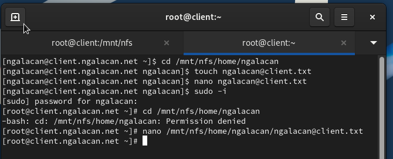{#fig:18 width=70%}

# Внесение изменений в настройки внутреннего окружения виртуальной машины

## Выполнение лабораторной работы

```
cd /vagrant/provision/server
mkdir -p /vagrant/provision/server/nfs/etc
cp -R /etc/exports /vagrant/provision/server/nfs/etc/

```

## Выполнение лабораторной работы

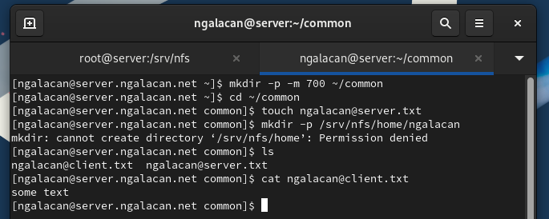{#fig:19 width=70%}

## Выполнение лабораторной работы

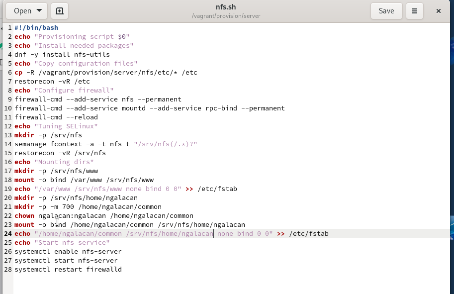{#fig:20 width=70%}

## Выполнение лабораторной работы

```
server.vm.provision "server nfs",
	type: "shell",
	preserve_order: true,
	path: "provision/server/nfs.sh"

client.vm.provision "client nfs",
	type: "shell",
	preserve_order: true,
	path: "provision/client/nfs.sh"
```

## Выводы

В результате выполнения работы были приобретены навыки настройки сервера NFS для удалённого доступа к ресурсам.
