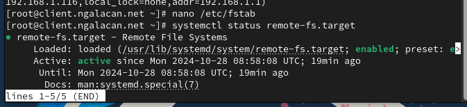

---
## Front matter
title: "Отчет по лабораторной работе №13"
subtitle: " Настройка NFS"
author: "Галацан Николай, НПИбд-01-22"

## Generic otions
lang: ru-RU
toc-title: "Содержание"

## Bibliography
bibliography: bib/cite.bib
csl: pandoc/csl/gost-r-7-0-5-2008-numeric.csl

## Pdf output format
toc: true # Table of contents
toc-depth: 2
lof: true # List of figures
lot: false # List of tables
fontsize: 12pt
linestretch: 1.5
papersize: a4
documentclass: scrreprt
## I18n polyglossia
polyglossia-lang:
  name: russian
  options:
	- spelling=modern
	- babelshorthands=true
polyglossia-otherlangs:
  name: english
## I18n babel
babel-lang: russian
babel-otherlangs: english
## Fonts
mainfont: IBM Plex Serif
romanfont: IBM Plex Serif
sansfont: IBM Plex Sans
monofont: IBM Plex Mono
mathfont: STIX Two Math
mainfontoptions: Ligatures=Common,Ligatures=TeX,Scale=0.94
romanfontoptions: Ligatures=Common,Ligatures=TeX,Scale=0.94
sansfontoptions: Ligatures=Common,Ligatures=TeX,Scale=MatchLowercase,Scale=0.94
monofontoptions: Scale=MatchLowercase,Scale=0.94,FakeStretch=0.9
mathfontoptions:
## Biblatex
biblatex: true
biblio-style: "gost-numeric"
biblatexoptions:
  - parentracker=true
  - backend=biber
  - hyperref=auto
  - language=auto
  - autolang=other*
  - citestyle=gost-numeric
## Pandoc-crossref LaTeX customization
figureTitle: "Рис."
tableTitle: "Таблица"
listingTitle: "Листинг"
lofTitle: "Список иллюстраций"
lotTitle: "Список таблиц"
lolTitle: "Листинги"
## Misc options
indent: true
header-includes:
  - \usepackage{indentfirst}
  - \usepackage{float} # keep figures where there are in the text
  - \floatplacement{figure}{H} # keep figures where there are in the text
---

# Цель работы

Приобретение навыков настройки сервера NFS для удалённого доступа к ресурсам.

# Выполнение лабораторной работы

## Настройка сервера NFSv4

На сервере устанавливаю необходимое ПО:
```
dnf -y install nfs-utils
```
Создаю каталог, который будет доступен всем пользователям сети (корень дерева NFS): `mkdir -p /srv/nfs`. В файле `/etc/exports` прописываю общий каталог с доступом только на чтение (рис. [-@fig:1]).

{#fig:1 width=70%}

Задаю контекст безопасности. Применяю измененную настройку SELinux. Запускаю сервер NFS и настраиваю межсетевой экран (рис. [-@fig:2])

{#fig:2 width=70%}

На клиенте аналогично устанавливаю `nfs-utils`. Пробую посмотреть имеющиеся подмонтированные удаленные ресурсы, однако RPC не может получить доступ. На сервере останавливаю межсетевой экран и пробую снова. Теперь отображается созданный на сервере каталог `/srv/nfs` (рис. [-@fig:3])

{#fig:3 width=70%}

На сервере запускаю межсетевой экран и просматриваю какие службы задействованы при удаленном монтировании (рис. [-@fig:4]), (рис. [-@fig:5]).

{#fig:4 width=70%}

{#fig:5 width=70%}


Добавляю службы `rpc-bind` и `mountd` в настройки межсетевого экрана на сервере и перезагружаю (рис. [-@fig:6]). 

{#fig:6 width=70%}

Вновь просматриваю имеющиеся подмонтированные удаленные ресурсы и вижу список уже при включенном межсетевом экране (рис. [-@fig:7]). 

{#fig:7 width=70%}

## Монтирование NFS на клиенте

На клиенте создаю каталог, в который будет монтироваться удалённый ресурс,
и монтирую дерево NFS:
```
mkdir -p /mnt/nfs
mount server.ngalacan.net:/srv/nfs /mnt/nfs
```

Проверяю, что общий ресурс подключен правильно (рис. [-@fig:8]).

{#fig:8 width=70%}

На клиенте редактирую файл `/etc/fstab`. Запись означает, что подключаются каталоги сервера для автоматического монтирования при
загрузке через `nfs`, для этого указываются каталоги и `_netdev` – опция, указывающая, что данный ресурс является сетевым (то есть монтироваться каталоги будут после загрузки сетевой подсистемы) (рис. [-@fig:9]).

{#fig:9 width=70%}

 На клиенте проверяю наличие автоматического монтирования удалённых ресурсов при запуске операционной системы (рис. [-@fig:10]).

{#fig:10 width=70%}

Перезагружаю ВМ `client` и вновь проверяю доступ к общему ресурсу с клиента (рис. [-@fig:11]).

{#fig:11 width=70%}


## Подключение каталогов к дереву NFS

На сервере создаю общий каталог для монтирования web-сервера и монтирую его. Проверяю, что отображается в каталоге `/srv/nfs` на сервере (рис. [-@fig:12])

{#fig:12 width=70%}

На клиенте проверяю, что отображается в `/mnt/nfs` (каталог `www`). На сервере в файле `/etc/exports` прописываю `/srv/nfs/www 192.168.0.0/16(rw)`. С помощью команды `exportfs -r` экспортирую каталоги, указанные в файле и проверяю каталог `/mnt/nfs` на клиенте.

На сервере в конце файла `/etc/fstab` прописываю `/var/www /srv/nfs/www none bind 0 0`. Повторно экспортирую каталоги и проверяю на клиенте (рис. [-@fig:13]).

{#fig:13 width=70%}

## Подключение каталогов для работы пользователей

На сервере под пользователем создаю в домашнем каталоге каталог `common` с полными правами доступа только для этого пользователя, а в нем файл `ngalacan@server.txt`:
```
mkdir -p -m 700 ~/common
cd ~/common
touch ngalacan@server.txt
```
На сервере создаю общий каталог для работы пользователя по сети: `mkdir -p /srv/nfs/home/ngalacan`.

Монтирую каталог `common` пользователя `ngalacan` в NFS: `mount -o bind /home/ngalacan/common /srv/nfs/home/ngalacan`. Установлены права на чтение, запись и исполнение только для самого пользователя.

В файле `/etc/exports` прописываю подключение каталога пользователя (рис. [-@fig:14]). 

{#fig:14 width=70%}

Вношу изменения в файл `/etc/fstab` (рис. [-@fig:15]).

{#fig:15 width=70%}

Повторно экспортирую каталоги и проверяю на клиенте `/mnt/nfs`. Появляется домашний каталог пользователя с сервера (рис. [-@fig:16]).

{#fig:16 width=70%}

На клиенте под пользователем `ngalacan` перехожу в каталог `/mnt/nfs/home/ngalacan`
и создаю в нём файл `ngalacan@client.txt` и вношу в него изменения. Пробую то же самое проделать под `root`, но получаю отказ в доступе (рис. [-@fig:17]).

{#fig:17 width=70%}

На сервере проверяю, что изменения, внесенные на клиенте, отображаются (рис. [-@fig:18]).

{#fig:18 width=70%}

## Внесение изменений в настройки внутреннего окружения виртуальной машины

На ВМ `server` перехожу в каталог для внесения изменений в настройки внутреннего окружения `/vagrant/provision/server/` и копирую в соответствующие каталоги конфигурационные файлы:

```
cd /vagrant/provision/server
mkdir -p /vagrant/provision/server/nfs/etc
cp -R /etc/exports /vagrant/provision/server/nfs/etc/

```


Вношу изменения в файл `/vagrant/provision/server/nfs.sh` (рис. [-@fig:19]).

{#fig:19 width=70%}


На ВМ `client` перехожу в каталог для внесения изменений в настройки внутреннего окружения и редактирую созданный скрипт `/vagrant/provision/client/nfs.sh` (рис. [-@fig:20]).

{#fig:20 width=70%}

Для отработки созданных скриптов во время загрузки ВМ в конфигурационном файле `Vagrantfile` добавляю следующие записи в соответствующих разделах:

```
server.vm.provision "server nfs",
	type: "shell",
	preserve_order: true,
	path: "provision/server/nfs.sh"

client.vm.provision "client nfs",
	type: "shell",
	preserve_order: true,
	path: "provision/client/nfs.sh"
```

# Выводы

В результате выполнения работы были приобретены навыки настройки сервера NFS для удалённого доступа к ресурсам.


# Ответы на контрольные вопросы

1. Как называется файл конфигурации, содержащий общие ресурсы NFS?

`/etc/exports`

2. Какие порты должны быть открыты в брандмауэре, чтобы обеспечить полный доступ к серверу NFS?

Cледует открыть TCP и UDP порты 2049 в брандмауэре.

3. Какую опцию следует использовать в `/etc/fstab`, чтобы убедиться, что общие
ресурсы NFS могут быть установлены автоматически при перезагрузке?

Для автоматической установки общих ресурсов NFS при перезагрузке следует использовать опцию `auto` в `/etc/fstab`.

