---
## Front matter
lang: ru-RU
title: Презентация по лабораторной работе №14
subtitle: "Настройка файловых служб Samba"
author:
  - Галацан Николай
institute:
  - Российский университет дружбы народов, Москва, Россия

## i18n babel
babel-lang: russian
babel-otherlangs: english

## Formatting pdf
toc: false
toc-title: Содержание
slide_level: 2
aspectratio: 169
section-titles: true
theme: metropolis
header-includes:
 - \metroset{progressbar=frametitle,sectionpage=progressbar,numbering=fraction}
 - '\makeatletter'
 - '\beamer@ignorenonframefalse'
 - '\makeatother'
---


## Докладчик

  * Галацан Николай
  * 1032225763
  * уч. группа: НПИбд-01-22
  * Факультет физико-математических и естественных наук
  * Российский университет дружбы народов

## Цели и задачи

Приобретение навыков настройки доступа групп пользователей к общим ресурсам
по протоколу SMB.

# Настройка сервера Samba

## Выполнение лабораторной работы

```
dnf -y install samba samba-client cifs-utils
```

## Выполнение лабораторной работы

```
groupadd -g 1010 sambagroup
usermod -aG sambagroup user

```

## Выполнение лабораторной работы

```
mkdir -p /srv/sambashare

```
## Выполнение лабораторной работы

{#fig:1 width=70%}

## Выполнение лабораторной работы

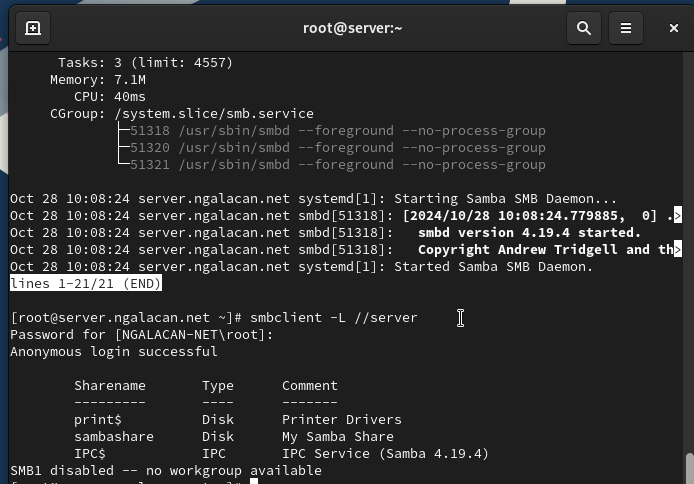{#fig:2 width=70%}

## Выполнение лабораторной работы

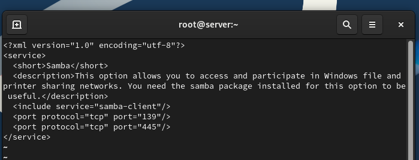{#fig:3 width=70%}

## Выполнение лабораторной работы

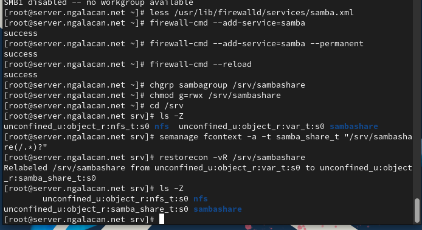{#fig:4 width=70%}

## Выполнение лабораторной работы 

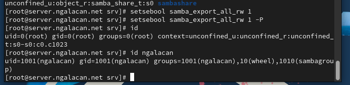{#fig:5 width=70%}


## Выполнение лабораторной работы 

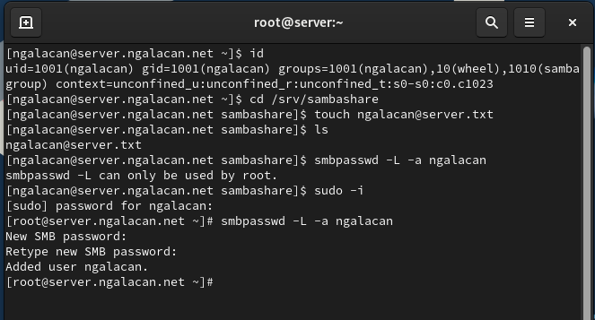{#fig:6 width=70%}

# Монтирование файловой системы Samba на клиенте

## Выполнение лабораторной работы

```
dnf -y install samba-client cifs-utils
```

## Выполнение лабораторной работы

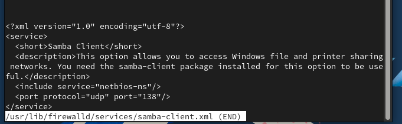{#fig:7 width=70%}

## Выполнение лабораторной работы

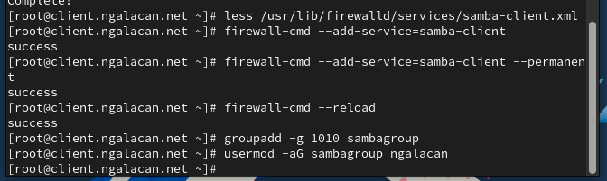{#fig:8 width=70%}

## Выполнение лабораторной работы

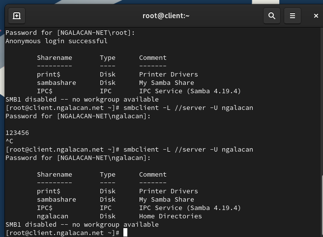{#fig:9 width=60%}

## Выполнение лабораторной работы

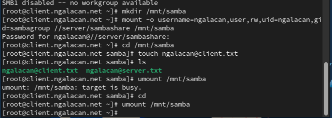{#fig:10 width=70%}

## Выполнение лабораторной работы

{#fig:11 width=70%}

## Выполнение лабораторной работы

{#fig:12 width=70%}

## Выполнение лабораторной работы

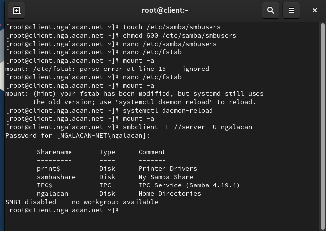{#fig:13 width=70%}

## Выполнение лабораторной работы

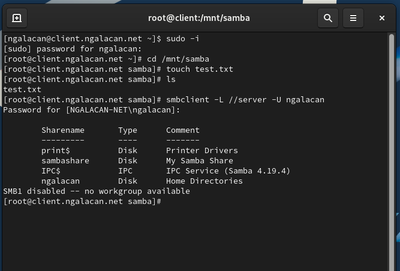{#fig:14 width=70%}


# Внесение изменений в настройки внутреннего окружения виртуальной машины

## Выполнение лабораторной работы

```
cd /vagrant/provision/server
mkdir -p /vagrant/provision/server/smb/etc/samba
cp -R /etc/samba/smb.conf /vagrant/provision/server/smb/etc/samba/
```


## Выполнение лабораторной работы

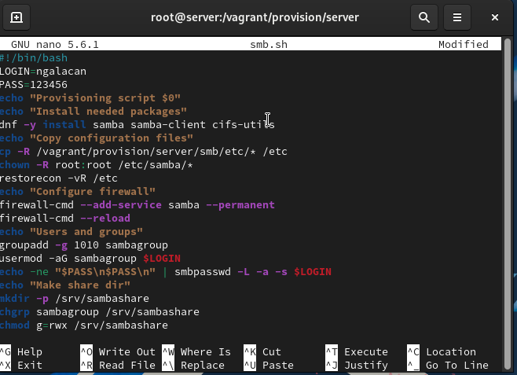{#fig:15 width=60%}


## Выполнение лабораторной работы

```
cd /vagrant/provision/client
mkdir -p /vagrant/provision/client/smb/etc/samba
cp -R /etc/samba/smb.conf /vagrant/provision/client/smb/etc/samba/
cp -R /etc/samba/smbusers /vagrant/provision/client/smb/etc/samba/
```


## Выполнение лабораторной работы

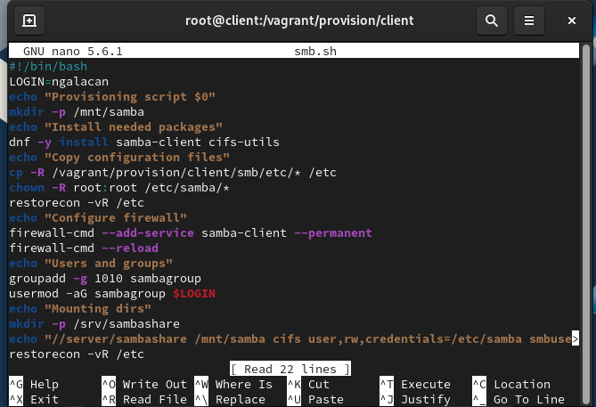{#fig:16 width=70%}

## Выполнение лабораторной работы

```
server.vm.provision "SMB server",
	type: "shell",
	preserve_order: true,
	path: "provision/server/smb.sh"
client.vm.provision "SMB client",
	type: "shell",
	preserve_order: true,
	path: "provision/client/smb.sh"
```

## Выводы

В результате выполнения работы были приобретены навыки настройки доступа групп пользователей к общим ресурсам по протоколу SMB.
