---
## Front matter
title: "Отчет по лабораторной работе №14"
subtitle: "Настройка файловых служб Samba"
author: "Галацан Николай, НПИбд-01-22"

## Generic otions
lang: ru-RU
toc-title: "Содержание"

## Bibliography
bibliography: bib/cite.bib
csl: pandoc/csl/gost-r-7-0-5-2008-numeric.csl

## Pdf output format
toc: true # Table of contents
toc-depth: 2
lof: true # List of figures
lot: false # List of tables
fontsize: 12pt
linestretch: 1.5
papersize: a4
documentclass: scrreprt
## I18n polyglossia
polyglossia-lang:
  name: russian
  options:
	- spelling=modern
	- babelshorthands=true
polyglossia-otherlangs:
  name: english
## I18n babel
babel-lang: russian
babel-otherlangs: english
## Fonts
mainfont: IBM Plex Serif
romanfont: IBM Plex Serif
sansfont: IBM Plex Sans
monofont: IBM Plex Mono
mathfont: STIX Two Math
mainfontoptions: Ligatures=Common,Ligatures=TeX,Scale=0.94
romanfontoptions: Ligatures=Common,Ligatures=TeX,Scale=0.94
sansfontoptions: Ligatures=Common,Ligatures=TeX,Scale=MatchLowercase,Scale=0.94
monofontoptions: Scale=MatchLowercase,Scale=0.94,FakeStretch=0.9
mathfontoptions:
## Biblatex
biblatex: true
biblio-style: "gost-numeric"
biblatexoptions:
  - parentracker=true
  - backend=biber
  - hyperref=auto
  - language=auto
  - autolang=other*
  - citestyle=gost-numeric
## Pandoc-crossref LaTeX customization
figureTitle: "Рис."
tableTitle: "Таблица"
listingTitle: "Листинг"
lofTitle: "Список иллюстраций"
lotTitle: "Список таблиц"
lolTitle: "Листинги"
## Misc options
indent: true
header-includes:
  - \usepackage{indentfirst}
  - \usepackage{float} # keep figures where there are in the text
  - \floatplacement{figure}{H} # keep figures where there are in the text
---

# Цель работы

Приобретение навыков настройки доступа групп пользователей к общим ресурсам
по протоколу SMB.

# Выполнение лабораторной работы

##  Настройка сервера Samba

На сервере устанавливаю необходимые пакеты:
```
dnf -y install samba samba-client cifs-utils
```

Создаю группу `sambagroup` для пользователей, которые будут работать с Samba-сервером с GID 1010, добавляю пользователя `ngalacan` к группе:
```
groupadd -g 1010 sambagroup
usermod -aG sambagroup ngalacan

```
Создаю общий каталог в файловой системе Linux, в который предполагается
монтировать разделяемые ресурсы:

```
mkdir -p /srv/sambashare

```
В файле конфигурации `/etc/samba/smb.conf` вношу изменения, изменив параметр рабочей группы и добавив раздел с описанием общего доступа к разделяемому ресурсу (рис. [-@fig:1]).

{#fig:1 width=70%}

С помощью `testparm` проверяю, нет ли ошибок в файле. Запускаю демон Samba и просматриваю статус. Проверяю доступ к общему ресурсу (рис. [-@fig:2])

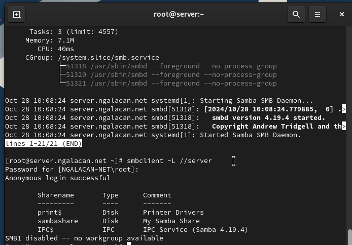{#fig:2 width=70%}

 Просматриваю файл конфигурации межсетевого экрана для Samba (рис. [-@fig:3])

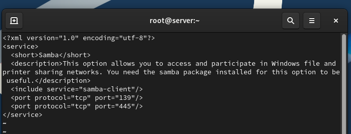{#fig:3 width=70%}

Настраиваю межсетевой экран, права доступа для каталога с разделяемым ресурсом, просматриваю и изменяю контекст безопасности (рис. [-@fig:4])

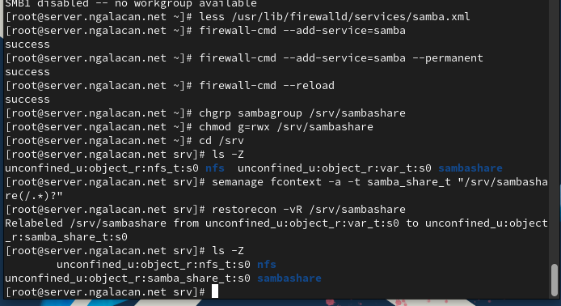{#fig:4 width=70%}

Разрешаю экспортировать разделяемые ресурсы для чтения и записи и просматриваю id пользователя (рис. [-@fig:5]). 

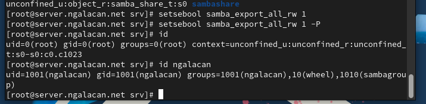{#fig:5 width=70%}


Под пользователем `ngalacan` создаю файл на разделяемом ресурсе. Добавляю пользователя в базу пользоваталей Samba (рис. [-@fig:6]). 

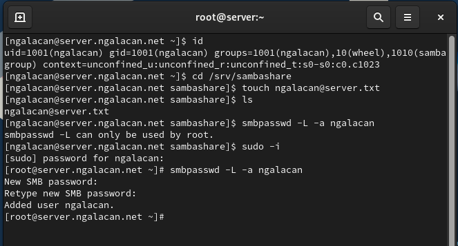{#fig:6 width=70%}

## Монтирование файловой системы Samba на клиенте

На клиенте устанавливаю необходимые пакеты:
```
dnf -y install samba-client cifs-utils
```
Просматриваю файл конфигурации межсетевого экрана для клиента Samba (рис. [-@fig:7]). 

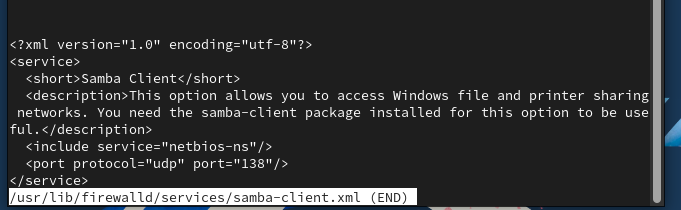{#fig:7 width=70%}

На клиенте настраиваю межсетевой экран и создаю группу `sambagroup`, куда добавляю своего пользователя (рис. [-@fig:8]).

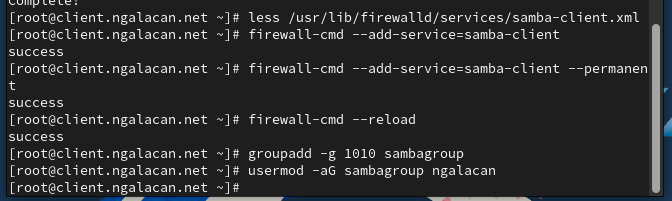{#fig:8 width=70%}

На клиенте в файле конфигурации `/etc/samba/smb.conf` изменяю параметр рабочей группы:
```
[global]
workgroup = NGALACAN-NET
```
Для проверки наличия общего доступа пытаюсь с клиента подключиться к серверу с помощью `smbclient`. По умолчанию ресурсы просматриваются под анонимной учетной записью. Подключаюсь под учетной записью своего пользователя (рис. [-@fig:9]).

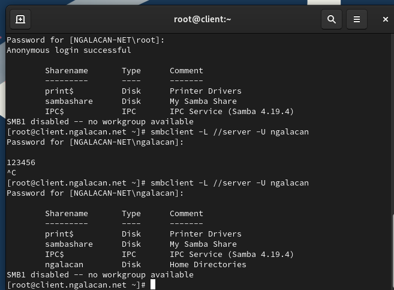{#fig:9 width=70%}

Создаю на клиенте точку монтирования, получаю доступ к общему ресурсу с помощью `mount`, проверяю, что пользователь может записывать файлы на разделяемом ресурсе, после чего отмонтирую каталог `/mnt/samba` (рис. [-@fig:10]).

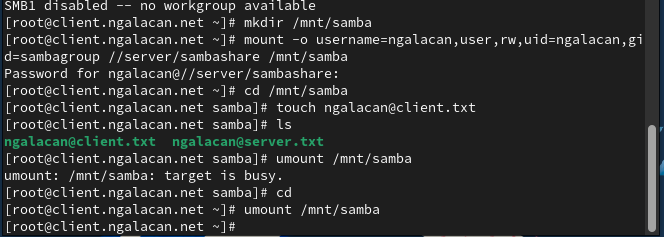{#fig:10 width=70%}

Для настройки работы с Samba с помощью файла учётных данных создаю файл `smbusers` (рис. [-@fig:11]).

{#fig:11 width=70%}

На клиенте в файле `/etc/fstab` добавляю строку (рис. [-@fig:12])

{#fig:12 width=70%}

Монтирую общий ресурс: `mount -a`. Убеждаюсь, что ресурс монтируется (рис. [-@fig:13]).

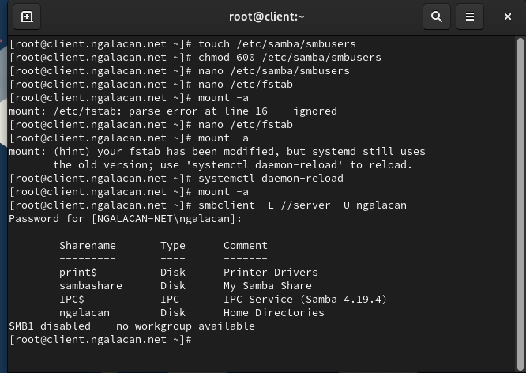{#fig:13 width=70%}

Перезагружаю клиента и убеждаюсь, что у пользователя есть доступ к разделяемым ресурсам и после перезагрузки (рис. [-@fig:14]). 

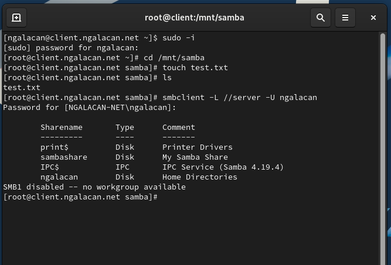{#fig:14 width=70%}


## Внесение изменений в настройки внутреннего окружения виртуальной машины

На ВМ `server` перехожу в каталог для внесения изменений в настройки внутреннего окружения `/vagrant/provision/server/` и копирую в соответствующие каталоги конфигурационные файлы:

```
cd /vagrant/provision/server
mkdir -p /vagrant/provision/server/smb/etc/samba
cp -R /etc/samba/smb.conf /vagrant/provision/server/smb/etc/samba/
```


Вношу изменения в файл `/vagrant/provision/server/smb.sh` (рис. [-@fig:15]).

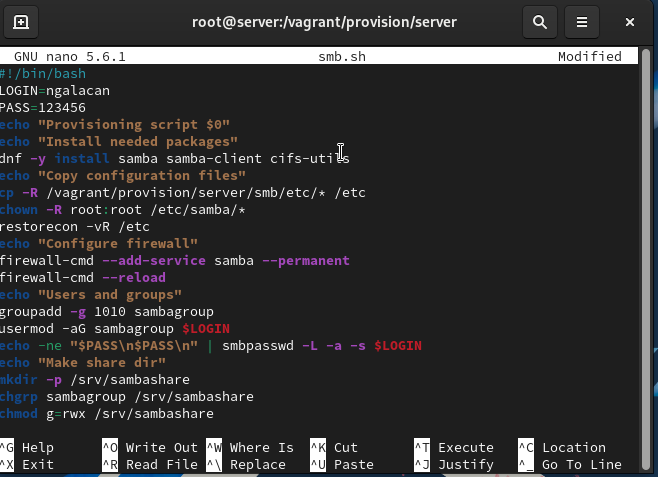{#fig:15 width=70%}


На ВМ `client` перехожу в каталог для внесения изменений в настройки внутреннего окружения и копирую в соответствующие каталоги конфигурационные файлы:

```
cd /vagrant/provision/client
mkdir -p /vagrant/provision/client/smb/etc/samba
cp -R /etc/samba/smb.conf /vagrant/provision/client/smb/etc/samba/
cp -R /etc/samba/smbusers /vagrant/provision/client/smb/etc/samba/
```


Создаю и редактирую скрипт `/vagrant/provision/client/smb.sh` (рис. [-@fig:16]).

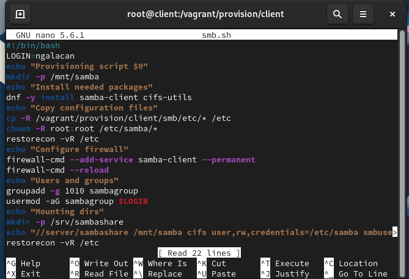{#fig:16 width=70%}

Для отработки созданных скриптов во время загрузки виртуальных машин `server` и `client` в конфигурационном файле `Vagrantfile` добавляю записи в соответствующих разделах конфигураций для сервера и клиента:
```
server.vm.provision "SMB server",
	type: "shell",
	preserve_order: true,
	path: "provision/server/smb.sh"
client.vm.provision "SMB client",
	type: "shell",
	preserve_order: true,
	path: "provision/client/smb.sh"
```

# Выводы

В результате выполнения работы были приобретены навыки настройки доступа групп пользователей к общим ресурсам по протоколу SMB.


# Ответы на контрольные вопросы

1. Какова минимальная конфигурация для `smb.conf` для создания общего ресурса, который предоставляет доступ к каталогу `/data`?

Минимальная конфигурация для `smb.conf` может включать следующие параметры:
```
[data]
path = /data
browsable = yes
read only = no
```

2. Как настроить общий ресурс, который даёт доступ на запись всем пользователям, имеющим права на запись в файловой системе Linux?

Для этого нужно установить параметр `read only = no`. Пример:
```
[data]
path = /data
browsable = yes
read only = no
```

3. Как ограничить доступ на запись к ресурсу только членам определённой группы?

Используйте параметр `write list`. Пример:
```
[data]
path = /data
browsable = yes
read only = yes
write list = @groupname
```

4. Какой переключатель SELinux нужно использовать, чтобы позволить пользователям получать доступ к домашним каталогам на сервере через SMB?

Необходимо включить переключатель `samba_enable_home_dirs` с помощью команды `setsebool -P samba_enable_home_dirs on`.

5. Как ограничить доступ к определённому ресурсу только узлам из сети 192.168.10.0/24?

Используйте параметр `hosts allow`. Пример:
```
[data]
path = /data
browsable = yes
read only = no
hosts allow = 192.168.10.
```

6. Какую команду можно использовать, чтобы отобразить список всех пользователей Samba на сервере?

Для этого используется команда `pdbedit -L`.

7. Что нужно сделать пользователю для доступа к ресурсу, который настроен как многопользовательский ресурс?

Пользователю необходимо иметь учётную запись Samba и соответствующие права доступа к ресурсу.

8. Как установить общий ресурс Samba в качестве многопользовательской учётной записи, где пользователь alice используется как минимальная учётная запись пользователя?

Для этого используется параметр `force user = alice`.

9. Как можно запретить пользователям просматривать учётные данные монтирования Samba в файле `/etc/fstab`?

Для этого используется параметр `credentials`, который позволяет хранить учётные данные в отдельном файле с ограниченным доступом. В файле `/etc/fstab` можно указать:
```
/mountpoint smbfs credentials=/path/to/credentials_file 0 0
```
Файл с учётными данными должен быть доступен только владельцу: `chmod 600 /path/to/credentials_file`

10. Какая команда позволяет перечислить все экспортируемые ресурсы Samba, доступные на определённом сервере?

Для этого используется команда `smbclient` с параметром -L и указанием имени сервера: `smbclient -L //server_address -U username`
