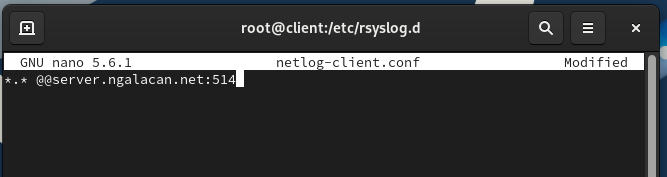
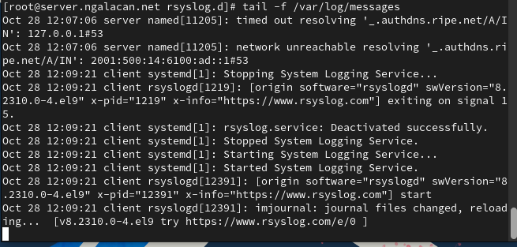
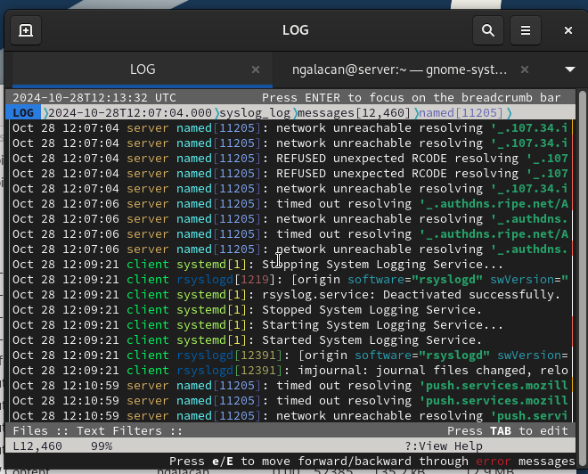

---
## Front matter
lang: ru-RU
title: Презентация по лабораторной работе №15
subtitle: " Настройка сетевого журналирования"
author:
  - Галацан Николай
institute:
  - Российский университет дружбы народов, Москва, Россия

## i18n babel
babel-lang: russian
babel-otherlangs: english

## Formatting pdf
toc: false
toc-title: Содержание
slide_level: 2
aspectratio: 169
section-titles: true
theme: metropolis
header-includes:
 - \metroset{progressbar=frametitle,sectionpage=progressbar,numbering=fraction}
 - '\makeatletter'
 - '\beamer@ignorenonframefalse'
 - '\makeatother'
---


## Докладчик

  * Галацан Николай
  * 1032225763
  * уч. группа: НПИбд-01-22
  * Факультет физико-математических и естественных наук
  * Российский университет дружбы народов

## Цели и задачи

Получение навыков по работе с журналами системных событий.

# Настройка сервера сетевого журнала

## Выполнение лабораторной работы

```
cd /etc/rsyslog.d
touch netlog-server.conf
```

## Выполнение лабораторной работы


{#fig:1 width=70%}

## Выполнение лабораторной работы


{#fig:2 width=60%}

## Выполнение лабораторной работы

```
firewall-cmd --add-port=514/tcp
firewall-cmd --add-port=514/tcp --permanent

```

# Настройка клиента сетевого журнала
 
## Выполнение лабораторной работы


```
cd /etc/rsyslog.d
touch netlog-client.conf


```

## Выполнение лабораторной работы


{#fig:3 width=70%}

# Просмотр журнала

## Выполнение лабораторной работы


{#fig:4 width=70%}

## Выполнение лабораторной работы


{#fig:5 width=70%}

## Выполнение лабораторной работы


{#fig:6 width=60%}


# Внесение изменений в настройки внутреннего окружения виртуальной машины

## Выполнение лабораторной работы


```
cd /vagrant/provision/server
mkdir -p /vagrant/provision/server/netlog/etc/rsyslog.d
cp -R /etc/rsyslog.d/netlog-server.conf
		-> /vagrant/provision/server/netlog/etc/rsyslog.d
```


## Выполнение лабораторной работы


{#fig:7 width=70%}

## Выполнение лабораторной работы


```
cd /vagrant/provision/client
mkdir -p /vagrant/provision/client/netlog/etc/rsyslog.d
cp -R /etc/rsyslog.d/netlog-client.conf
		-> /vagrant/provision/client/netlog/etc/rsyslog.d/
```


## Выполнение лабораторной работы


{#fig:8 width=70%}

## Выполнение лабораторной работы

```
server.vm.provision "server netlog",
	type: "shell",
	preserve_order: true,
	path: "provision/server/netlog.sh"

client.vm.provision "client netlog",
	type: "shell",
	preserve_order: true,
	path: "provision/client/netlog.sh"
```


## Выводы

В результате выполнения работы были приобретены навыки по работе с журналами системных событий.

