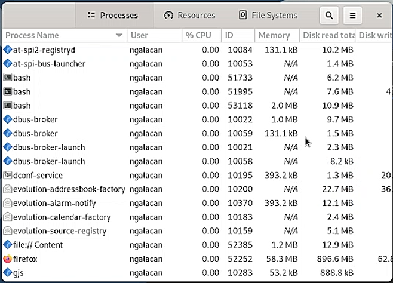
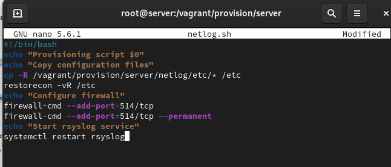

---
## Front matter
title: "Отчет по лабораторной работе №"
subtitle: "-"
author: "Галацан Николай, НПИбд-01-22"

## Generic otions
lang: ru-RU
toc-title: "Содержание"

## Bibliography
bibliography: bib/cite.bib
csl: pandoc/csl/gost-r-7-0-5-2008-numeric.csl

## Pdf output format
toc: true # Table of contents
toc-depth: 2
lof: true # List of figures
lot: false # List of tables
fontsize: 12pt
linestretch: 1.5
papersize: a4
documentclass: scrreprt
## I18n polyglossia
polyglossia-lang:
  name: russian
  options:
	- spelling=modern
	- babelshorthands=true
polyglossia-otherlangs:
  name: english
## I18n babel
babel-lang: russian
babel-otherlangs: english
## Fonts
mainfont: IBM Plex Serif
romanfont: IBM Plex Serif
sansfont: IBM Plex Sans
monofont: IBM Plex Mono
mathfont: STIX Two Math
mainfontoptions: Ligatures=Common,Ligatures=TeX,Scale=0.94
romanfontoptions: Ligatures=Common,Ligatures=TeX,Scale=0.94
sansfontoptions: Ligatures=Common,Ligatures=TeX,Scale=MatchLowercase,Scale=0.94
monofontoptions: Scale=MatchLowercase,Scale=0.94,FakeStretch=0.9
mathfontoptions:
## Biblatex
biblatex: true
biblio-style: "gost-numeric"
biblatexoptions:
  - parentracker=true
  - backend=biber
  - hyperref=auto
  - language=auto
  - autolang=other*
  - citestyle=gost-numeric
## Pandoc-crossref LaTeX customization
figureTitle: "Рис."
tableTitle: "Таблица"
listingTitle: "Листинг"
lofTitle: "Список иллюстраций"
lotTitle: "Список таблиц"
lolTitle: "Листинги"
## Misc options
indent: true
header-includes:
  - \usepackage{indentfirst}
  - \usepackage{float} # keep figures where there are in the text
  - \floatplacement{figure}{H} # keep figures where there are in the text
---

# Цель работы


# Выполнение лабораторной работы

(рис. [-@fig:1]).

{#fig:1 width=70%}

(рис. [-@fig:2])

{#fig:2 width=70%}

 (рис. [-@fig:3])

{#fig:3 width=70%}

 (рис. [-@fig:4])

{#fig:4 width=70%}

(рис. [-@fig:5]). 

{#fig:5 width=70%}


(рис. [-@fig:6]). 

{#fig:6 width=70%}

(рис. [-@fig:7]). 

{#fig:7 width=70%}

(рис. [-@fig:8]).

{#fig:8 width=70%}

(рис. [-@fig:9]).

{#fig:9 width=70%}

 (рис. [-@fig:10]).

{#fig:10 width=70%}

 (рис. [-@fig:11]).

{#fig:11 width=70%}

 (рис. [-@fig:12])

{#fig:12 width=70%}

 (рис. [-@fig:13]).

{#fig:13 width=70%}

(рис. [-@fig:14]). 

{#fig:14 width=70%}

(рис. [-@fig:15]).

{#fig:15 width=70%}

(рис. [-@fig:16]).

{#fig:16 width=70%}

## Внесение изменений в настройки внутреннего окружения виртуальной машины

На ВМ `server` перехожу в каталог для внесения изменений в настройки внутреннего окружения `/vagrant/provision/server/` и копирую в соответствующие каталоги конфигурационные файлы:

```
cd /vagrant/provision/server
cp -R /etc/dovecot/dovecot.conf
	↪ /vagrant/provision/server/mail/etc/dovecot/
cp -R /etc/dovecot/conf.d/10-master.conf
	↪ /vagrant/provision/server/mail/etc/dovecot/conf.d/
cp -R /etc/dovecot/conf.d/10-auth.conf
	↪ /vagrant/provision/server/mail/etc/dovecot/conf.d/
mkdir -p /vagrant/provision/server/mail/etc/postfix/
cp -R /etc/postfix/master.cf /vagrant/provision/server/mail/etc/postfix/
```


Вношу изменения в файл `/vagrant/provision/server/mail.sh` (рис. [-@fig:17]).

{#fig:17 width=70%}


На ВМ `client` перехожу в каталог для внесения изменений в настройки внутреннего окружения и редактирую скрипт `/vagrant/provision/client/mail.sh` (рис. [-@fig:18]).

{#fig:18 width=70%}

# Выводы


# Ответы на контрольные вопросы


