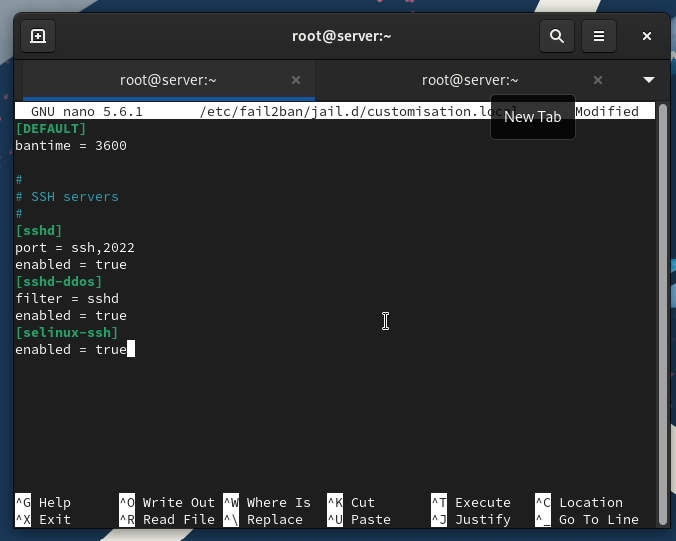
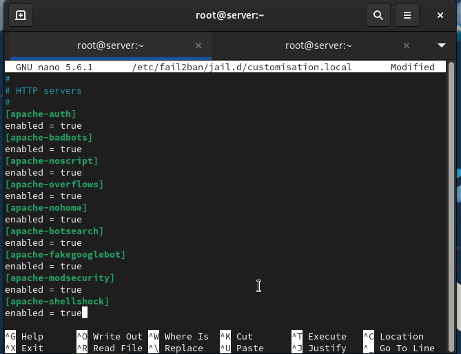
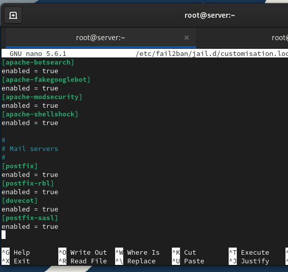
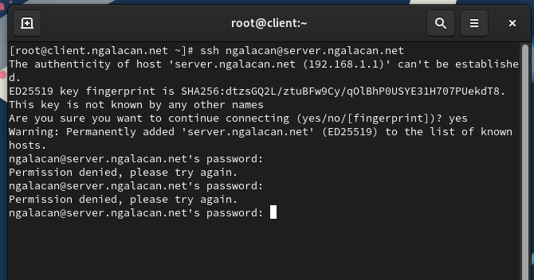
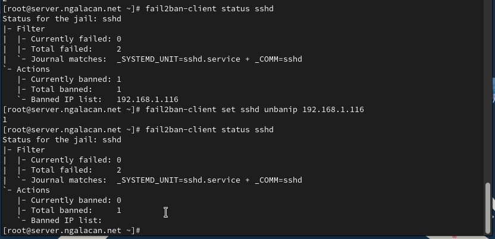
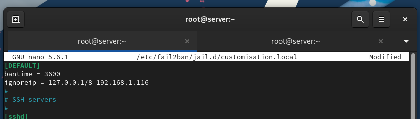
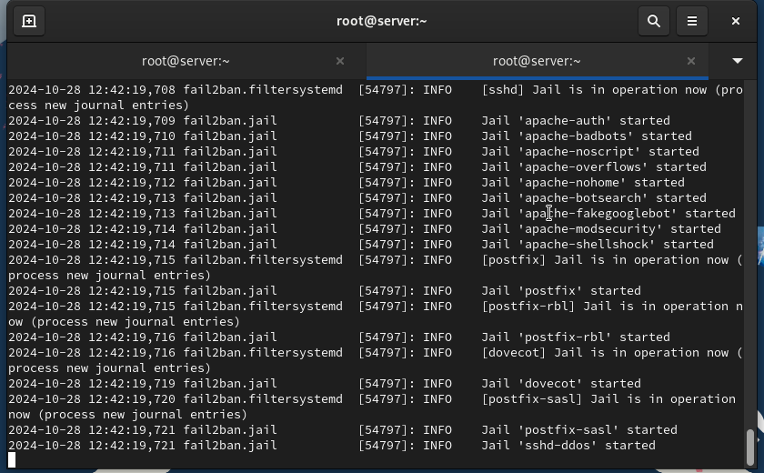
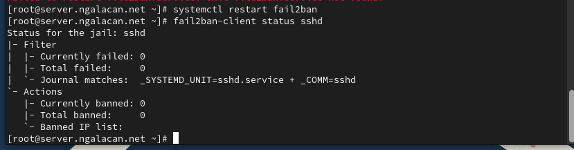
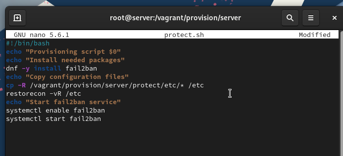

---
## Front matter
lang: ru-RU
title: Презентация по лабораторной работе №16
subtitle: "Базовая защита от атак типа «brute force»"
author:
  - Галацан Николай
institute:
  - Российский университет дружбы народов, Москва, Россия

## i18n babel
babel-lang: russian
babel-otherlangs: english

## Formatting pdf
toc: false
toc-title: Содержание
slide_level: 2
aspectratio: 169
section-titles: true
theme: metropolis
header-includes:
 - \metroset{progressbar=frametitle,sectionpage=progressbar,numbering=fraction}
 - '\makeatletter'
 - '\beamer@ignorenonframefalse'
 - '\makeatother'
---


## Докладчик

  * Галацан Николай
  * 1032225763
  * уч. группа: НПИбд-01-22
  * Факультет физико-математических и естественных наук
  * Российский университет дружбы народов

## Цели и задачи

Получить навыки работы с программным средством Fail2ban для обеспечения базовой защиты от атак типа «brute force».

# Защита с помощью Fail2ban

## Выполнение лабораторной работы


{#fig:1 width=50%}

## Выполнение лабораторной работы

{#fig:2 width=50%}

## Выполнение лабораторной работы

{#fig:3 width=50%}

## Выполнение лабораторной работы

{#fig:4 width=50%}

## Выполнение лабораторной работы

{#fig:5 width=50%}


## Выполнение лабораторной работы. 

{#fig:6 width=50%}

## Выполнение лабораторной работы 

{#fig:7 width=50%}

# Проверка работы Fail2ban

## Выполнение лабораторной работы

```
fail2ban-client status
fail2ban-client status sshd
fail2ban-client set sshd maxretry 2
```

## Выполнение лабораторной работы

{#fig:8 width=70%}

## Выполнение лабораторной работы

{#fig:9 width=70%}

## Выполнение лабораторной работы

{#fig:10 width=70%}

## Выполнение лабораторной работы

{#fig:11 width=70%}

## Выполнение лабораторной работы

{#fig:12 width=70%}


# Внесение изменений в настройки внутреннего окружения виртуальной машины

## Выполнение лабораторной работы

```
cd /vagrant/provision/server
mkdir -p /vagrant/provision/server/protect/etc/fail2ban/jail.d
cp -R /etc/fail2ban/jail.d/customisation.local
	↪ /vagrant/provision/server/protect/etc/fail2ban/jail.d/
```


## Выполнение лабораторной работы

{#fig:13 width=70%}

## Выполнение лабораторной работы

```
server.vm.provision "server protect",
	type: "shell",
	preserve_order: true,
	path: "provision/server/protect.sh"
```


## Выводы

В результате выполнения работы были получены навыки работы с программным средством Fail2ban для обеспечения базовой защиты от атак типа «brute force».

