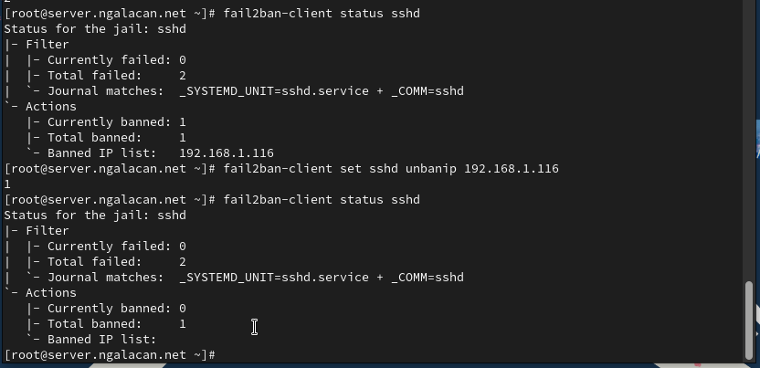

---
## Front matter
title: "Отчет по лабораторной работе №16"
subtitle: "Базовая защита от атак типа «brute force»"
author: "Галацан Николай, НПИбд-01-22"

## Generic otions
lang: ru-RU
toc-title: "Содержание"

## Bibliography
bibliography: bib/cite.bib
csl: pandoc/csl/gost-r-7-0-5-2008-numeric.csl

## Pdf output format
toc: true # Table of contents
toc-depth: 2
lof: true # List of figures
lot: false # List of tables
fontsize: 12pt
linestretch: 1.5
papersize: a4
documentclass: scrreprt
## I18n polyglossia
polyglossia-lang:
  name: russian
  options:
	- spelling=modern
	- babelshorthands=true
polyglossia-otherlangs:
  name: english
## I18n babel
babel-lang: russian
babel-otherlangs: english
## Fonts
mainfont: IBM Plex Serif
romanfont: IBM Plex Serif
sansfont: IBM Plex Sans
monofont: IBM Plex Mono
mathfont: STIX Two Math
mainfontoptions: Ligatures=Common,Ligatures=TeX,Scale=0.94
romanfontoptions: Ligatures=Common,Ligatures=TeX,Scale=0.94
sansfontoptions: Ligatures=Common,Ligatures=TeX,Scale=MatchLowercase,Scale=0.94
monofontoptions: Scale=MatchLowercase,Scale=0.94,FakeStretch=0.9
mathfontoptions:
## Biblatex
biblatex: true
biblio-style: "gost-numeric"
biblatexoptions:
  - parentracker=true
  - backend=biber
  - hyperref=auto
  - language=auto
  - autolang=other*
  - citestyle=gost-numeric
## Pandoc-crossref LaTeX customization
figureTitle: "Рис."
tableTitle: "Таблица"
listingTitle: "Листинг"
lofTitle: "Список иллюстраций"
lotTitle: "Список таблиц"
lolTitle: "Листинги"
## Misc options
indent: true
header-includes:
  - \usepackage{indentfirst}
  - \usepackage{float} # keep figures where there are in the text
  - \floatplacement{figure}{H} # keep figures where there are in the text
---

# Цель работы

Получить навыки работы с программным средством Fail2ban для обеспечения базовой защиты от атак типа «brute force».

# Выполнение лабораторной работы

## Защита с помощью Fail2ban

На сервере устанавливаю `fail2ban`:
```
dnf -y install fail2ban
```

Запускаю сервер `fail2ban` (рис. [-@fig:1]).

{#fig:1 width=70%}

В доп. терминале запускаю просмотр журнала событий `fail2ban`. Создаю файл с локальной конфигурацией `/etc/fail2ban/jail.d/customisation.local`. Задаю время блокирования, включаю защиту SSH, после чего перезапускаю `fail2ban` (рис. [-@fig:2]).

{#fig:2 width=70%}

Просматриваю журнал событий `fail2ban` и вижу сообщения об активации jail-ов (рис. [-@fig:3]).

{#fig:3 width=70%}

В файле конфигурации включаю защиту HTTP, после чего перезапускаю `fail2ban` (рис. [-@fig:4]).

{#fig:4 width=70%}

Просматриваю журнал событий `fail2ban` (рис. [-@fig:5]). 

{#fig:5 width=70%}


В файле конфигурации включаю защиту почты, после чего перезапускаю `fail2ban` (рис. [-@fig:6]). 

{#fig:6 width=70%}

Просматриваю журнал событий `fail2ban` (рис. [-@fig:7]). 

{#fig:7 width=70%}

## Проверка работы Fail2ban

На сервере просматриваю статус службы, статус защиты SSH, устанавливаю максимальное количество ошибок для SSH, равное 2:
```
fail2ban-client status
fail2ban-client status sshd
fail2ban-client set sshd maxretry 2
```

С клиента пытаюсь подключиться к серверу по SSH и намеренно ввожу неверный пароль (рис. [-@fig:8]).

{#fig:8 width=70%}

Снова просматриваю статус защиты SSH на сервере и вижу 2 попытки неудачного входа и 1 забаненный IP-адрес. Разблокирую адрес клиента и вновь просматриваю статус. Убеждаюсь, что заблокированных IP нет (рис. [-@fig:9]).

{#fig:9 width=70%}

Вношу изменения в конфигурационный файл, добавив в раздел по умолчанию игнорирование адреса клиента (рис. [-@fig:10]).

{#fig:10 width=70%}

Перезапускаю службу и просматриваю журнал событий (рис. [-@fig:11]).

{#fig:11 width=70%}

С клиента вновь пытаюсь аналогичным образом войти на сервер с неправильным паролем. Просматриваю статус защиты SSH и вижу 0 заблокированных адресов, так как адрес клиента находится в списке игнорируемых (рис. [-@fig:12])

{#fig:12 width=70%}


## Внесение изменений в настройки внутреннего окружения виртуальной машины

На ВМ `server` перехожу в каталог для внесения изменений в настройки внутреннего окружения `/vagrant/provision/server/` и копирую в соответствующие каталоги конфигурационные файлы:

```
cd /vagrant/provision/server
mkdir -p /vagrant/provision/server/protect/etc/fail2ban/jail.d
cp -R /etc/fail2ban/jail.d/customisation.local
	↪ /vagrant/provision/server/protect/etc/fail2ban/jail.d/
```


Вношу изменения в файл `/vagrant/provision/server/protect.sh` (рис. [-@fig:13]).

{#fig:13 width=70%}

Для отработки созданного скрипта во время загрузки ВМ `server` в конфигурационном файле `Vagrantfile` добавляю запись в соответствующий раздел конфигураций для сервера:

```
server.vm.provision "server protect",
	type: "shell",
	preserve_order: true,
	path: "provision/server/protect.sh"
```


# Выводы

В результате выполнения работы были получены навыки работы с программным средством Fail2ban для обеспечения базовой защиты от атак типа «brute force».


# Ответы на контрольные вопросы

1. Поясните принцип работы Fail2ban.

Fail2ban - это программное обеспечение, которое предотвращает атаки
на сервер, анализируя лог-файлы и блокируя IP-адреса, с которых идут
подозрительные или злонамеренные действия. Он работает следующим
образом:

- Мониторит указанные лог-файлы на наличие заданных событий (например, неудачных попыток входа).
- Когда число попыток превышает определенный порог, Fail2ban временно блокирует IP-адрес, добавляя правила в файрвол.
- Заблокированный IP-адрес может быть разблокирован автоматически
после определенного периода времени


2. Настройки какого файла более приоритетны: `jail.conf` или `jail.local`?

Настройки файла `jail.local` более приоритетны, чем настройки файла
`jail.conf`.

3. Как настроить оповещение администратора при срабатывании Fail2ban?

Чтобы настроить оповещение администратора при срабатывании Fail2ban,
необходимо настроить отправку уведомлений по электронной почте или
другим способом. Это можно сделать, изменяя настройки в файле jail.local,
добавляя адрес электронной почты администратора и настройки SMTPсервера.


4. Поясните построчно настройки по умолчанию в конфигурационном файле
`/etc/fail2ban/jail.conf`, относящиеся к веб-службе.

Примеры настроек по умолчанию в конфигурационном файле `/etc/fail2ban/jail.conf`,
относящиеся к веб-службе:

- `[apache]` - секция, относящаяся к веб-серверу Apache.
- `enabled = true` - включение проверки лог-файлов Apache.
- `port = http,https` - указание портов для мониторинга.
- `filter = apache-auth` - указание фильтра для обработки лог-файлов.
- `logpath = /var/log/apache*/*error.log` - путь к лог-файлам Apache.
- `maxretry = 5` - максимальное количество попыток до блокировки адреса.
- `bantime = 600` - продолжительность блокировки в секундах.

5. Поясните построчно настройки по умолчанию в конфигурационном файле
`/etc/fail2ban/jail.conf`, относящиеся к почтовой службе.

Примеры настроек по умолчанию в конфигурационном файле `/etc/fail2ban/jail.conf`,
относящиеся к почтовой службе:

- `[postfix]` - секция, относящаяся к почтовому серверу Postfix.
- `enabled = true` - включение проверки лог-файлов Postfix.
- `port = smtp,ssmtp` - указание портов для мониторинга.
- `filter = postfix` - указание фильтра для обработки лог-файлов.
- `logpath = /var/log/mail.log` - путь к лог-файлам Postfix.
- `maxretry = 3` - максимальное количество попыток до блокировки адреса.
- `bantime = 3600` - продолжительность блокировки в секундах

6. Какие действия может выполнять Fail2ban при обнаружении атакующего
IP-адреса? Где можно посмотреть описание действий для последующего
использования в настройках Fail2ban?

Fail2ban может выполнять различные действия при обнаружении атакующего IP-адреса, такие как блокировка адреса через файрвол, добавление
правил в IP-таблицы, отправка уведомлений администратору и другие. Описание доступных действий можно найти в документации или руководстве
Fail2ban.

7. Как получить список действующих правил Fail2ban?

Можно использовать
команду: `fail2ban-client status`.


8. Как получить статистику заблокированных Fail2ban адресов?

Можно использовать команду `fail2ban-client status <jail-name>`, где
`<jail-name>` - имя конкретного `jail`, например, “`ssh`” или “`apache`”.

9. Как разблокировать IP-адрес?

`fail2ban-client set sshd unbanip <ip-адрес клиента>`

